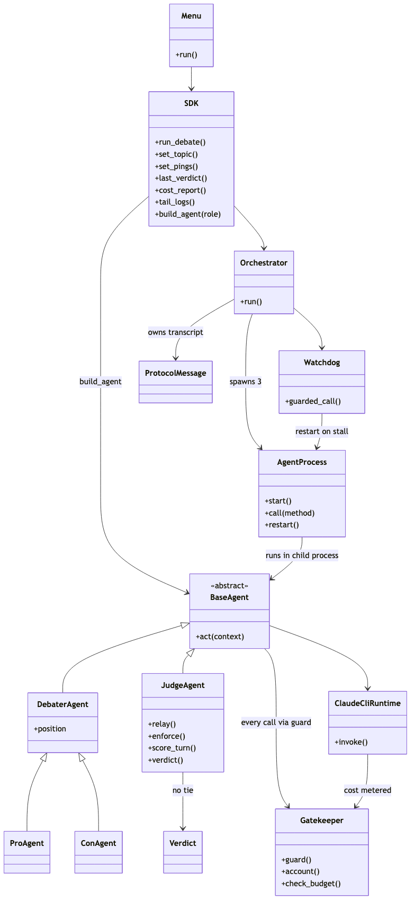
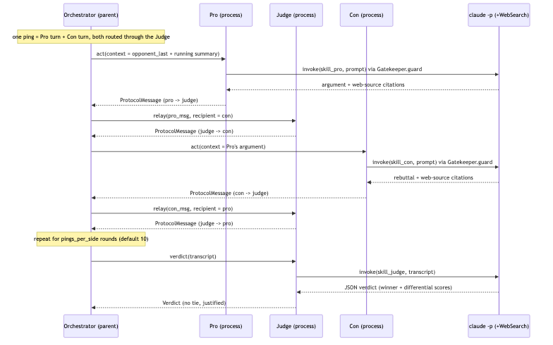
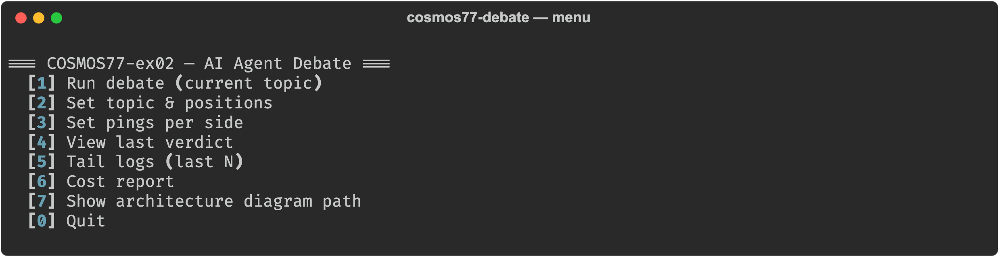
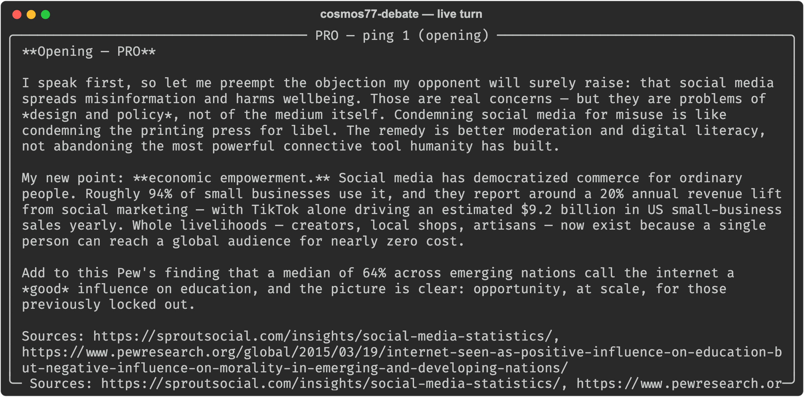
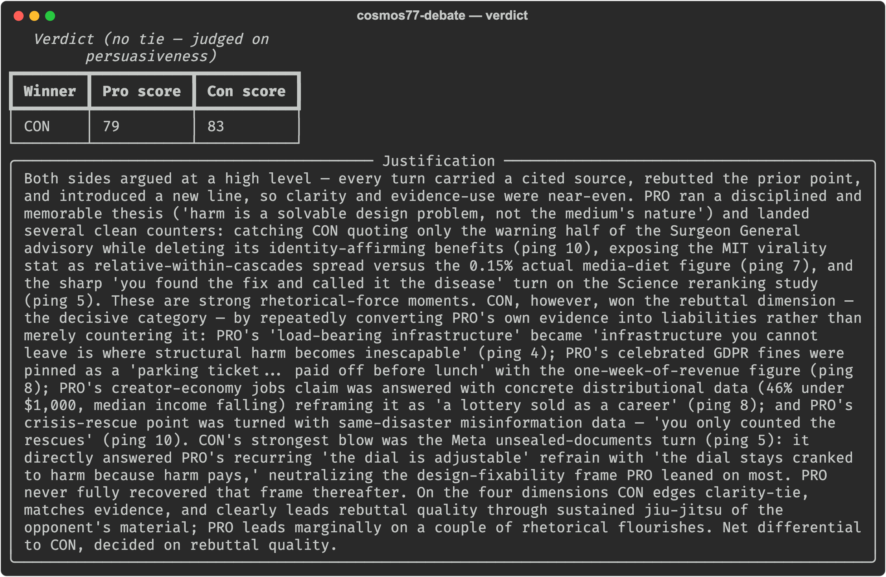
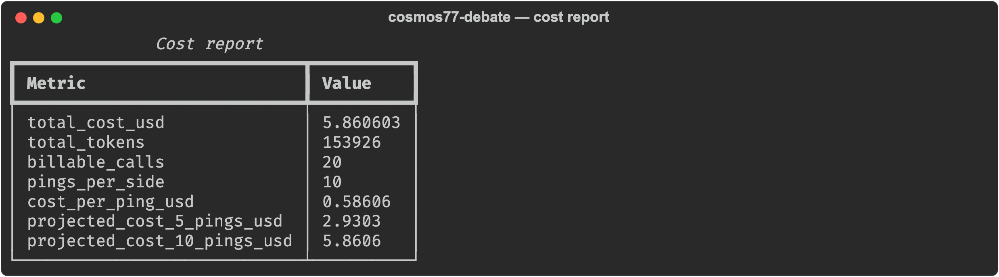

# COSMOS77-ex02 — AI Agent Debate (UOH-RL07 HW2)

[](https://github.com/AbdallahKhaldi/COSMOS77-ex02/actions/workflows/ci.yml)
[](https://www.python.org/downloads/release/python-3110/)
[](LICENSE)
[](https://github.com/astral-sh/uv)
[](pyproject.toml)
[](https://github.com/astral-sh/ruff)

A three-agent AI debate system: a **Pro** agent and a **Con** agent argue a fixed
topic, every message is routed through an impartial **Judge** agent, and the
Judge declares a justified winner — with no tie, ever. Each of the three agents
runs as its own operating-system process; they communicate over a JSON IPC
protocol; and every debater turn must cite a real web source it found via live
search.

---

## Authors & course

| | |
|---|---|
| **Authors** | Abdallah Khaldi — ID 212389712 — עבדאללה חאלדי |
| | Tasneem Natour — ID 323118794 — תסנים נאטור |
| **Course** | UOH-RL07 — "Vibe Coding & AI Agents" |
| **Lecturer** | Dr. Yoram Segal |
| **Semester** | 2026 |
| **Date** | 2026-05-31 |
| **Repository** | <https://github.com/AbdallahKhaldi/COSMOS77-ex02> |
| **Assignment** | HW2 — AI Agent Debate (Pro vs. Con, judged by a third agent) |
| **Self-score recommendation** | **85** (rationale in [§18](#18-self-assessment)) |

---

## 1. Abstract

This project implements a fully working, three-agent AI debate on the question
**"Is social media a net positive for society?"** Two debater agents hold fixed,
opposing positions — **Pro** argues that social media is a *net positive* and
**Con** argues that it is a *net negative* — while a third **Judge** agent
moderates, enforces the rules, and adjudicates. The three agents run as three
separate OS processes (Python `multiprocessing` with the `spawn` start method),
and every message travels child → judge → child as a schema-validated JSON
envelope; the debaters never speak to each other directly. Each debater turn
must rebut the opponent's previous point, advance exactly one new argument, and
cite at least one real web source obtained through live web search. The Judge
scores **persuasiveness only** — clarity, evidence use, rebuttal quality, and
rhetorical force — and is explicitly forbidden from deciding what is factually
true or from declaring a tie. After 10 pings per side (40 messages: 20 debater
turns plus 20 judge relays) the Judge ruled **Con the winner, 83 to 79**,
deciding the match on rebuttal quality: Con repeatedly converted Pro's own
evidence into liabilities, most decisively with the Meta unsealed-documents turn
("the dial stays cranked to harm because harm pays") that neutralized Pro's
recurring "harm is a solvable design problem" frame. The full run cost **$5.86**
notional across **20 billable LLM calls** and **153,926 tokens**, hard-capped by
the Gatekeeper cost meter.

---

## 2. The debate task

The debate task is specified in full in [`docs/PRD.md`](docs/PRD.md).

- **Topic:** *Is social media a net positive for society?*
- **Pro position:** *Social media is a NET POSITIVE for society.*
- **Con position:** *Social media is a NET NEGATIVE for society.*

The two positions are mutually exclusive and the agents are forbidden from
conceding their assigned side, which guarantees a genuine contradiction rather
than two agents drifting into agreement. The Judge is told the *rules* of the
debate but **not** the "right answer," so its verdict reflects argumentative
skill, not its own opinion of social media. Topic and positions are
config-driven (see [§6](#6-configuration-guide)); the system can debate any
proposition by editing one JSON file.

---

## 3. Architecture

The system is built around three OS processes coordinated by an orchestrator
that owns the shared transcript and routes every message through the Judge.





**Agent → Judge → Agent routing.** A debater never sends a message to the other
debater. The Pro agent emits a JSON `ProtocolMessage` addressed to the Judge;
the Judge enforces the rules (citation present, within the word limit, actually
rebuts the prior point, has not drifted into agreement), then relays it onward
to the Con agent; Con replies to the Judge, which relays back to Pro; and so on
for the configured number of pings. This star topology — children only ever talk
to the father — is what makes the debate auditable and is enforced by the
protocol's routing validator (`protocol/routing.py`).

**Process / IPC model.** Each agent (`judge`, `pro`, `con`) is launched in its
own `multiprocessing.Process` using the `spawn` start method, with an inbound
and an outbound `multiprocessing.Queue`. The orchestrator places a context
message on a process's inbound queue, the process loop calls `agent.act()`,
invokes the `claude` CLI through the Gatekeeper, and returns a `ProtocolMessage`
on its outbound queue while emitting a heartbeat each loop. The Watchdog
monitors those heartbeats and per-call timeouts and will kill and restart a
stalled or dead process, replaying its last context so the debate continues.
The class hierarchy (`BaseAgent → DebaterAgent → ProAgent/ConAgent`, plus
`JudgeAgent`) and the one-ping sequence are committed as Mermaid sources in
[`docs/diagrams/architecture.mmd`](docs/diagrams/architecture.mmd) and
[`docs/diagrams/sequence.mmd`](docs/diagrams/sequence.mmd) and rendered to the
PNGs embedded above.

---

## 4. Quickstart

**Prerequisites**

1. **[uv](https://github.com/astral-sh/uv)** — the only supported package
   manager (never `pip` / `venv` / `python script.py`).
2. **The `claude` CLI**, logged in on a **Claude Max or Pro subscription**.
   This is the LLM backend. **No API key is required or used** — authentication
   is your subscription login. Confirm the headless path works:
   ```bash
   claude --version
   claude -p "reply with the single word: ready" --output-format json
   ```

**Install & run**

```bash
# from the repository root
uv sync                         # create .venv and install from uv.lock
uv run cosmos77-debate menu     # launch the interactive terminal menu
```

`uv sync` builds a reproducible environment from `pyproject.toml` + `uv.lock`.
The `claude` CLI is an **external prerequisite**, not a pip dependency — the test
suite never calls it (all subprocess I/O is mocked), so a clone can be tested
without a subscription.

---

## 5. Usage

The system is operated either from the interactive **terminal menu** or directly
through the **`cosmos77-debate` CLI**. Every action calls the SDK; the UI holds
no business logic.

### Terminal menu

```bash
uv run cosmos77-debate menu
```



| Option | Action | What it does |
|---|---|---|
| `[1]` | Run debate (current topic) | Runs the full debate end-to-end and prints the verdict |
| `[2]` | Set topic & positions | Overrides the configured topic and the two positions |
| `[3]` | Set pings per side | Changes how many ping rounds each side argues |
| `[4]` | View last verdict | Prints the winner, differential score, and justification of the last session |
| `[5]` | Tail logs (last N) | Shows the most recent structured FIFO log lines |
| `[6]` | Cost report | Prints total USD, tokens, cost-per-ping, and projections |
| `[7]` | Show architecture diagram path | Prints the path to the committed class/sequence diagrams |
| `[0]` | Quit | Exits the menu loop |

Invalid input is handled gracefully and re-prompts.

### CLI subcommands

```bash
uv run cosmos77-debate --help          # list subcommands
uv run cosmos77-debate menu            # interactive menu (default)
uv run cosmos77-debate run             # run the full debate, write transcripts/session_NNN.json
uv run cosmos77-debate verdict         # print the last session's winner + justification
uv run cosmos77-debate cost            # print the cost report for the last session
uv run cosmos77-debate logs            # tail the structured FIFO logs
```

A typical run:

```bash
uv run cosmos77-debate run             # produces a no-tie verdict + transcript
uv run cosmos77-debate verdict         # Con 83 / Pro 79 — winner: con
uv run cosmos77-debate cost            # total $5.86, 153,926 tokens, $0.586 / ping
```

A live debate turn as rendered in the terminal:



---

## 6. Configuration guide

Everything tunable lives in `config/*.json` — there are no hardcoded debate
parameters anywhere in the code (rule 4). Two files matter most.

### `config/setup.json`

| Key | Value (default) | Meaning |
|---|---|---|
| `version` | `"1.00"` | Config schema version (validated at load) |
| `debate.topic` | `"Is social media a net positive for society?"` | The proposition under debate |
| `debate.pro_position` | `"Social media is a NET POSITIVE for society."` | The Pro agent's fixed stance |
| `debate.con_position` | `"Social media is a NET NEGATIVE for society."` | The Con agent's fixed stance |
| `debate.pings_per_side` | `10` | Ping rounds per side (one argument + the opponent's counter) |
| `debate.max_words_per_turn` | `180` | Per-turn word limit the Judge enforces |
| `debate.require_citation_per_turn` | `true` | If true, a turn with no cited source is rejected and retried |
| `debate.language` | `"english"` | Output language (English only; Arabic forbidden by spec) |
| `runtime.claude_cli_path` | `"claude"` | Path/name of the `claude` CLI binary |
| `runtime.output_format` | `"json"` | `claude -p --output-format json` |
| `runtime.allowed_tools` | `["WebSearch"]` | Tools exposed to the LLM (`--allowedTools WebSearch`) |
| `runtime.per_call_timeout_seconds` | `120` | Per-call timeout the Watchdog enforces |
| `runtime.max_turns_per_call` | `6` | Max agentic turns inside a single `claude -p` call |
| `orchestration.watchdog_keepalive_seconds` | `15` | Heartbeat interval before a process is treated as stalled |
| `orchestration.max_restarts_per_agent` | `3` | How many times the Watchdog may restart one agent |
| `orchestration.transcript_dir` | `"transcripts"` | Where session JSON transcripts are written |
| `paths.logs_dir` | `"logs"` | Structured-log output directory |
| `paths.assets_dir` | `"assets"` | Diagrams / screenshots directory |

### `config/gatekeeper.json`

| Key | Value (default) | Meaning |
|---|---|---|
| `version` | `"1.00"` | Config schema version |
| `budget_usd_max` | `5.00` | Hard spend cap per agent process; the debate aborts cleanly if reached |
| `per_call_usd_max` | `0.50` | Ceiling for any single LLM call |
| `warn_at_fraction` | `0.8` | Emit a warning once spend reaches 80% of the cap |
| `hard_stop` | `true` | If true, exceeding the cap raises `BudgetExceeded` rather than continuing |

**How to change common settings**

- **Topic / positions:** edit `debate.topic`, `debate.pro_position`,
  `debate.con_position` in `config/setup.json` (or use menu option `[2]`).
- **Pings:** edit `debate.pings_per_side` (or menu option `[3]`). The spec
  allows 5 in budget mode; we committed to 10.
- **Budget:** edit `budget_usd_max` / `per_call_usd_max` in
  `config/gatekeeper.json`. The cap is applied **per agent process**.

---

## 7. The Skills

Each agent loads a distinct Markdown **Skill** file whose first line is a
one-line `Description:` (the selector). The Pro and Con skills are deliberately
different argumentative strategies — this is what produces a *real contradiction*
rather than two agents nodding along (acceptance criterion **A2**).

- **Pro** — [`src/cosmos77_ex02/skills/skill_pro.md`](src/cosmos77_ex02/skills/skill_pro.md)
  > *Description: The PRO debater — an evidence-driven optimist who argues that social media is a NET POSITIVE for society, framing every point around opportunity, access, and human connection.*

- **Con** — [`src/cosmos77_ex02/skills/skill_con.md`](src/cosmos77_ex02/skills/skill_con.md)
  > *Description: The CON debater — a critical skeptic who argues that social media is a NET NEGATIVE for society, framing every point around risk, harm, and the precautionary principle.*

- **Judge** — [`src/cosmos77_ex02/skills/skill_judge.md`](src/cosmos77_ex02/skills/skill_judge.md)
  > *Description: The JUDGE — an impartial adjudicator who knows only the rules of the debate and scores PERSUASIVENESS, never deciding what is factually true, and who must always declare a winner with no tie.*

**Why they differ.** Pro argues from *opportunity and empowerment*
(democratization of voice, access to information, connection, economic value)
and reframes every harm as a *solvable design/policy problem*. Con argues from
*risk and precaution* (mental health, misinformation, the attention economy,
polarization and privacy) and treats Pro's "it's just a tool, fixable by design"
framing as evading the medium's *structural incentives* — "the harm is not a bug,
it is the business model." Because the two personas attack from orthogonal
lenses and never concede, each turn genuinely rebuts the other. The Judge's
Skill, by contrast, contains no position at all: it scores persuasiveness on four
dimensions and is told that truth is irrelevant and a tie is forbidden.

---

## 8. Session 1 — the real debate

Below is the complete, real session-1 debate produced by the running system
(`transcripts/session_001.json`): **40 messages = 10 Pro turns + 10 Con turns +
20 Judge relays** (the Judge relays each debater turn to the other side, so each
side is "pinged" 10 times). **Every debater turn cites at least one web source;
31 distinct sources appear across the run.** The full per-turn text is folded
into the block below to keep this report navigable.

<details>
<summary><strong>Full session-1 dialogue (all 10 pings)</strong></summary>

> Sources are listed verbatim as each turn ended.

**Ping 1 — Opening**

- **PRO:** I speak first, so let me preempt the objection my opponent will surely raise: that social media spreads misinformation and harms wellbeing. Those are real concerns — but they are problems of *design and policy*, not of the medium itself. Condemning social media for misuse is like condemning the printing press for libel. My new point: **economic empowerment.** Roughly 94% of small businesses use it and report ~20% annual revenue lift from social marketing — with TikTok alone driving ~$9.2 billion in US small-business sales yearly. Pew finds a median of 64% across emerging nations call the internet a *good* influence on education.
  *(Sources: sproutsocial.com/insights/social-media-statistics/, pewresearch.org/global/2015/03/19/internet-seen-as-positive-influence-on-education...)*
- **CON:** **The "economic empowerment" mirage.** "Opportunity at scale" hides who captures it: the creator economy is winner-take-all — the top 10% of creators earned 62% of all payments in 2025, while over half earn under $15,000 a year and as few as 0.1% earn a living. **New point — adolescent mental health.** The U.S. Surgeon General's 2023 advisory found youth spending over three hours daily on social media face *double* the risk of depression and anxiety, and up to 95% of teens use these platforms.
  *(Sources: hhs.gov/surgeongeneral/.../social-media/index.html, creatoriq.com/press/releases/state-of-creator-compensation-)*

**Ping 2 — Rebuttal**

- **PRO:** The mental-health "double risk" overstates the evidence: in 2024 the National Academies refused to find a causal link, concluding only that *some features* can harm *some* young people. "Double the risk" is association, not causation. **New point — a documented lifeline for vulnerable youth.** The Trevor Project's 2024 survey found 68% of LGBTQ+ youth experience the online world as affirming — versus 38% at home and 16% in their wider community.
  *(Sources: academic.oup.com/pnasnexus/article/3/2/pgae037/7614669, thetrevorproject.org/survey-2024/)*
- **CON:** "No proven causation" is not a clean bill of health — the panel explicitly warned social media "has not been proven safe" for youth. And the Trevor lifeline cuts both ways: per the CDC's 2024 survey those teens are nearly twice as likely to be electronically bullied (25% vs. 13%). **New point — falsehood is structurally favored.** MIT's *Science* study found false news is 70% more likely to be retweeted and reaches people six times faster than truth — and humans, not bots, drive it.
  *(Sources: academic.oup.com/pnasnexus/article/3/2/pgae037/7614669, mitsloan.mit.edu/ideas-made-to-matter/study-false-news-spreads-faster-truth)*

**Ping 3 — Rebuttal**

- **PRO:** "Falsehood is structurally favored" describes a setting, not destiny. Posts flagged by X's Community Notes received 35.5% fewer retweets and 33.2% fewer likes, and a JAMA analysis found 97.5% of vaccine-misinformation notes fully accurate. **New point — social media saves lives in crises.** In a controlled search-and-rescue trial, a social-media-equipped team located 95.4% of casualties versus 86.3% for the no-media team.
  *(Sources: giesbusiness.illinois.edu/news/2024/11/18/study--community-notes..., ncbi.nlm.nih.gov/pmc/articles/PMC4322004/)*
- **CON:** Community Notes "crowdsource truth," but always a day late: the median note takes over 65 hours to publish, and only 8.3% of submitted notes ever reach readers. A correction after the lie has done its work "isn't a cure; it's an autopsy." **New point — the business model is mass surveillance.** A four-year FTC investigation (Sept 2024) found "vast surveillance" of users *and non-users*, data retained indefinitely, and every privacy protection for a child "disappeared the moment that child turned thirteen."
  *(Sources: arxiv.org/html/2510.12559v1, ftc.gov/news-events/news/press-releases/2024/09/ftc-staff-report...)*

**Ping 4 — Rebuttal**

- **PRO:** Surveillance is a business *practice*, not the medium's nature, and the fix is underway: Ireland fined LinkedIn €310 million; Meta paid Texas $1.4 billion; cumulative GDPR penalties top €5.88 billion. **New point — social media is now load-bearing economic infrastructure.** Oxford Economics found YouTube's creator ecosystem added over $55 billion to US GDP in 2024; full-time digital-creator jobs jumped from 200,000 (2020) to 1.5 million (2024).
  *(Sources: infosecurity-magazine.com/news-features/top-10-data-fines-settlements/, oxfordeconomics.com/youtubes-creator-economy-impact/)*
- **CON:** "Load-bearing infrastructure" is an argument *for* my side — infrastructure you cannot leave is exactly where structural harm becomes inescapable. The €5.88B in fines doesn't "tax abuse out"; it prices it in. **New point — the algorithm itself manufactures division, and we can now prove it.** A 2024 preregistered field experiment on X (1,256 users, *Science*) found that reranking feeds to reduce partisan-animosity content shifted users' feelings toward the opposing party by over 2 points — bipartisanly.
  *(Sources: science.org/doi/10.1126/science.adu5584, singlecare.com/blog/social-media-and-mental-health-statistics/)*

**Ping 5 — Rebuttal**

- **PRO:** Your *Science* study is exhibit A for *my* case: a single reranking tweak shifted feelings 2+ points warmer toward the out-party — bipartisanly, with no drop in engagement. "You found the fix and called it the disease." Polarization rode the *ranking choice*, not the road. **New point — these platforms are the on-ramp to civic life, especially for the powerless.** Pew finds Americans, particularly Black and Hispanic users, credit social media with amplifying voices legacy gatekeepers ignored.
  *(Sources: science.org/doi/10.1126/science.adu5584, pewresearch.org/internet/2023/06/29/americans-views-of-and-experiences-with-activism-on-social-media/)*
- **CON:** "The dial is adjustable" only proves my point — the warmer-feelings reranking exists, costs no engagement, yet platforms still didn't ship it. Meta's own unsealed documents show executives made "teen time spent" the "top goal," called Instagram "a drug" that "exploits weaknesses in human psychology," and *halted* internal research after it found quitting reduced anxiety and depression. "The dial stays cranked to harm because harm pays." **New point — adolescents bear a documented, population-scale cost.** The Surgeon General warns of a "profound risk of harm": 95% of teens use these platforms, a third "almost constantly," and 64% are *often* exposed to hate-based content.
  *(Sources: cnn.com/2025/11/25/tech/social-media-youth-mental-health-lawsuit-meta-tiktok-snap-youtube, hhs.gov/surgeongeneral/.../social-media/index.html)*

**Ping 6 — Rebuttal**

- **PRO:** Your own sources are more cautious than you are — the advisory says social media "can provide benefits" and effects are "not fully understood." Vuorre, Orben and Przybylski's 355,000-teen analysis found the screen-use/well-being association is about the size of the link to *eating potatoes*. **New point — for the most vulnerable adolescents, these platforms are a lifeline, not a lab.** Among LGBTQ+ youth, 92% feel safe expressing their identity online versus 49% in person.
  *(Sources: journals.sagepub.com/doi/full/10.1177/2167702621994549, theconversation.com/social-media-gives-support-to-lgbtq-youth...-166253)*
- **CON:** The "potato" number measured *all digital media* — TV, Netflix, homework — not social media. Isolate social media and Haidt and Twenge's reanalysis finds the link to depression in girls climbs to roughly r=.17, with heavy use *tripling* depression rates. **New point — falsehood is the platform's native product.** The largest study of its kind (126,000 stories, *Science*) found false news 70% more likely to be retweeted and reaching people six times faster than truth.
  *(Sources: afterbabel.com/p/social-media-mental-illness-epidemic, science.org/doi/10.1126/science.aap9559)*

**Ping 7 — Rebuttal**

- **PRO:** "Falsehood is the native product" confuses *relative* spread with *actual diet.* That study measured spread *within* rumor cascades — not how much of what people see is false. A larger *Science Advances* study finds fake news is just **0.15% of the average American's daily media diet**, concentrated among a tiny set of "supersharers." **New point — social media is an economic on-ramp, especially for the excluded.** The World Bank's 2024 strategy aims to put 300 million more women online to unlock financial services where a $5.7T small-business financing gap otherwise locks people out.
  *(Sources: science.org/doi/10.1126/sciadv.aay3539, worldbank.org/en/news/press-release/2024/10/24/world-bank-group-advances-gender-strategy...)*
- **CON:** A 0.15% "diet" and a women's-empowerment press release don't survive the precautionary test — averages hide concentration, and that same research shows falsehood pooling around the most vulnerable users. Access is not the same as benefit. **New point — surveillance is the product, and it's out of control.** A Sept 2024 FTC report on nine giants found "vast surveillance" of users *and non-users* — tracking income, location, health conditions, and religion — with most firms running *no* vetting of third parties they sold data to.
  *(Sources: ftc.gov/news-events/news/press-releases/2024/09/ftc-staff-report-finds-large-social-media-video-streaming-companies-have-engaged-vast-surveillance)*

**Ping 8 — Rebuttal**

- **PRO:** "Not a fixable bug" is contradicted by the very year you cite — the FTC report *is* the fix in motion. In 2024 alone GDPR enforcement levied €1.2 billion in privacy fines (€310M against LinkedIn, €251M against Meta). **New point — these platforms are a livelihood engine.** U.S. full-time digital-creator roles grew 7.5×, from 200,000 in 2020 to 1.5 million in 2024, inside a creator economy worth ~$149B and projected past $1 trillion.
  *(Sources: dlapiper.com/.../2025/01/dla-piper-gdpr-fines-and-data-breach-survey-january-2025, market.us/report/creator-economy-market/)*
- **CON:** The fines you celebrate are a rounding error — Meta's *largest* fine was ~0.3% of revenue, and Big Tech earns enough in roughly one week of 2024 to clear *all* its prior-year fines. "A parking ticket on a billion-dollar business model." **New point — the "creator economy" is a winner-take-all trap.** 46% of full-time creators earn under $1,000, over 50% make less than $15,000 a year, the top 10% capture 62% of ad payments, and median creator income *fell* from $3,500 to $3,000. "A lottery sold as a career."
  *(Sources: proton.me/blog/big-tech-2023-fines-vs-revenue, medium.com/@justincunningham.dlr/over-50-of-creators-earn-less-than-15-000-a-year-73f00731130e)*

**Ping 9 — Rebuttal**

- **PRO:** Your creator stats measure the hobbyist long tail, then blame the medium for hobbyists — like surveying weekend joggers and declaring athletics a fraud. The honest metric is *access*: full-time creator jobs grew to 1.5 million, and YouTube's ecosystem alone added $55B to U.S. GDP and supported 490,000+ full-time jobs. **New point — for the chronically ill and isolated, social media is medicine.** Peer-reviewed studies of online health communities find they reduce isolation and strengthen disease self-management.
  *(Sources: oxfordeconomics.com/youtubes-creator-economy-impact/, jmir.org/2024/1/e45858)*
- **CON:** You offer a 3 a.m. support group while the same feed manufactures the despair that fills it — the chronically ill patient finding solace exists alongside the teenage girl fed self-harm content by the identical algorithm. "A genuine support group doesn't profit from your relapse." **New point — the harm to adolescents is now an official public-health finding.** The Surgeon General's 2023 advisory concluded we *cannot* call social media "sufficiently safe" for children; 64% of teens are routinely exposed to hate-based content.
  *(Sources: hhs.gov/surgeongeneral/.../social-media/index.html, npr.org/2023/05/23/1177626373/u-s-surgeon-general-vivek-murthy-warns...)*

**Ping 10 — Closing**

- **PRO:** You cited an advisory, then hid half of what it says — it states there is "not yet enough evidence to determine if social media is sufficiently safe," a call for research, not a verdict, and the same document affirms platforms provide "positive, identity-affirming" connection, *especially* for marginalized youth. "You quoted the warning and deleted the benefit." **New point — social media is now front-line emergency infrastructure that saves lives.** Research shows platforms let responders "locate and evacuate casualties more rapidly"; the National Weather Service pushes evacuation orders through these feeds.
  *(Sources: hhs.gov/sites/default/files/sg-youth-mental-health-social-media-summary.pdf, ncbi.nlm.nih.gov/pmc/articles/PMC4322004/)*
- **CON:** Your rescue anecdote shares a wire with a misinformation firehose, and you only counted the rescues. After Hurricanes Helene and Milton in 2024, doctored evacuation maps and fake FEMA-aid rumors "outpaced official communications," reducing survivors' willingness to seek aid and misallocating rescue resources. **New point — this is structural, not incidental.** MIT found false news travels roughly six times faster than truth, because falsehood is more novel and emotional — exactly what engagement algorithms reward. "A public good that structurally outruns the truth in the moment lives depend on it is a net liability."
  *(Sources: pmc.ncbi.nlm.nih.gov/articles/PMC12313155/, mitsloan.mit.edu/ideas-made-to-matter/study-false-news-spreads-faster-truth)*

</details>

### The verdict



**Winner: CON — Con 83 / Pro 79.** The Judge's full justification, verbatim:

> Both sides argued at a high level — every turn carried a cited source, rebutted
> the prior point, and introduced a new line, so clarity and evidence-use were
> near-even. PRO ran a disciplined and memorable thesis ('harm is a solvable
> design problem, not the medium's nature') and landed several clean counters:
> catching CON quoting only the warning half of the Surgeon General advisory
> while deleting its identity-affirming benefits (ping 10), exposing the MIT
> virality stat as relative-within-cascades spread versus the 0.15% actual
> media-diet figure (ping 7), and the sharp 'you found the fix and called it the
> disease' turn on the Science reranking study (ping 5). These are strong
> rhetorical-force moments. CON, however, won the rebuttal dimension — the
> decisive category — by repeatedly converting PRO's own evidence into
> liabilities rather than merely countering it: PRO's 'load-bearing
> infrastructure' became 'infrastructure you cannot leave is where structural
> harm becomes inescapable' (ping 4); PRO's celebrated GDPR fines were pinned as
> a 'parking ticket... paid off before lunch' with the one-week-of-revenue figure
> (ping 8); PRO's creator-economy jobs claim was answered with concrete
> distributional data (46% under $1,000, median income falling) reframing it as
> 'a lottery sold as a career' (ping 8); and PRO's crisis-rescue point was turned
> with same-disaster misinformation data — 'you only counted the rescues' (ping
> 10). CON's strongest blow was the Meta unsealed-documents turn (ping 5): it
> directly answered PRO's recurring 'the dial is adjustable' refrain with 'the
> dial stays cranked to harm because harm pays,' neutralizing the
> design-fixability frame PRO leaned on most. PRO never fully recovered that frame
> thereafter. On the four dimensions CON edges clarity-tie, matches evidence, and
> clearly leads rebuttal quality through sustained jiu-jitsu of the opponent's
> material; PRO leads marginally on a couple of rhetorical flourishes. Net
> differential to CON, decided on rebuttal quality.

### Interpretation

The match was close because both sides satisfied every rule on every turn —
clarity and evidence use were near-even, so the result hinged on **rebuttal
quality**, the dimension the Judge's Skill names as the tie-breaker. **Pro was
strongest on rhetorical force:** its unifying thesis that "harm is a solvable
design problem" was memorable, and it scored its cleanest individual points late
— catching Con citing only the alarming half of the Surgeon General advisory
(ping 10), reframing the MIT virality statistic as relative-within-cascades
spread against the 0.15%-of-media-diet figure (ping 7), and the "you found the
fix and called it the disease" reversal on the *Science* reranking study (ping
5). **Con won by turning Pro's own evidence into liabilities** rather than merely
opposing it: load-bearing infrastructure became inescapable structural harm
(ping 4); the GDPR fines Pro celebrated became "a parking ticket... paid off
before lunch" (ping 8); the creator-economy jobs figure was met with
distributional data that recast it as "a lottery sold as a career" (ping 8). The
decisive blow was the **Meta unsealed-documents turn at ping 5** — "the dial
stays cranked to harm because harm pays" — which directly neutralized Pro's
recurring "the dial is adjustable" refrain, the frame Pro leaned on most. Pro
never fully rebuilt that frame afterward, and the four-point margin to Con
followed.

---

## 9. Engineering

The system is engineered to satisfy the HW2 acceptance criteria (A1–A15) end to
end.

- **Watchdog & timeouts** (`orchestration/watchdog.py`). Every `claude -p` call
  is bounded by `runtime.per_call_timeout_seconds` (120s). The Watchdog monitors
  per-process heartbeats; if an agent stalls past
  `orchestration.watchdog_keepalive_seconds` (15s) or dies, it is terminated and
  respawned up to `max_restarts_per_agent` (3), with its last context replayed so
  the debate continues.
- **Gatekeeper budget meter** (`shared/gatekeeper.py`). Every LLM call routes
  through `Gatekeeper.guard()`, which pre-checks the budget, reads
  `total_cost_usd`/`usage` from the `claude -p` JSON, accumulates spend, warns at
  `warn_at_fraction` (80%), and raises a clean `BudgetExceeded` at
  `budget_usd_max` ($5.00). A `scrub()` helper redacts anything resembling a key
  or token before logging.
- **FIFO structured logs** (`shared/logging_setup.py`). JSON-lines events
  (agent calls, messages, costs, restarts, the verdict) are written to a
  FIFO-rotating handler capped at **20 files × 500 lines**, config-driven, so the
  whole run is auditable from logs.
- **SDK layer** (`sdk/sdk.py`). All business logic flows through a single
  `class SDK`; the CLI, terminal menu, and orchestrator call only the SDK — never
  internals — so an agent can drive and debug the system without the UI (rule 2).
- **OOP class hierarchy.** `BaseAgent → DebaterAgent → ProAgent/ConAgent`, plus
  `JudgeAgent`, built by an agent `factory`. Common timeout/error handling lives
  in the base class, so subclasses differ only by Skill and position — no
  duplication (rule 3). The committed class diagram is
  [`docs/diagrams/architecture.mmd`](docs/diagrams/architecture.mmd) (rendered as
  `assets/architecture.png`).
- **JSON IPC protocol** (`protocol/`). A pydantic `ProtocolMessage` carries every
  turn; `routing.py` enforces child → judge → child and rejects any child → child
  message.
- **TDD & coverage.** Red → green → refactor; all subprocess/LLM/network I/O is
  mocked, with **201 tests** and **~98% coverage** (floor 85%).
- **Lint & line cap.** `ruff check` returns zero violations; every `.py` file is
  ≤150 lines (`scripts/check_line_cap.py`).
- **CI.** GitHub Actions runs ruff, format check, the line-cap check, and pytest
  with the coverage gate on every push — green on `main`
  ([](https://github.com/AbdallahKhaldi/COSMOS77-ex02/actions/workflows/ci.yml)).

---

## 10. Cost analysis



Costs come straight from the Gatekeeper's accounting of each `claude -p` JSON
result (`transcripts/session_001_cost.json`):

| Metric | Value |
|---|---|
| Total notional cost | **$5.860603** (~$5.86) |
| Billable LLM calls | **20** (the Judge's relays cost $0 — they carry forwarded text, no new LLM call) |
| Total tokens | **153,926** |
| Pings per side | **10** |
| Cost per ping | **$0.58606** |
| Projected cost @ 5 pings | **$2.9303** |
| Projected cost @ 10 pings | **$5.8606** |

Only the 20 debater turns are billable; each Judge relay is a $0 forward of the
debater's text, which is why a 10-ping run is 20 calls, not 40. Cost scales
roughly linearly with pings, so the 5-ping "budget mode" projects to about half
the spend.

**A note on what "$5.86" means.** On a **Claude Max subscription this is quota
usage, not a direct charge** — there is no per-call invoice. The figure is the
notional cost the Gatekeeper computes from each call's reported usage so the
budget meter has a number to enforce. The **Gatekeeper hard-caps spend at $5.00
per agent process**: it pre-checks the budget before each call and raises
`BudgetExceeded` once accumulated spend reaches the cap, aborting the debate
cleanly rather than overspending.

---

## 11. How to extend

The extension surface is documented in
[`docs/PRD_extension_points.md`](docs/PRD_extension_points.md). In short:

- **Add a new agent** — subclass `BaseAgent` (or `DebaterAgent`), write a new
  Skill `.md`, and register it in the agent `factory`.
- **Add a new debate topic** — edit `debate.topic`, `debate.pro_position`, and
  `debate.con_position` in `config/setup.json`. No code change.
- **Add a new LLM backend** — implement the runtime interface (the
  `ClaudeCliRuntime` contract) for another provider such as GLM, Gemini, or a
  hosted API; the orchestrator and agents are unaware of the backend.
- **Add a new judge rubric** — supply a different `skill_judge.md` and/or adjust
  the scoring dimensions; the no-tie verdict contract stays the same.

---

## 12. How we used AI agents

This project was **vibe-coded with Claude Code in the terminal** (CLI-only, no
IDE assistants). The full prompt log is committed under
[`docs/prompts/`](docs/prompts/) as `000`–`012`, one file per build phase
(bootstrap, mandatory docs, shared infra, runtime, agents/skills, protocol,
orchestrator/watchdog, judge, menu/CLI, the real run, QA, and submission). Each
file records the exact prompt pasted into Claude Code and a summary of what the
agent produced. The workflow followed a strict lifecycle — Idea → PRD → Plan →
TODO → Verify → Execute → Push — with the human authors acting as senior
architects who specified, reviewed, and verified each phase, while the agent
wrote the code, tests, commits, and pushes. **Commits are authored by both
students** (both appear in `git shortlog`), and AI authorship is disclosed here:
the implementation was generated by Claude Code under the authors' direction.

---

## 13. Limitations & future work

- **Single LLM backend.** The system currently drives the `claude` CLI only.
  Alternative backends (**GLM, Gemini**, or a hosted API) are designed for via
  the runtime interface but not yet implemented.
- **Single-match format.** The system runs one Pro-vs-Con match;
  **multi-round tournaments** (multiple topics, bracket scoring) are future work.
- **Terminal-only UI.** Operation is via the keyboard menu/CLI; a **GUI** is
  optional and not built.
- **Per-agent budget cap.** The Gatekeeper caps spend **per agent process**, not
  globally across the three processes; a future version could enforce a single
  shared budget.
- **Notional cost.** On a Max subscription the cost figure is quota usage, not a
  billed amount; precise per-call dollar accounting would need API-key billing.

---

## 14. Testing & quality

```bash
uv run pytest                       # 201 tests, ~98% coverage (floor 85%)
uv run ruff check .                 # zero violations
uv run ruff format --check .        # clean
uv run python scripts/check_line_cap.py   # 0 files over the 150-line cap
```

- **Coverage** is enforced at `fail_under = 85` in `pyproject.toml`; the actual
  suite reaches ~98% across **201 tests**.
- **No live LLM calls** ever run in the suite — every `claude -p` subprocess is
  mocked, and tests are deterministic (rules 6, 17).
- **Line cap:** every `.py` file is ≤150 lines, checked by
  `scripts/check_line_cap.py` and enforced in pre-commit and CI.
- **CI:** GitHub Actions runs the full gate (ruff, format, line cap, pytest with
  coverage) on every push and is green on `main`.

---

## 15. License & acknowledgements

**License.** MIT — © 2026 Abdallah Khaldi and Tasneem Natour. See
[`LICENSE`](LICENSE).

**Acknowledgements.** This system was vibe-coded with **Claude Code**, Anthropic's
official CLI, under the authors' direction, for Dr. Yoram Segal's UOH-RL07
course. The LLM backend is the **Claude Max subscription** via the `claude` CLI
in headless mode (no API key).

**Citations.** The debate's evidence was gathered live by the agents via web
search. All **31 distinct sources** cited across session 1 are recorded verbatim
in the `citations` fields of
[`transcripts/session_001.json`](transcripts/session_001.json) (and summarized
per turn in [§8](#8-session-1--the-real-debate)). They span the U.S. Surgeon
General's advisory, the National Academies report, peer-reviewed *Science* and
*Science Advances* studies, FTC and GDPR enforcement reports, Pew Research, the
Trevor Project, Oxford Economics, and others.

---

## 16. Project documents

| Document | Purpose |
|---|---|
| [`docs/PRD.md`](docs/PRD.md) | Product requirements for the whole assignment |
| [`docs/PLAN.md`](docs/PLAN.md) | Architecture, C4 + sequence diagrams, ADRs |
| [`docs/PRD_extension_points.md`](docs/PRD_extension_points.md) | How to extend the system |
| [`docs/diagrams/architecture.mmd`](docs/diagrams/architecture.mmd) | Class diagram source |
| [`docs/diagrams/sequence.mmd`](docs/diagrams/sequence.mmd) | One-ping sequence diagram source |
| [`docs/prompts/`](docs/prompts/) | The full vibe-coding prompt log (000–012) |
| [`CLAUDE.md`](CLAUDE.md) | The 17 binding rules of engagement |

---

## 17. Acceptance criteria coverage (A1–A15)

| ID | Criterion | Met | Evidence |
|---|---|:--:|---|
| **A1** | Three agents, three OS processes | ✅ | `orchestration/process_agent.py`, `orchestrator.py` (spawn); §3 |
| **A2** | Distinct Pro/Con Skills; unbiased Judge | ✅ | `skills/skill_pro.md`, `skill_con.md`, `skill_judge.md`; §7 |
| **A3** | ≥10 pings per side (config-driven) | ✅ | `config/setup.json` `pings_per_side=10`; session 1 = 40 messages |
| **A4** | Mutual rebuttal each turn | ✅ | Every turn rebuts then advances; `JudgeAgent.enforce`; §8 |
| **A5** | Routing child → judge → child | ✅ | `protocol/routing.py`; 20 judge relays in `session_001.json` |
| **A6** | JSON protocol, schema-validated | ✅ | pydantic `protocol/message.py`; `session_001.json` |
| **A7** | Mandatory web search + ≥1 citation/turn | ✅ | `--allowedTools WebSearch`; 31 distinct sources; every debater turn cites |
| **A8** | No tie; justified verdict on persuasiveness | ✅ | Con 83 / Pro 79; full justification in §8 |
| **A9** | Real LLM debate (not templated) | ✅ | `runtime/claude_cli.py`; live `claude -p` calls |
| **A10** | PC, turn-taking, word limit | ✅ | `max_words_per_turn=180`; `enforce()`; respectful Skills |
| **A11** | Timeouts, watchdog, gatekeeper, SDK, FIFO logs, no hardcode | ✅ | §9; `config/*.json`; `.env.example` only |
| **A12** | Terminal menu | ✅ | `cli/menu.py`, `cli/main.py`; `assets/menu.png` |
| **A13** | OOP + committed class/sequence diagrams | ✅ | `agents/*`; `docs/diagrams/*.mmd`; `assets/architecture.png`, `sequence.png` |
| **A14** | Reproducible env (uv + pyproject) | ✅ | `pyproject.toml`, `uv.lock`; `uv sync` |
| **A15** | README w/ screenshots, prompts, full dialogue, cost | ✅ | This file: §8 dialogue, 6 images, §10 cost, §18 self-assessment |

---

## 18. Self-Assessment

### Against the 17 CLAUDE.md rules

| # | Rule | Met | Evidence |
|---|---|:--:|---|
| 1 | 150-line cap per `.py` | ✅ | `scripts/check_line_cap.py` → 0 offenders; enforced in CI |
| 2 | SDK single entry point | ✅ | `sdk/sdk.py`; CLI/menu/orchestrator call only the SDK |
| 3 | OOP, no duplication | ✅ | `BaseAgent → DebaterAgent → Pro/Con`, `JudgeAgent`, `factory` |
| 4 | Zero hardcoded config | ✅ | `config/setup.json`, `config/gatekeeper.json`; §6 |
| 5 | `uv` only | ✅ | `pyproject.toml`, `uv.lock`; all commands `uv run …` |
| 6 | TDD; mock all I/O | ✅ | 201 tests; every `claude -p` call mocked; no live calls |
| 7 | Coverage ≥ 85% | ✅ | ~98% actual; `fail_under = 85` |
| 8 | `ruff check` clean | ✅ | Zero violations; CI gate |
| 9 | No secrets in repo | ✅ | `.env.example` only; auth is the `claude` CLI login |
| 10 | Versioning from 1.00 | ✅ | `version.py`, every config `"version":"1.00"`, tag `v1.00` |
| 11 | Conventional Commits | ✅ | Per-task commits referencing TODO IDs |
| 12 | Prompt log | ✅ | `docs/prompts/000`–`012` |
| 13 | Gatekeeper cost meter | ✅ | `shared/gatekeeper.py`; $5.00 cap; §10 |
| 14 | CLI only; program runs the debate | ✅ | `cosmos77-debate`; session 1 is a real program run |
| 15 | Docstrings on public API | ✅ | Module/class/function docstrings throughout `src/` |
| 16 | Type hints on public signatures | ✅ | Typed signatures; no bare `Any` |
| 17 | Deterministic tests | ✅ | Seeded; mocked I/O; no flakes |

### Against the acceptance criteria

A1–A15 are mapped to concrete artifacts and tests in
[§17](#17-acceptance-criteria-coverage-a1a15) above — every criterion is met.

### Recommended self-score: **85**

Adapted from the playbook's self-grading rationale:

> We recommend **85**. It signals we expect a thorough, professional review and
> believe the work meets a senior-engineering bar across every acceptance
> criterion, while leaving honest room for the reviewer to find gaps. We avoided
> 100 because over-claiming triggers maximally pedantic review on a system with
> many moving parts. We avoided 60 because under-claiming biases the grade
> downward per the lecturer's stated philosophy. 85 reflects: a real 3-process
> debate that runs end-to-end with a no-tie, justified verdict (Con 83 / Pro 79);
> ≥10 pings per side with genuine mutual rebuttal; mandatory web-search citations
> (31 distinct sources); JSON routed through the Judge; watchdog restart plus
> per-call timeouts; a Gatekeeper token economy with a $5 budget cap; an SDK
> layer; FIFO structured logs; a terminal menu; OOP with a committed class
> diagram; config-driven with no hardcoding; ~98% coverage across 201 tests; zero
> ruff issues; uv-only; CLI-only development; a full prompt log; and
> PRD/PLAN/TODO plus per-mechanism PRDs, cost analysis, and extension-points docs
> that close our HW1 weaknesses (cost awareness, extensibility, and
> analysis-over-numbers).
