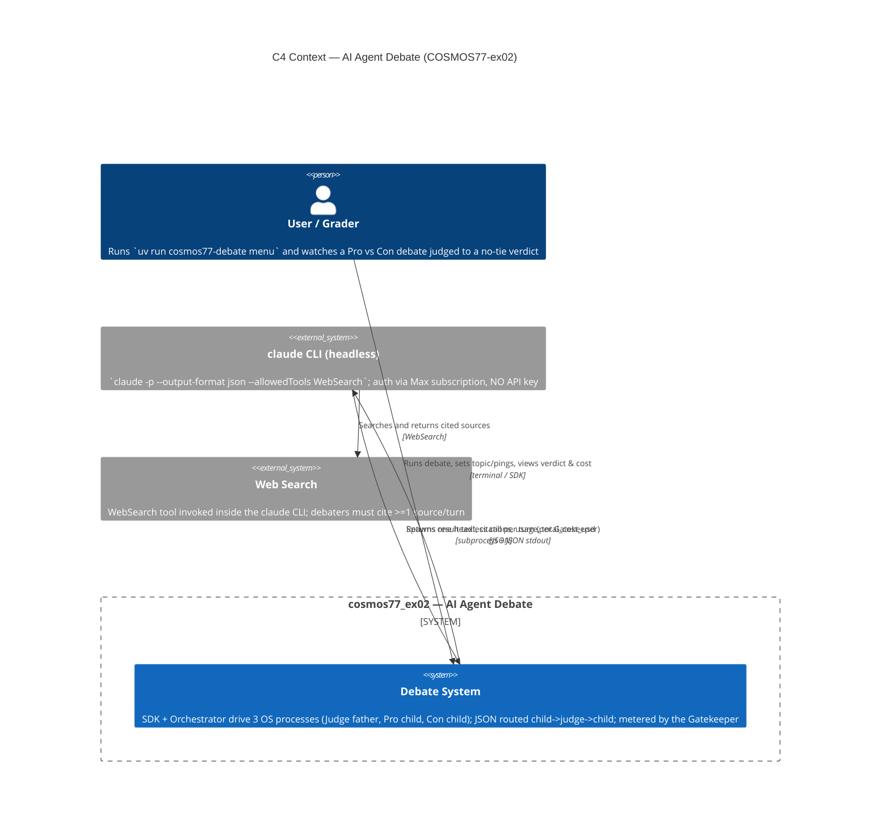
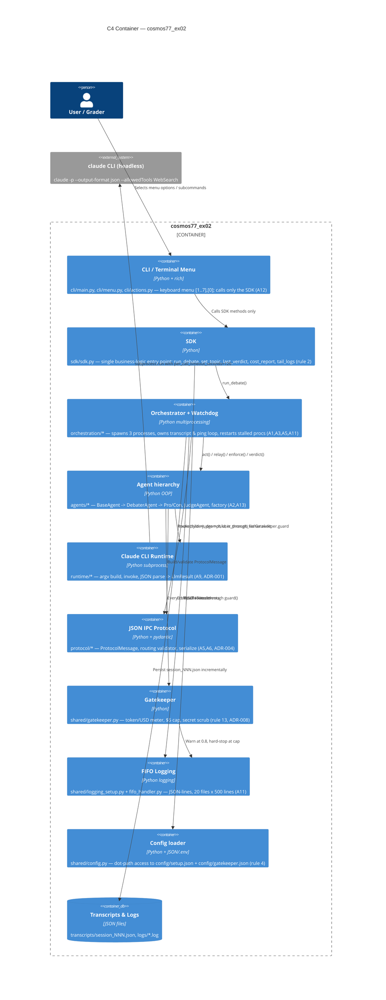
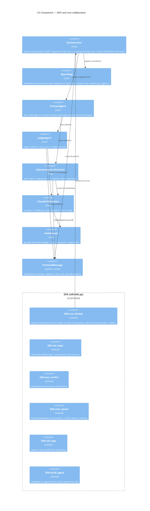
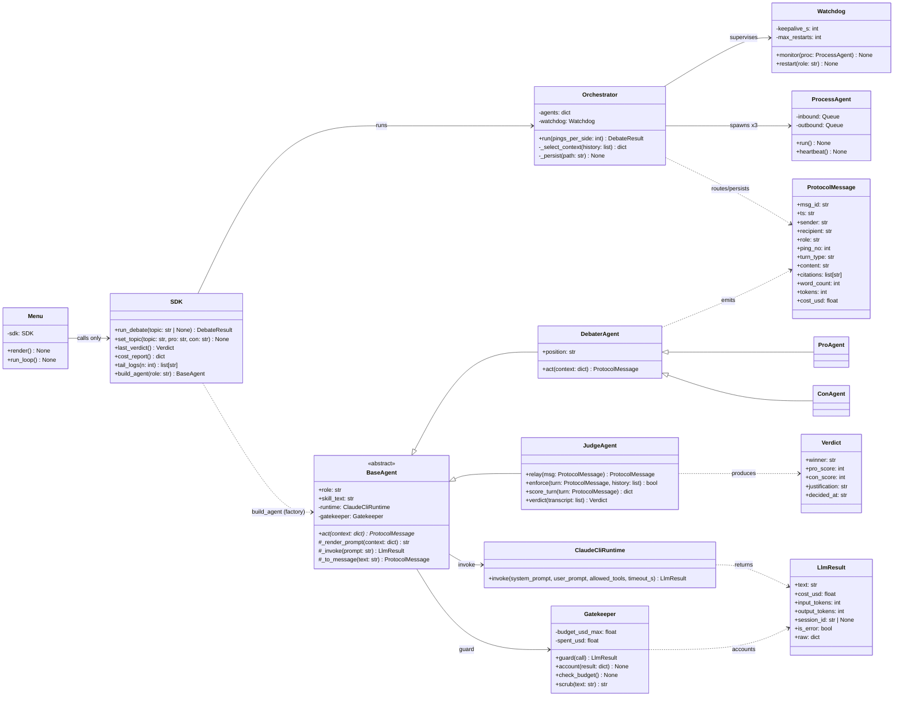

# PLAN.md — Architecture & Build Plan (COSMOS77-ex02, AI Agent Debate)

> **Scope.** This document is the binding architecture and build plan for HW2 — *AI Agent Debate* (UOH-RL07, Dr. Yoram Segal). It specifies the C4 model (Context → Container → Component → Code), the runtime sequence of a single debate ping, the architectural decisions (ADRs) with their trade-offs, the phased delivery roadmap, and the risk register. It is the engineering counterpart to `docs/PRD.md` and the twelve per-mechanism PRDs (`docs/PRD_agent_base.md`, `docs/PRD_judge_agent.md`, `docs/PRD_debater_agents.md`, `docs/PRD_skills.md`, `docs/PRD_ipc_protocol.md`, `docs/PRD_orchestrator.md`, `docs/PRD_watchdog.md`, `docs/PRD_gatekeeper.md`, `docs/PRD_logging.md`, `docs/PRD_web_search.md`, `docs/PRD_terminal_menu.md`, `docs/PRD_extension_points.md`).
>
> Every fixed value cited here is read from `config/setup.json` and `config/gatekeeper.json` at runtime via the `Config` loader (rule 4 — zero hardcoded config). Nothing in this plan is invented: numbers are pinned to those files.

---

## 1. System summary

Three agents run as **three operating-system processes**:

- **Judge (father process)** — spawns, supervises, routes, enforces, and scores.
- **Pro (child process)** — argues that *"Social media is a NET POSITIVE for society."*
- **Con (child process)** — argues that *"Social media is a NET NEGATIVE for society."*

The debate topic is **"Is social media a net positive for society?"** (`debate.topic`). Children **never** talk to each other directly; **every** message is routed **child → judge → child** (A5). Each side takes **10 pings** (`debate.pings_per_side = 10`, A3). Every debater turn must (a) rebut the opponent (A4), (b) add exactly one new point, and (c) cite **≥ 1 web source** (A7); turns over **180 words** (`debate.max_words_per_turn = 180`) or missing a citation (`debate.require_citation_per_turn = true`) are rejected and retried (A10).

All LLM reasoning is produced by the **`claude` CLI in headless mode** — `claude -p --output-format json --allowedTools WebSearch` — authenticated through the developer's Claude Max subscription (no API key, see ADR-001). Every such call is wrapped by the **Gatekeeper**, which meters tokens and USD against a **$5.00 budget cap** (`gatekeeper.budget_usd_max = 5.00`) and aborts the debate cleanly when exceeded (rule 13, A11, ADR-008).

The Judge scores **persuasiveness** — clarity, evidence use, rebuttal quality, rhetorical force — **not** factual truth. Lies are permitted and are expected to be caught by the *opponent*, never penalized by the Judge for being false. The verdict is **never a tie** (A8): the Judge always names a winner with a differential score (e.g., Pro 80 / Con 73) and a written justification grounded in specific turns.

---

## 2. C4 model

### 2.1 Level 1 — System Context

The grader/user launches one command; the `cosmos77_ex02` system orchestrates three agent processes, each of which reaches the external `claude` CLI, which in turn performs web search.



### 2.2 Level 2 — Container

Each "container" is a deployable/runnable unit inside the package. The CLI/Menu and Orchestrator are the only callers of business logic, and both go through the single `SDK` entry point (rule 2, ADR-005).



### 2.3 Level 3 — Component (inside the SDK and its collaborators)



### 2.4 Level 4 — Code (class diagram)

This is the committed OOP class diagram required by A13 (also rendered to `assets/architecture.png` in Phase 9 from `docs/diagrams/architecture.mmd`).



---

## 3. Sequence — one full ping

A *ping* = one Pro argument followed by the Con counter-argument (A3). Every message passes through the Judge (A5). The Judge **enforces** before relaying: an over-length (>180 words) or citation-less turn is rejected and the debater is asked to redo it (A7, A10). At the end of all pings the Judge produces the no-tie verdict (A8).

```mermaid
sequenceDiagram
    autonumber
    actor User
    participant SDK
    participant Orch as Orchestrator
    participant WD as Watchdog
    participant Pro as Pro process
    participant Judge as Judge process (father)
    participant Con as Con process
    participant GK as Gatekeeper
    participant CLI as claude -p (+WebSearch)

    User->>SDK: run_debate()
    SDK->>Orch: run(pings_per_side=10)
    Orch->>WD: start heartbeat monitor (keepalive=15s)

    Note over Orch,Pro: --- Pro turn of ping N ---
    Orch->>Pro: context {opponent_last + running_summary}
    Pro->>GK: guard(invoke)  pre-check budget vs $5.00 cap
    GK->>CLI: claude -p --output-format json --allowedTools WebSearch (timeout 120s)
    CLI-->>GK: {result, citations[], usage, total_cost_usd}
    GK->>GK: account(total_cost_usd); warn @0.8; raise BudgetExceeded @cap
    GK-->>Pro: LlmResult
    Pro-->>Judge: ProtocolMessage(sender=pro, recipient=judge)
    Judge->>Judge: enforce(turn) -> words<=180 AND citations>=1 AND rebuts opponent
    alt turn rejected (no citation / >180 words / no rebuttal / agreeing)
        Judge-->>Pro: redo request (role reminder)
        Pro-->>Judge: corrected ProtocolMessage
    end
    Judge->>Judge: score_turn(persuasiveness only; truth ignored)
    Judge-->>Con: relay(Pro turn)  child->judge->child

    Note over Orch,Con: --- Con turn of ping N ---
    Orch->>Con: context {Pro's last turn + running_summary}
    Con->>GK: guard(invoke)
    GK->>CLI: claude -p (+WebSearch)
    CLI-->>GK: {result, citations[], usage, total_cost_usd}
    GK-->>Con: LlmResult
    Con-->>Judge: ProtocolMessage(sender=con, recipient=judge)
    Judge->>Judge: enforce + score_turn
    Judge-->>Pro: relay(Con turn)
    Orch->>Orch: persist transcripts/session_NNN.json (incremental)

    Note over Orch,Judge: After 10 pings/side
    Orch->>Judge: verdict(transcript)
    Judge-->>Orch: Verdict(winner, pro_score != con_score, justification)
    Orch-->>SDK: DebateResult(transcript_path, verdict)
    SDK-->>User: winner + differential score + justification
```

If the Watchdog observes no heartbeat from a process for longer than `orchestration.watchdog_keepalive_seconds = 15`, or the process dies, it terminates and respawns it (up to `orchestration.max_restarts_per_agent = 3`), replaying the last context so the debate continues (see `docs/PRD_watchdog.md`). A single `claude -p` call that exceeds `runtime.per_call_timeout_seconds = 120` raises `RuntimeTimeout` in `ClaudeCliRuntime` (see `docs/PRD_agent_base.md`).

---

## 4. Architecture Decision Records (ADRs)

Each ADR records the decision, the alternatives considered, and the trade-off. Where a rule makes an alternative impossible, this section is the authorized place to record it (per `CLAUDE.md` "When in doubt").

### ADR-001 — Claude CLI headless over the Agent SDK / API key
- **Status:** Accepted.
- **Decision:** All LLM reasoning is produced by invoking the `claude` CLI headless: `claude -p --output-format json --allowedTools WebSearch` (`runtime.claude_cli_path = "claude"`, `runtime.output_format = "json"`, `runtime.allowed_tools = ["WebSearch"]`). Implemented in `runtime/claude_cli.py` (see `docs/PRD_agent_base.md`, `docs/PRD_web_search.md`).
- **Alternatives:** (a) the Anthropic API + an `ANTHROPIC_API_KEY`; (b) the Agent SDK / a hosted agent framework.
- **Trade-off:** The CLI uses the existing **Max subscription** — no API key in the repo (rule 9, A14), built-in `WebSearch` tooling satisfies the mandatory-citation requirement (A7) without a custom search integration, and the JSON envelope exposes `total_cost_usd` and `usage` that the Gatekeeper reads directly (rule 13). The cost is a subprocess boundary (slower than an in-process SDK call, must mock `subprocess` in tests per rule 6) and coupling to the CLI's JSON shape. We accept this because it is exactly on-theme for the course (terminal-only, CLI-driven, A14) and removes all secret-management risk. The alternative WebSearch backend (a Python `WebSearchTool`) is kept only as a documented fallback (`docs/PRD_web_search.md`, ADR cross-reference there).

### ADR-002 — Stateless agents + orchestrator-owned context over per-agent persistent sessions
- **Status:** Accepted.
- **Decision:** Agents are **stateless** between turns. The **Orchestrator owns the transcript** and performs Context Engineering each turn: it **SELECTs** the opponent's last turn plus a short running summary into the next agent's prompt, and **WRITEs/evicts** older raw turns to keep the prompt small (see `docs/PRD_orchestrator.md`). Each `act()` is a fresh `claude -p` call.
- **Alternatives:** (a) per-agent persistent CLI sessions via `claude --resume <session_id>`; (b) long-lived in-memory agent objects accumulating full history.
- **Trade-off:** Statelessness makes Watchdog restarts **clean** — a respawned process simply replays the last orchestrator-owned context, with no lost session state (A11). It keeps each prompt small, which directly lowers tokens and therefore USD against the $5.00 cap (ADR-008). The cost is that the Orchestrator must reconstruct context every turn and the model has no implicit memory of earlier turns. We rejected `claude --resume` because a crashed/killed session id cannot be reliably resumed by a fresh process, which would defeat the watchdog requirement; persistent in-memory agents were rejected because they balloon context (cost) and complicate the kill/restart story. This decision is the course-aligned "Context Engineering over Prompt Engineering" position stated in `docs/PRD.md`.

### ADR-003 — `multiprocessing` + Queues for IPC
- **Status:** Accepted.
- **Decision:** Each agent is a real OS process via `multiprocessing.Process`, with one inbound and one outbound `multiprocessing.Queue` per process (`orchestration/process_agent.py`). The loop: wait for a context message → `agent.act()` → put a `ProtocolMessage` on the outbound queue → emit a heartbeat (see `docs/PRD_orchestrator.md`, `docs/PRD_watchdog.md`).
- **Alternatives:** (a) `threading` (one process, shared memory); (b) `asyncio` coroutines; (c) sockets/HTTP between separately launched processes.
- **Trade-off:** `multiprocessing` gives genuine OS-level process isolation — satisfying the literal "agent = process" requirement (A1) — and clean `terminate()`/respawn semantics the Watchdog needs (A11). Queues are pickle-serializable, test-friendly, and avoid a network stack. Threads were rejected (no real process isolation, fails A1); asyncio was rejected (single process, same problem); sockets were rejected as needless complexity for local agents. The cost is pickle/serialization overhead and the need to keep `ProtocolMessage` picklable (it is — pydantic model, ADR-004).

### ADR-004 — JSON + pydantic protocol
- **Status:** Accepted.
- **Decision:** Every inter-process message is a `ProtocolMessage` pydantic model serialized to JSON (`protocol/message.py`, `protocol/serialize.py`), with a routing validator (`protocol/routing.py`) that enforces child → judge → child (see `docs/PRD_ipc_protocol.md`). Fields: `{msg_id, ts, sender, recipient, role, ping_no, turn_type, content, citations[], word_count, tokens, cost_usd}`.
- **Alternatives:** (a) free-form Python dicts; (b) pickled custom objects; (c) Protobuf/Avro.
- **Trade-off:** pydantic gives **schema validation for free** — rejecting a turn that is over `max_words_per_turn = 180` or has empty `citations[]` when `require_citation_per_turn = true` (A6, A7, A10) — and the JSON is human-auditable in `transcripts/session_NNN.json` and the FIFO logs (A15). The routing validator makes child→child traffic a hard error (A5). JSON is token-frugal and monitorable. Plain dicts were rejected (no validation), Protobuf rejected (build complexity, unreadable transcripts, overkill for local IPC).

### ADR-005 — SDK as the single entry point
- **Status:** Accepted (rule 2).
- **Decision:** All business logic flows through `class SDK` in `src/cosmos77_ex02/sdk/sdk.py`. The terminal menu, CLI subcommands, the orchestrator entry, and any external/programmatic consumer call **only** the SDK, never internals (see `docs/PRD_terminal_menu.md`).
- **Alternatives:** the CLI/menu calling the Orchestrator and agents directly.
- **Trade-off:** A single façade keeps the menu thin (it just maps keys to SDK methods, A12), makes the system **programmatically drivable** so an agent can debug it without the UI (rule 2), and isolates UI churn from core logic. The cost is one extra indirection layer and the discipline of never reaching past it — enforced in review and by keeping `cli/*` excluded from coverage (`[tool.coverage.run] omit`).

### ADR-006 — `uv`-only toolchain
- **Status:** Accepted (rule 5, A14).
- **Decision:** `uv` is the only package manager: `uv add`, `uv sync`, `uv run`. Never `pip`, `venv`, or `python script.py`. Reproducibility is guaranteed by `pyproject.toml` + a committed `uv.lock` (`uv lock --check` in QA).
- **Alternatives:** pip + `requirements.txt` + venv; Poetry; conda.
- **Trade-off:** `uv` gives fast, deterministic, lockfile-backed installs so the grader can rebuild the environment with one `uv sync` (A14). The `claude` CLI is documented as an **external prerequisite**, not a pip dependency. The cost is requiring `uv` on the grader's machine — a one-time install documented in the README quickstart and accepted as course-standard.

### ADR-007 — 150-line hard cap per `.py` file
- **Status:** Accepted (rule 1).
- **Decision:** No `.py` file exceeds **150 lines** (comments and blanks included), enforced by `scripts/check_line_cap.py` in pre-commit and CI. Oversized modules are split (e.g., `runtime/` → `claude_cli.py` + `argv.py` + `parse.py`; `orchestration/` → `orchestrator.py` + `loop.py`; logging → `logging_setup.py` + `fifo_handler.py`).
- **Alternatives:** a soft style guideline; a higher cap (e.g., 300).
- **Trade-off:** A hard cap forces single-responsibility modules and a clean OOP decomposition (rule 3, A13), and is a graded, automatically-checked rule. The cost is more files and more imports; we accept it because the split mirrors the component boundaries in §2.3 anyway, and the cap is non-negotiable for the grade.

### ADR-008 — Gatekeeper budget cap value and rationale
- **Status:** Accepted (rule 13, A11).
- **Decision:** The Gatekeeper (`shared/gatekeeper.py`) meters every `claude -p` call by reading `total_cost_usd`/`usage` from the JSON result and accumulating spend. It **warns at `warn_at_fraction = 0.8`** ($4.00) and **hard-stops** (`hard_stop = true`) the debate cleanly via `BudgetExceeded` at **`budget_usd_max = $5.00`**, with a per-call ceiling of **`per_call_usd_max = $0.50`**. Every agent call is wrapped by `Gatekeeper.guard()` (pre-check → run → account → post-check).
- **Alternatives:** no cap; a token-count cap instead of USD; a higher/lower dollar figure.
- **Trade-off:** $5.00 is sized so a full **10-ping** run (≈ 20 debater turns + judge relays/scoring + 1 verdict, each well under the $0.50 per-call ceiling) completes with comfortable headroom, while still guaranteeing the run cannot silently run away — directly closing the HW1 "cost awareness" weakness (`docs/PRD.md`, README cost section). A USD cap is chosen over a raw token cap because USD is what the subscription/billing actually measures and is what the cost report projects (10-vs-5-ping). If the cap ever trips mid-run, the system aborts gracefully and the documented fallback is to lower `pings_per_side` and rerun. The Gatekeeper also `scrub()`s anything resembling a key/token before logging (cyber layer, rule 9). See `docs/PRD_gatekeeper.md`.

---

## 5. Phased roadmap (mirrors the playbook §3–§14)

Delivery is strictly phased; phases are not batched (the lecturer grades commit cadence). Each phase ends with: update `docs/TODO.md`, save `docs/prompts/NNN_*.md`, multiple conventional commits, `git push origin main`, and a green GitHub Actions run.

| Phase | Title | Key outputs | Acceptance focus |
|---|---|---|---|
| **0** | Bootstrap + tooling + `CLAUDE.md` + CI | Repo skeleton, `pyproject.toml`, configs (`setup.json`, `gatekeeper.json`, `logging_config.json`), pre-commit, CI, line-cap script | A14; rules 1,4,5,9 |
| **1** | Mandatory docs | `docs/PRD.md`, this `docs/PLAN.md`, `docs/TODO.md` (≥600), 12 per-mechanism PRDs | A13 (diagrams), planning |
| **2** | Shared infrastructure | `shared/config.py`, `version.py`, `logging_setup.py` + `fifo_handler.py` (20×500 FIFO), `gatekeeper.py` (USD meter), `sdk/sdk.py` skeleton | A11; rules 2,4,7,13 |
| **3** | Claude CLI runtime | `runtime/claude_cli.py` + `argv.py` + `parse.py` → `LlmResult`; `RuntimeTimeout`; subprocess mocked | A9; ADR-001 |
| **4** | Agent hierarchy + 3 distinct Skills | `agents/base.py`, `debater.py`, `pro.py`, `con.py`, `judge.py`, `factory.py`; `skills/skill_pro.md`, `skill_con.md`, `skill_judge.md` | A2, A13; rule 3 |
| **5** | JSON IPC protocol | `protocol/message.py` (pydantic), `routing.py`, `serialize.py` | A5, A6; ADR-004 |
| **6** | Orchestrator + Watchdog | `orchestration/process_agent.py`, `orchestrator.py` (+`loop.py`), `watchdog.py`; live smoke test (marker) | A1, A3, A4, A5, A9, A11 |
| **7** | Judge logic | Strengthened `JudgeAgent.enforce/score_turn/verdict`; `agents/verdict.py` (no-tie `Verdict`) | A4, A7, A8, A10 |
| **8** | Terminal menu + CLI | `cli/menu.py`, `cli/actions.py`, `cli/main.py`; `cosmos77-debate` script | A12 |
| **9** | Real run + diagrams + cost | `transcripts/session_001.json`, `docs/diagrams/architecture.mmd` + `sequence.mmd` rendered to `assets/`, `transcripts/session_001_cost.json`, screenshots | A13, A15; cost awareness |
| **10** | README lab report | Full `README.md` (≥250 lines, ≥5 images, full session-1 dialogue, cost analysis, self-assessment) | A15 |
| **11** | QA gauntlet | All gates green; `docs/ACCEPTANCE.md` mapping A1–A15 → test/file → status | A1–A15 audit |
| **12** | Cover PDF + tag + release | `COSMOS77-ex02.pdf` (exercise 2), `v1.00` tag + GitHub Release | submission |

**Quality gates carried across every phase:** `uv run ruff check .` → zero (rule 8); `uv run pytest --cov-fail-under=85` → green with **all** subprocess/LLM/network I/O mocked (rules 6, 7, 17); `scripts/check_line_cap.py` → 0 offenders (rule 1); conventional commits referencing TODO IDs (rule 11); a prompt-log file per phase (rule 12).

---

## 6. Risk register

| ID | Risk | Likelihood | Impact | Mitigation | Owner / artifact |
|---|---|---|---|---|---|
| **R1** | **LLM stalls / hangs** — a `claude -p` call never returns, or a child process freezes. | Medium | High (debate hangs → fails the "runs end-to-end" grade) | Per-call timeout `runtime.per_call_timeout_seconds = 120` raising `RuntimeTimeout`; Watchdog keep-alive `watchdog_keepalive_seconds = 15` detects a missing heartbeat and `terminate()`s + respawns the process (up to `max_restarts_per_agent = 3`), replaying last context. | `runtime/claude_cli.py`, `orchestration/watchdog.py`; `docs/PRD_watchdog.md` |
| **R2** | **Citation-less turn** — a debater argues without a web source, or fabricates one. | Medium | High (violates A7) | `require_citation_per_turn = true`; `JudgeAgent.enforce()` rejects a turn with empty `citations[]` and requests a redo; `ProtocolMessage` pydantic validator fails empty-citation turns; debaters run with `--allowedTools WebSearch`; Python `WebSearchTool` fallback documented. | `protocol/message.py`, `agents/judge.py`; `docs/PRD_web_search.md` |
| **R3** | **Agents auto-agree** — Pro and Con converge into parallel monologues or concede. | Medium | High (kills the "real contradiction" substance, violates A2/A4) | Pro and Con load **deliberately different** Skills (opportunity/optimist framing vs precaution/skeptic framing) with **distinct Description lines**; each turn must explicitly rebut the opponent's last point (A4); `JudgeAgent.enforce()` detects "I agree"-style drift and intervenes with a role reminder; positions are fixed config strings, never conceded. | `skills/skill_pro.md`, `skill_con.md`, `agents/judge.py`; `docs/PRD_debater_agents.md`, `docs/PRD_skills.md` |
| **R4** | **Budget overrun** — cumulative cost approaches/exceeds the cap mid-debate. | Low–Medium | Medium (incomplete run) | Gatekeeper meters `total_cost_usd` per call, warns at `warn_at_fraction = 0.8` ($4.00), enforces `per_call_usd_max = $0.50`, and hard-stops cleanly via `BudgetExceeded` at `budget_usd_max = $5.00` (`hard_stop = true`); stateless agents + context trimming (ADR-002) keep per-call tokens low; documented fallback to lower `pings_per_side` and rerun. | `shared/gatekeeper.py`; `docs/PRD_gatekeeper.md`, ADR-008 |
| **R5** | **Tie / unjustified verdict** — the Judge equivocates or returns equal scores. | Low | High (violates A8) | `Verdict` dataclass validation **forbids equal scores / "tie"**; the Judge breaks close calls on rebuttal quality and must ground the justification in specific turns. | `agents/verdict.py`, `agents/judge.py`; `docs/PRD_judge_agent.md` |
| **R6** | **Child→child leak** — a message bypasses the father. | Low | High (violates A5) | `protocol/routing.validate_route()` rejects any debater→debater route; `is_through_father(history)` audit asserted in orchestration tests. | `protocol/routing.py`; `docs/PRD_ipc_protocol.md` |
| **R7** | **Flaky / live-LLM tests** — the suite calls the real CLI or non-determinism creeps in. | Low | Medium (CI red, rule 17) | All subprocess/LLM/network I/O mocked; seeds fixed; the live end-to-end test sits behind a `live` marker, skipped in CI, runnable locally. | `tests/`, `tests/integration/test_debate_smoke.py` |
| **R8** | **Ceremony-over-substance** (the HW1/HW2 trap) — docs polished but the debate doesn't actually run. | Medium | High | Phase 6 (working debate) is the top effort allocation; Phase 9 commits a real `transcripts/session_001.json`; Phase 11 re-runs end-to-end and produces `docs/ACCEPTANCE.md` mapping every A1–A15 to a passing test/artifact. | `orchestration/*`, `docs/ACCEPTANCE.md` |

---

## 7. Cross-references

- Requirements & user stories, KPIs, scope: `docs/PRD.md`.
- Per-mechanism detail: `docs/PRD_agent_base.md`, `docs/PRD_judge_agent.md`, `docs/PRD_debater_agents.md`, `docs/PRD_skills.md`, `docs/PRD_ipc_protocol.md`, `docs/PRD_orchestrator.md`, `docs/PRD_watchdog.md`, `docs/PRD_gatekeeper.md`, `docs/PRD_logging.md`, `docs/PRD_web_search.md`, `docs/PRD_terminal_menu.md`.
- Extensibility (add an agent / topic / backend / rubric): `docs/PRD_extension_points.md` (referenced by ADR-001 and ADR-002).
- Rendered diagrams (Phase 9): `docs/diagrams/architecture.mmd` + `docs/diagrams/sequence.mmd` → `assets/architecture.png`, `assets/sequence.png`.
- Acceptance audit (Phase 11): `docs/ACCEPTANCE.md`.

*All configured values in this document are read at runtime from `config/setup.json` and `config/gatekeeper.json`; this plan never hardcodes them (rule 4).*
