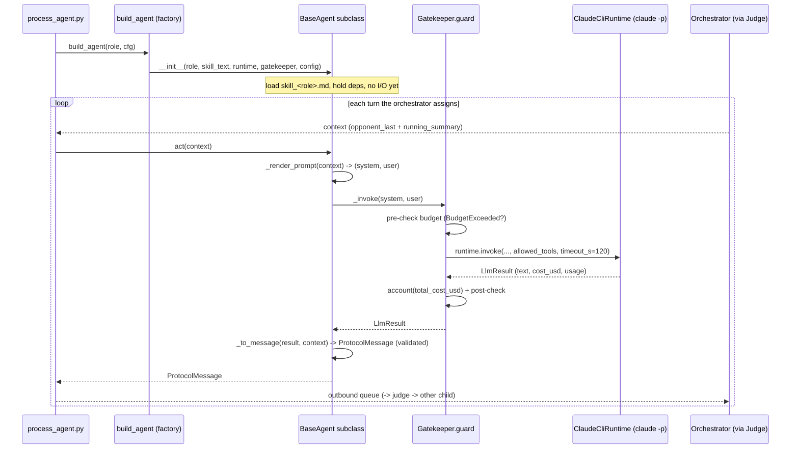

# PRD — BaseAgent (the `claude -p` agent abstraction)

> **Status:** authoritative (Phase 1). Supersedes the Phase-0 placeholder.
> **Scope:** the shared abstract base class for all three debate agents — Judge (father), Pro, Con — implemented in Phase 4 at `src/cosmos77_ex02/agents/base.py`.
> **Sibling PRDs:** `docs/PRD_judge_agent.md`, `docs/PRD_debater_agents.md`, `docs/PRD_skills.md`, `docs/PRD_ipc_protocol.md`, `docs/PRD_gatekeeper.md`, `docs/PRD_web_search.md`, `docs/PRD_orchestrator.md`, `docs/PRD_watchdog.md`. The whole-assignment context lives in `docs/PRD.md`; architecture and ADRs in `docs/PLAN.md`.

---

## 1. Purpose and rationale

`BaseAgent` is the single OOP abstraction every debate participant inherits from. It exists so that the three agents — `JudgeAgent`, `ProAgent`, `ConAgent` — share **one** code path for the four things every agent does on every turn:

1. **Build a prompt** from its Skill text plus orchestrator-injected context.
2. **Invoke the runtime** (`claude -p --output-format json`) to get a real LLM response.
3. **Account for cost** by routing the call through the Gatekeeper.
4. **Emit a typed protocol message** (`ProtocolMessage`) that the orchestrator can route and log.

This directly serves rule **3** (OOP, no duplication: "logic in 3 files → base class") and rule **13** (every LLM/agent invocation routes through the Gatekeeper) from `CLAUDE.md`. Without this base, the Judge/Pro/Con classes would each re-implement subprocess invocation, JSON parsing, cost metering, timeout handling, and message construction — exactly the duplication the 17 rules forbid. By concentrating that logic here, the subclasses are reduced to *policy* (what to ask the LLM and how to validate the answer), while `BaseAgent` owns *mechanism*.

`BaseAgent` is the contract that closes the HW1 "extensibility" weakness (see `docs/PRD_extension_points.md`): adding a fourth agent or a new backend is "subclass `BaseAgent` + write a Skill", not "rewrite the call stack".

### Acceptance-criteria mapping

| Criterion (playbook §1.5) | How BaseAgent contributes |
|---|---|
| **A1** — 3 agents as 3 processes | Each `BaseAgent` instance is constructed inside its own OS process by `orchestration/process_agent.py`; the base is process-agnostic and holds no cross-process state. |
| **A2** — distinct Skills, unbiased judge | The base loads Skill text by role from `skills/`; subclasses pick *which* file, so the same base yields genuinely different behaviour (`docs/PRD_skills.md`). |
| **A6** — JSON protocol | `_to_message()` returns a validated `ProtocolMessage` (`docs/PRD_ipc_protocol.md`). |
| **A7** — mandatory web search + citation | The base passes `allowed_tools=["WebSearch"]` (from `runtime.allowed_tools`) to the runtime; debater subclasses parse and require ≥1 citation (`docs/PRD_web_search.md`). |
| **A9** — real LLM debate | `act()` content always originates from a real `claude -p` call via `_invoke()`; the base never fabricates argument text in Python. |
| **A11** — timeouts, Gatekeeper, no hardcoding | Per-call timeout from `runtime.per_call_timeout_seconds` (120s); every call wrapped by `Gatekeeper.guard`; all knobs read from `config/setup.json`. |

---

## 2. Responsibilities (and explicit non-responsibilities)

### 2.1 BaseAgent IS responsible for

- **Holding agent identity and dependencies**: `role` (one of `constants.ROLES = ("judge","pro","con")`), the loaded Skill text, a `ClaudeCliRuntime` instance, and a `Gatekeeper` instance.
- **Rendering the prompt** from Skill + injected context (`_render_prompt`).
- **Invoking the runtime through the Gatekeeper** (`_invoke`), so budget metering is unavoidable.
- **Parsing the runtime result** into an `LlmResult` (delegated to the runtime; see `docs/PRD_web_search.md` and Phase 3 `runtime/parse.py`).
- **Constructing a `ProtocolMessage`** from the LLM text plus cost/token telemetry (`_to_message`).
- **Uniform error and timeout handling** for every subclass (one `try/except` surface here, not three — rule 3).

### 2.2 BaseAgent is NOT responsible for

- **Routing.** Messages go child → judge → child. The base only *emits* a `ProtocolMessage`; the **Orchestrator** delivers it and the **Judge** relays it (`docs/PRD_orchestrator.md`, `docs/PRD_judge_agent.md`). The base never sends a message to a peer.
- **Turn-taking / ping counting.** Owned by the Orchestrator's loop (`docs/PRD_orchestrator.md`, A3).
- **Process spawning / lifecycle of the OS process.** Owned by `orchestration/process_agent.py` and the **Watchdog** (`docs/PRD_watchdog.md`, A1/A11).
- **Scoring or the verdict.** Owned by `JudgeAgent` (`docs/PRD_judge_agent.md`, A8). The base only gives the Judge the same call mechanism.
- **Persona content.** Lives in the Skill markdown files (`docs/PRD_skills.md`, A2).

---

## 3. Public contract: `act(context) -> ProtocolMessage`

`act` is the single **abstract** method every subclass must implement. It is the entire public surface of an agent as seen by the Orchestrator.

```python
from abc import ABC, abstractmethod

class BaseAgent(ABC):
    """Abstract base for every debate agent (judge, pro, con).

    Owns the shared mechanism — prompt rendering, gated LLM invocation,
    and protocol-message emission — so subclasses only encode policy
    (what to ask and how to validate). One agent instance lives inside
    one OS process (see orchestration/process_agent.py).
    """

    def __init__(
        self,
        role: str,
        skill_text: str,
        runtime: ClaudeCliRuntime,
        gatekeeper: Gatekeeper,
        config: Config,
    ) -> None: ...

    @abstractmethod
    def act(self, context: dict) -> ProtocolMessage:
        """Produce this agent's next protocol message for the given turn context.

        Args:
            context: orchestrator-supplied turn context (see §4).

        Returns:
            A validated ProtocolMessage carrying the agent's output plus
            cost/token telemetry.

        Raises:
            RuntimeTimeout: the claude -p call exceeded per_call_timeout_seconds.
            BudgetExceeded: the Gatekeeper budget cap was reached pre/post call.
            ValidationError: the emitted message failed pydantic validation.
        """
```

### Contract guarantees

- **Pure-ish from the caller's view:** `act(context)` takes a context dict and returns a `ProtocolMessage`. It has no side effects on shared state and never talks to a peer agent (A5).
- **Telemetry-complete:** the returned message always carries `tokens` and `cost_usd` populated from the `LlmResult`, so the Orchestrator/log can build the cost report (`docs/PRD_gatekeeper.md`, A15 cost section).
- **Subclass shape:**
  - `DebaterAgent.act` (and its `ProAgent`/`ConAgent` subclasses) builds a turn that rebuts the opponent's last point, adds one new point, and requires ≥1 citation within `max_words_per_turn` = **180** words (`docs/PRD_debater_agents.md`, A4/A7/A10).
  - `JudgeAgent.act` produces relay/enforcement/scoring output and, at debate end, the no-tie `Verdict` (`docs/PRD_judge_agent.md`, A8).

---

## 4. The injected-context contract

The Orchestrator owns the transcript and practices Context Engineering: it **selects** the opponent's last turn plus a short running summary into each agent's context and **evicts** older raw turns to keep prompts (and cost) small (`docs/PRD_orchestrator.md`). `BaseAgent` consumes — never builds — this context. The agreed `context` dict shape:

| Key | Type | Meaning |
|---|---|---|
| `topic` | `str` | The debate topic — `"Is social media a net positive for society?"` (from `debate.topic`). |
| `position` | `str` | This agent's fixed stance (Pro = `debate.pro_position`, Con = `debate.con_position`; empty/neutral for the judge so it does **not** know the "right answer", A2). |
| `ping_no` | `int` | Current ping index (1..`pings_per_side` = **10**). |
| `turn_type` | `str` | One of `constants.TURN_TYPES = ("opening","rebuttal","closing")`. |
| `opponent_last` | `ProtocolMessage \| None` | The opponent's previous turn to rebut (None on the very first turn). |
| `running_summary` | `str` | Orchestrator-maintained condensed history (Context Engineering "Write/evict"). |
| `constraints` | `dict` | Echoed config: `max_words_per_turn` (180), `require_citation_per_turn` (true), `language` ("english"). |

This shape is the seam between `docs/PRD_orchestrator.md` (producer) and this PRD (consumer); both must stay in sync. The base does not mutate the context.

---

## 5. Shared helpers

These three protected helpers are the reusable machinery. They live in `BaseAgent` so no subclass repeats them (rule 3). If `base.py` approaches the 150-line cap (rule 1), the prompt-template strings move to a `agents/prompt_templates.py` constants module and the helpers stay thin.

### 5.1 `_render_prompt(context) -> tuple[str, str]`

Assembles the `(system_prompt, user_prompt)` pair the runtime needs.

- **System prompt** = the agent's **Skill text** (loaded from `skills/skill_<role>.md`; see `docs/PRD_skills.md`). This is passed to `claude -p` as `--append-system-prompt`. The Skill's one-line *Description* drives selection; the persona body sets the rhetoric (Pro = opportunity framing, Con = risk/precaution framing) so the debate genuinely contradicts (A2) and never auto-agrees.
- **User prompt** = a deterministic render of the injected `context` (§4): the topic, this agent's position, the turn type, the opponent's last argument to rebut, the running summary, and the explicit constraints (≤180 words, must cite ≥1 web source, English only). The render is a fixed template filled with context values — **no LLM argument text is invented here** (A9).
- Deterministic and pure → unit-testable with no I/O (rule 6, rule 17).

### 5.2 `_invoke(system_prompt, user_prompt) -> LlmResult`

The single point where an agent touches the outside world. **Always** wrapped by the Gatekeeper:

```python
def _invoke(self, system_prompt: str, user_prompt: str) -> LlmResult:
    """Run one claude -p call, metered and budget-guarded.

    Wraps the runtime call in Gatekeeper.guard so the budget is checked
    BEFORE the call and the spend is accounted AFTER it (rule 13).
    """
    rt = self._config.get("runtime")
    return self._gatekeeper.guard(
        lambda: self._runtime.invoke(
            system_prompt,
            user_prompt,
            allowed_tools=rt["allowed_tools"],            # ["WebSearch"]
            timeout_s=rt["per_call_timeout_seconds"],     # 120
        )
    )
```

- `Gatekeeper.guard(callable)` performs **pre-check budget → run → account → post-check** (`docs/PRD_gatekeeper.md`). It reads `total_cost_usd`/`usage` from the `claude -p` JSON and accumulates spend; it warns at `warn_at_fraction` = **0.8** and raises `BudgetExceeded` (clean, catchable) when accumulated spend reaches `budget_usd_max` = **$5.00**, with `per_call_usd_max` = **$0.50** as the single-call ceiling. `hard_stop` = `true`. This guarantees rule 13 / A11 holds for every agent without any subclass remembering to do it.
- `allowed_tools` and `timeout_s` come straight from `config/setup.json` (`runtime` block) — no hardcoding (rule 4). The mandatory `WebSearch` tool here is what makes A7 (citations) possible; see `docs/PRD_web_search.md`.

### 5.3 `_to_message(llm_result, context) -> ProtocolMessage`

Maps an `LlmResult` + the turn `context` into a validated `ProtocolMessage` (`docs/PRD_ipc_protocol.md`):

- Sets `msg_id`, `ts`, `sender=self.role`, `recipient` (debaters always `"judge"`; the judge addresses the target child — routing enforced by `protocol/routing.py`, A5), `role`, `ping_no`, `turn_type`.
- Sets `content` = the LLM `text`; computes `word_count`; extracts `citations[]` (URLs/sources surfaced by `WebSearch`).
- Sets `tokens` = `input_tokens + output_tokens` and `cost_usd` = `LlmResult.cost_usd` (telemetry for A15 cost analysis).
- Construction runs pydantic validators: missing required fields, over-length `content` (> `max_words_per_turn` = 180), or empty `citations[]` when `require_citation_per_turn` = `true` raise a validation error. The base surfaces that to the subclass; the **Judge** turns it into a reject/retry (A7/A10) per `docs/PRD_judge_agent.md`. The base does not silently "fix" an invalid turn.

---

## 6. Class lifecycle



1. **Construction** (`__init__`): the factory `agents/factory.py::build_agent(role, cfg)` builds the right subclass; unknown role raises. Dependencies (`runtime`, `gatekeeper`, `config`) are **injected**, never constructed inside the agent — this keeps the base trivially mockable (rule 6) and lets the Watchdog rebuild an agent cheaply on restart (`docs/PRD_watchdog.md`). The Skill text is loaded once at construction.
2. **Per-turn `act()`**: the only repeated step (§3). Stateless between turns — the agent holds no transcript; all per-turn state arrives via `context` (ADR-002 in `docs/PLAN.md`: stateless agents + orchestrator-owned context). This statelessness is what makes a clean Watchdog restart possible (A11).
3. **Teardown**: the agent has no open handles to close (the runtime spawns a short-lived `claude -p` subprocess per call and returns). The process itself is torn down by `process_agent.py`/Watchdog.

---

## 7. Error handling

All error handling is centralised here so the three subclasses stay duplication-free (rule 3). Errors are typed and catchable so the Orchestrator/Watchdog can react deterministically.

| Failure | Source | Raised type | Handling |
|---|---|---|---|
| Budget cap reached | `Gatekeeper.guard` pre/post-check | `BudgetExceeded` | Propagated to the Orchestrator, which **aborts the debate cleanly**, persists the partial transcript, and exits with a budget message (A11; `docs/PRD_gatekeeper.md`). Never a crash. |
| Single call too expensive | Gatekeeper `per_call_usd_max` (0.50) | `BudgetExceeded` | Same clean-abort path. |
| Per-call timeout | runtime `subprocess.run(timeout=120)` | `RuntimeTimeout` | Propagated; the Watchdog treats a timed-out/stuck call as a stall, kills and restarts the process replaying its last context (`docs/PRD_watchdog.md`, A11). |
| `claude -p` non-zero exit / `is_error` | runtime | `RuntimeError` | Surfaced to the caller; Orchestrator may retry within `max_restarts_per_agent` = **3**. |
| Malformed / missing-cost JSON | `runtime/parse.py` | informative `ValueError` (missing cost → defaults to 0 + warning) | Parse errors bubble up; a missing cost field does not crash metering. |
| Invalid emitted message (no citation / over 180 words / bad route) | `_to_message` pydantic validators / `routing.validate_route` | `ValidationError` | Surfaced to the subclass; for debaters the **Judge** rejects and requests a redo (A7/A10), `docs/PRD_judge_agent.md`. |

Principles: **fail loud but catchable** (typed exceptions, never bare `except`); **never fabricate** a fallback argument to paper over an LLM failure (A9); **never silently exceed budget** (rule 13); secrets are scrubbed before any log write via the Gatekeeper's `scrub()` helper (`docs/PRD_gatekeeper.md`, cyber layer).

---

## 8. Timeout behaviour

- Every `claude -p` call is bounded by `runtime.per_call_timeout_seconds` = **120s**, passed through `_invoke` to `subprocess.run(timeout=...)` in the runtime. A breach raises `RuntimeTimeout` (never an indefinite hang) — this is the agent-local half of A11.
- The agent-local timeout is the **inner** guard; the **outer** guard is the Watchdog's `watchdog_keepalive_seconds` = **15s** heartbeat plus `max_restarts_per_agent` = **3** (`docs/PRD_watchdog.md`). The two layers are complementary: the inner timeout stops a single runaway call; the outer Watchdog handles a wedged process or one that stopped emitting heartbeats.
- `runtime.max_turns_per_call` = **6** caps the internal agentic turns of a single `claude -p` invocation (tool-use rounds for `WebSearch`), bounding both latency and cost per call.
- Because the agent is stateless (§6), a Watchdog restart simply reconstructs the agent via the factory and re-issues `act(context)` with the same context — no lost transcript, debate continues (A11).

---

## 9. Testing strategy (TDD, all I/O mocked)

Per rules 6, 7, and 17, every behaviour below has a happy-path and an error-path test under `tests/unit/test_agents/`, with `ClaudeCliRuntime` and `Gatekeeper` mocked — **no live `claude` calls in the suite** (the live end-to-end test is the Phase 6 `tests/integration/test_debate_smoke.py`, marker `live`, skipped in CI).

- `_render_prompt` returns a system prompt equal to the loaded Skill and a user prompt containing topic, position, opponent's last point, and the explicit 180-word/citation/English constraints — deterministic, no I/O.
- `_invoke` calls `Gatekeeper.guard` exactly once and forwards `allowed_tools=["WebSearch"]` and `timeout_s=120` from config (assert via mock); `BudgetExceeded` from the mock propagates unchanged.
- `_to_message` builds a valid `ProtocolMessage` with populated `tokens`/`cost_usd`; an over-180-word or citation-less `LlmResult` produces a validation error (feeds A7/A10).
- `act` is abstract — instantiating `BaseAgent` directly raises `TypeError`; subclasses (`ProAgent`, `ConAgent`, `JudgeAgent`) each return a `ProtocolMessage`.
- Timeout path: a runtime mock raising `RuntimeTimeout` surfaces unchanged from `act`.
- Determinism: any randomness seeded; no network/subprocess touches real binaries (rule 17). Target ≥ **90%** coverage on `agents/` (above the 85% floor) per the Phase 4 prompt.

---

## 10. Dependencies and file budget

- **Depends on:** `runtime/claude_cli.py` (`ClaudeCliRuntime`, `LlmResult`), `shared/gatekeeper.py` (`Gatekeeper`, `guard`, `BudgetExceeded`, `scrub`), `shared/config.py` (`Config`), `protocol/message.py` (`ProtocolMessage`) and `protocol/routing.py`, `constants.py` (`ROLES`, `TURN_TYPES`), and the `skills/skill_*.md` files.
- **Depended on by:** `agents/debater.py`, `agents/pro.py`, `agents/con.py`, `agents/judge.py`, `agents/factory.py`, and indirectly the Orchestrator/Watchdog and the `SDK`.
- **File budget (rule 1):** `agents/base.py` ≤ 120 lines (Phase 4 target, within the 150 hard cap). If exceeded, extract prompt-template constants into `agents/prompt_templates.py`; the helpers themselves stay in `base.py`. Type hints on every public signature, no bare `Any` (rule 16); Google-style docstrings explaining *why* (rule 15). English only (rule, spec).

---

## 11. Open questions / ADR pointers

- **Citation extraction location** — whether `_to_message` parses citations from the LLM text or the runtime surfaces them structurally is finalised in `docs/PRD_web_search.md`; the base treats `citations[]` as already-extracted strings.
- **Per-agent vs orchestrator-owned context** — resolved by **ADR-002** (`docs/PLAN.md`): stateless agents, orchestrator-owned context, for clean Watchdog restarts; `claude --resume` was considered and rejected.
- **Backend abstraction** — a future non-Claude backend implements the same `runtime.invoke(...) -> LlmResult` interface so `BaseAgent` is untouched (`docs/PRD_extension_points.md`, ADR-001).
