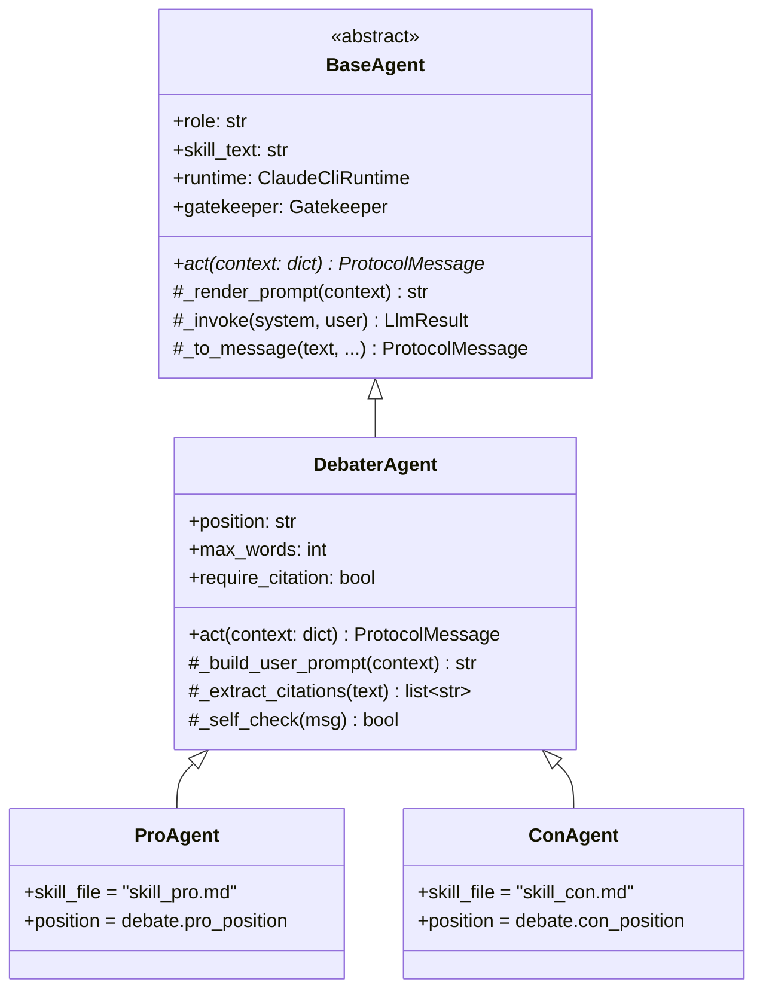

# PRD — Debater Agents (Pro & Con)

> **Status:** Authoritative (Phase 1 deliverable). Implements playbook §3 task 4.
> **Scope:** The two debating agents, `ProAgent` and `ConAgent`, that share one base class but load **different** Skills, and the mechanism that guarantees they produce a *real* contradiction and never auto-agree.
> **Binding rules:** `CLAUDE.md` (the 17 rules) and `../CLAUDE_CODE_PLAYBOOK.md` §1.5 (acceptance criteria A1–A15).
> **Sibling docs:** `docs/PRD_agent_base.md` (the BaseAgent contract), `docs/PRD_skills.md` (the three Skill files), `docs/PRD_judge_agent.md` (enforcement + verdict), `docs/PRD_ipc_protocol.md` (the message envelope), `docs/PRD_orchestrator.md` (the ping loop + context injection), `docs/PRD_web_search.md` (citation tool + fallback), `docs/PRD_gatekeeper.md` (cost metering), `docs/PRD_watchdog.md` (timeouts/restart).

---

## 1. Purpose & context

The substance of HW2 lives in a debate that **genuinely disagrees**. The single largest failure mode the playbook warns about (§0.0) is a system that compiles, ties, or *collapses into agreement* — two agents politely conceding to each other while the ceremony around them looks immaculate. This document specifies the debater agents so that outcome is **structurally impossible**, not merely discouraged by a prompt.

The two debaters are the producers of every argumentative turn. Each is a real OS process (A1) that:

- Receives an injected context (the opponent's last turn + a running summary) from the Orchestrator, routed **through the Judge** (A5 — children never talk directly; see `docs/PRD_orchestrator.md` and `docs/PRD_judge_agent.md`).
- Calls the LLM via the Claude CLI runtime through the Gatekeeper (A9 — arguments come from the LLM, never from Python string templates).
- Emits exactly one validated `ProtocolMessage` per turn (A6).

The Pro and Con agents are **the same code path on purpose** (rule 3 — OOP, no duplication). Everything that makes them adversaries is data: a different Skill file and a different fixed position string. This is the "same base, different Skills" requirement of A2, and the rest of this document is about making that difference *load-bearing*.

---

## 2. Configured facts this PRD is pinned to

All values are read via the Config loader (`src/cosmos77_ex02/shared/config.py`); none are hardcoded (rule 4). Source: `config/setup.json` and `config/gatekeeper.json`.

| Knob | Config path | Value | Effect on a debater |
|---|---|---|---|
| Topic | `debate.topic` | `"Is social media a net positive for society?"` | The shared subject both agents argue. |
| Pro position (fixed string) | `debate.pro_position` | `"Social media is a NET POSITIVE for society."` | `ProAgent`'s immutable thesis. |
| Con position (fixed string) | `debate.con_position` | `"Social media is a NET NEGATIVE for society."` | `ConAgent`'s immutable thesis. |
| Pings per side | `debate.pings_per_side` | `10` | Each debater produces 10 scored turns (A3). |
| Word limit per turn | `debate.max_words_per_turn` | `180` | Hard ceiling on `content`; over-limit turns are rejected/retried (A10). |
| Citation requirement | `debate.require_citation_per_turn` | `true` | Each turn must carry ≥1 source; zero citations → reject/retry (A7). |
| Language | `debate.language` | `"english"` | All output English only (rule "English only"). |
| Allowed tools | `runtime.allowed_tools` | `["WebSearch"]` | The only tool a debater may invoke (A7). |
| Per-call timeout | `runtime.per_call_timeout_seconds` | `120` | Watchdog kills a stalled turn after this (A11). |
| Max turns per call | `runtime.max_turns_per_call` | `6` | Caps WebSearch+reason loops inside one `claude -p` call. |
| Per-call USD ceiling | `per_call_usd_max` | `0.50` | Gatekeeper rejects a single turn that would exceed this. |
| Budget cap | `budget_usd_max` | `5.00` | Gatekeeper hard-stops the debate cleanly at this total. |

> **Rule:** none of these is ever literal in `agents/*.py`. Changing the topic, the positions, the ping count, or the word limit is a config edit only (this is also an extension point — see `docs/PRD_extension_points.md`).

---

## 3. Class design (OOP, no duplication)

The hierarchy satisfies rule 3 and acceptance A13. Common turn logic lives in exactly one place; the subclasses differ only in which Skill they load and which fixed position string they assert.



### 3.1 `BaseAgent` (see `docs/PRD_agent_base.md`)
The abstract contract: holds `role`, `skill_text`, the `ClaudeCliRuntime`, and the `Gatekeeper`; exposes the abstract `act(context) -> ProtocolMessage`; and provides the shared helpers `_render_prompt`, `_invoke` (always wrapped by `Gatekeeper.guard`), and `_to_message`. The Judge also extends `BaseAgent` — see `docs/PRD_judge_agent.md`.

### 3.2 `DebaterAgent(BaseAgent)` — the single shared turn engine
**All** debate-turn behaviour (the five turn requirements in §4) is implemented here exactly once. `ProAgent` and `ConAgent` inherit it unchanged. `DebaterAgent` is `abstract` only in the sense that it is never instantiated directly; the orchestrator always builds a `ProAgent` or `ConAgent` via the factory.

Responsibilities:
- `act(context)` — assemble the user prompt from injected context, invoke the LLM via `_invoke`, parse the result, run `_self_check`, and emit a `ProtocolMessage`.
- `_build_user_prompt(context)` — inject the opponent's last turn, the running summary, the agent's own fixed position, and the five turn rules (§4).
- `_extract_citations(text)` — pull URLs/source markers the LLM returned from WebSearch into `citations[]`.
- `_self_check(msg)` — local pre-flight validation (word count, ≥1 citation, opponent reference) so most defects are caught *before* the Judge sees them, saving a round-trip and budget.

### 3.3 `ProAgent` / `ConAgent`
Each `≤ 120` lines (rule 1; typically far less). They override **only**:
1. the Skill file they load (`skill_pro.md` vs `skill_con.md`); and
2. the fixed position string they read from config (`debate.pro_position` vs `debate.con_position`).

No turn logic is duplicated between them. They are built by `agents/factory.py::build_agent(role, cfg)`; an unknown role raises (tested per A-audit and Phase 4).

> File-size note (rule 1): if `debater.py` approaches 150 lines, citation extraction moves to a helper (e.g. `agents/citations.py`) and prompt assembly to `agents/prompting.py`. No single `.py` exceeds 150 lines, ever.

---

## 4. The five mandatory turn requirements

Every debater turn MUST satisfy all five. They are enforced in **two layers**: the debater's own `_self_check` (cheap, local) and the Judge's `enforce` (authoritative — see `docs/PRD_judge_agent.md`). A turn failing any check is **rejected and retried** (A7, A10); persistent failure is logged and the Watchdog/Gatekeeper bound the retries.

| # | Requirement | Acceptance | Where enforced | On failure |
|---|---|---|---|---|
| (a) | **Rebut the opponent's last point** — explicitly reference and attack the prior argument; no parallel monologue. | A4 | `_self_check` (must reference injected opponent turn) + `JudgeAgent.enforce` (no reference → flagged) | Reject → retry with a "you must rebut <prior point>" reminder. |
| (b) | **Advance one new point** — add a distinct argument not already made by this side. | A4 (mutual rebuttal implies forward motion) | Skill instruction + Judge scoring (repetition lowers the `rhetoric`/`evidence` score) | Allowed but penalized; the running summary lets the agent avoid self-repetition. |
| (c) | **Cite ≥1 web source** — at least one real URL/source from WebSearch in `citations[]`. | A7 | `_extract_citations` + `_self_check` + `ProtocolMessage` validator (`citations[]` non-empty when `require_citation_per_turn=true`) + `JudgeAgent.enforce` | Reject → retry; if still none, the orchestrator may invoke the `WebSearchTool` fallback (see `docs/PRD_web_search.md`). |
| (d) | **Stay within `max_words_per_turn` (180)** — `word_count ≤ 180`. | A10 | `ProtocolMessage` validator + `_self_check` + `JudgeAgent.enforce` | Reject → retry with an explicit "≤180 words" instruction. |
| (e) | **Stay PC / respectful** — attack the argument, not the person; one speaks, the other listens; no slurs or harassment. | A10 | Skill instruction (English-only, respectful tone) + Judge moderation note | Judge requests a civil redo; tone violations never score. |

> **Important separation of concerns (A8):** the debater is *never* asked to be factually correct. The Judge scores **persuasiveness only** and lies are permitted; it is the *opponent's* job to catch a falsehood (rebuttal quality), not the Judge's. A debater that fabricates a plausible statistic and cites a real-looking source is playing the game correctly; the contradiction mechanism (§5) ensures the other side is incentivized to expose it.

---

## 5. Real-contradiction enforcement (the core of this PRD)

This is the part that makes the assignment work. "Same base, different Skills" (A2) is necessary but not sufficient — two LLM instances given the same topic will drift toward agreement unless the disagreement is *structurally pinned*. We enforce real contradiction with **five independent mechanisms**, each of which alone biases toward disagreement and which together make auto-agreement effectively impossible.

### 5.1 Fixed, immutable position strings
Each debater is permanently bound to a verbatim thesis read from config:
- `ProAgent.position = config.get("debate.pro_position")` = `"Social media is a NET POSITIVE for society."`
- `ConAgent.position = config.get("debate.con_position")` = `"Social media is a NET NEGATIVE for society."`

These strings are injected into **every** turn's user prompt as a non-negotiable instruction: *"Your fixed position for the entire debate is: <position>. You must never concede the overall position, even if the opponent's point is strong — rebut it and reframe."* Because the strings are literal opposites (NET POSITIVE vs NET NEGATIVE), an agent that "agrees with the overall position of the opponent" is *by definition* contradicting its own injected instruction, which `JudgeAgent.enforce` detects and corrects (drift intervention, A4).

### 5.2 Distinct Skills = distinct rhetorical strategies (A2)
The two Skill files (`skill_pro.md`, `skill_con.md`; specified in `docs/PRD_skills.md`) are deliberately **different argumentative engines**, not just opposite stances. They have different Description lines (the selector) and different personas:

| | `skill_pro.md` — the **Optimist / Opportunity** framing | `skill_con.md` — the **Skeptic / Precaution** framing |
|---|---|---|
| Persona | Evidence-driven optimist | Critical, risk-averse skeptic |
| Default lens | Opportunity, upside, what social media *enables* | Risk, harm, what social media *costs* |
| Core themes | Access to information, democratization of voice, connection across distance, economic value (creators, small business), civic mobilization, marginalized-community support | Mental-health harms, misinformation/disinformation, addiction & the attention economy, polarization & filter bubbles, privacy/surveillance, harms to minors |
| Burden it presses | "The benefits are real, measurable, and broadly distributed." | "The harms are systemic, externalized, and growing faster than mitigations." |
| Rhetorical move | Reframe a harm as a solvable side-effect of a net good | Reframe a benefit as a lure that masks a structural cost |
| Stance on opponent's point | Concede the *narrow* fact, deny the *net* conclusion | Concede the *narrow* benefit, deny the *net* conclusion |

Because the two skills reason from **incommensurable framings** (opportunity vs precaution), they naturally pull on different evidence and reach opposite net judgments. This is what prevents the debate from becoming two paraphrases of the same centrist take.

### 5.3 Mandatory mutual rebuttal (A4)
Requirement (a) plus the orchestrator's context injection (the opponent's last turn is *always* in the prompt — see `docs/PRD_orchestrator.md`) force each turn to *engage* the other side. An agent cannot ignore the opponent: the prior point is in its context and it is instructed to attack it. The Judge rejects parallel monologues. Engagement is the opposite of agreement.

### 5.4 Judge anti-collusion intervention (A4, A8)
The Judge (`docs/PRD_judge_agent.md`) actively watches for *drift into agreement*. If a turn says, in effect, "I agree with my opponent" or otherwise abandons its fixed position, the Judge does **not** relay it; it returns a role reminder ("You are arguing that <position>; rebut the opponent and continue") and requests a redo. This is a runtime safety net layered on top of the prompt-level pins in §5.1–§5.2.

### 5.5 No-tie verdict pressure (A8)
Because the Judge **must** declare a winner with a differential score and a justification grounded in specific turns (no tie, ever — A8), each debater is competing, not collaborating. The scoring rubric rewards rebuttal quality and rhetorical force, so the rational strategy for each agent is to *out-argue* the other, which reinforces contradiction rather than consensus.

### 5.6 Why these are independent (defense in depth)
- Remove the Skills (5.2) and the fixed positions (5.1) still force opposite theses.
- Remove the position pins and the distinct Skills still push opposite framings.
- Remove the prompt-level controls and the Judge's drift intervention (5.4) still catches collapse at runtime.
- The no-tie pressure (5.5) makes cooperation strictly dominated for both agents.

No single mechanism is a single point of failure. This directly closes the "agents auto-agreeing" risk in the `docs/PLAN.md` risk register.

---

## 6. Turn lifecycle (one debater turn)

```mermaid
sequenceDiagram
    participant O as Orchestrator
    participant J as Judge (father)
    participant D as Debater (Pro/Con process)
    participant GK as Gatekeeper
    participant CLI as claude -p (+WebSearch)

    O->>J: opponent_last_turn + running_summary
    J->>D: injected context (routed via father, A5)
    D->>D: _build_user_prompt(skill, position, context, 5 rules)
    D->>GK: guard(_invoke)
    GK->>GK: pre-check budget (< budget_usd_max)
    GK->>CLI: claude -p --output-format json --allowedTools WebSearch
    CLI-->>GK: {text, citations, total_cost_usd, usage}
    GK->>GK: account(total_cost_usd, usage); post-check cap
    GK-->>D: LlmResult
    D->>D: _extract_citations + _self_check (a..e)
    alt self-check passes
        D-->>J: ProtocolMessage (content, citations[], word_count, cost_usd)
        J->>J: enforce(turn): citation? ≤180w? rebuts? on-position?
        alt enforce passes
            J-->>O: relayed turn (toward the other child)
        else enforce fails
            J-->>D: reject + reason → retry
        end
    else self-check fails
        D->>D: retry locally (cheaper than a Judge round-trip)
    end
```

Notes:
- Every LLM call is wrapped by `Gatekeeper.guard` (rule 13); a turn that would breach `per_call_usd_max` (0.50) or `budget_usd_max` (5.00) is stopped cleanly.
- A turn that exceeds `per_call_timeout_seconds` (120) is handled by the Watchdog (A11; `docs/PRD_watchdog.md`).
- The debater's `_self_check` is an optimization, not the authority — the Judge's `enforce` is the binding gate (A4, A7, A10).

---

## 7. Inputs, outputs, and the protocol contract

### 7.1 Input — injected context (from the Orchestrator, via the Judge)
A debater receives a context dict containing at least:
- `opponent_last`: the opponent's previous `ProtocolMessage` content (for requirement (a)).
- `running_summary`: a short rolling summary of the debate so far (Context Engineering — keeps prompts small; see `docs/PRD_orchestrator.md`).
- `ping_no`: the current ping index (1..`pings_per_side` = 1..10).
- `turn_type`: one of `opening | rebuttal | closing` (the first turn for each side is `opening`, the last is `closing`, the rest `rebuttal`).

The debater never receives the *full* raw transcript — only the selected slice — which both respects the token budget and keeps each turn focused on the immediate exchange.

### 7.2 Output — a single `ProtocolMessage` (A6; see `docs/PRD_ipc_protocol.md`)
Each `act()` returns exactly one validated message:

```json
{
  "msg_id": "uuid",
  "ts": "ISO-8601",
  "sender": "pro",            // or "con"
  "recipient": "judge",       // debaters ALWAYS send to the judge (A5)
  "role": "pro",              // or "con"
  "ping_no": 1,
  "turn_type": "opening",     // opening | rebuttal | closing
  "content": "…≤180 words…",
  "citations": ["https://…"], // ≥1 when require_citation_per_turn=true (A7)
  "word_count": 178,
  "tokens": 0,
  "cost_usd": 0.0
}
```

Protocol-level validators (in `protocol/message.py` and `protocol/routing.py`) enforce:
- `sender ∈ {"pro","con"}` and `recipient == "judge"` for debater turns — a child→child message is **rejected** (A5).
- `word_count ≤ max_words_per_turn` (180).
- `citations` non-empty when `require_citation_per_turn` is true (A7).
- `turn_type ∈ {opening, rebuttal, closing}`.

A debater that produces a message failing validation triggers reject/retry; it cannot smuggle a non-compliant turn into the transcript.

---

## 8. Error handling, timeouts, and budget

| Failure | Detection | Response |
|---|---|---|
| LLM call exceeds 120s | Runtime `RuntimeTimeout` / Watchdog keep-alive (15s heartbeat) | Kill + restart the process (≤`max_restarts_per_agent`=3), replay last context, continue (A11). |
| Malformed `claude -p` JSON | Runtime parse layer (`runtime/parse.py`) | Informative error; turn retried; missing cost field defaults to 0 + warning (does not crash the debate). |
| Turn over 180 words | `_self_check` + message validator + Judge `enforce` | Reject → retry with explicit word-limit reminder. |
| Turn with no citation | `_extract_citations` empty + validator + Judge `enforce` | Reject → retry; fallback `WebSearchTool` if needed (`docs/PRD_web_search.md`). |
| Turn doesn't rebut | `_self_check` (no opponent reference) + Judge `enforce` | Reject → retry with "rebut <prior point>". |
| Turn drifts into agreement | Judge anti-collusion intervention (§5.4) | Role reminder + redo. |
| Per-call cost > $0.50 or total ≥ $5.00 | `Gatekeeper.check_budget` | Clean `BudgetExceeded`; debate aborts gracefully (rule 13). |

All of the above are deterministic and **mocked** in the test suite — no live `claude` calls in CI (rule 6, rule 17).

---

## 9. Testability (TDD, A-audit support)

Per rule 6 and rule 17, every behaviour below has at least one happy-path and one error-path test under `tests/unit/test_agents/`, with the runtime and Gatekeeper mocked.

- **Construction:** `ProAgent` loads `skill_pro.md` and the Pro position string; `ConAgent` loads `skill_con.md` and the Con position string. (A2)
- **Distinct skills:** the two skill files exist, are non-empty, and have **distinct Description lines** (also checked by the Phase 4 verification `diff`). (A2)
- **Citation present:** `DebaterAgent.act` yields a `ProtocolMessage` whose `citations[]` is non-empty when `require_citation_per_turn=true`; a missing-citation turn is flagged. (A7)
- **Word limit:** an over-180-word turn fails `_self_check`/validation and is rejected. (A10)
- **Rebuttal:** a turn lacking any reference to `opponent_last` is flagged as a non-rebuttal. (A4)
- **No fabrication:** `act()` content originates from the (mocked) `LlmResult`, never from a Python template — asserted by checking the message text equals the mocked LLM text, not a constant. (A9)
- **Routing:** a debater message always has `recipient == "judge"`; a synthesized child→child message is rejected by `routing.validate_route`. (A5)
- **Factory:** `build_agent("pro")` / `build_agent("con")` return the right classes; an unknown role raises.
- **Budget:** `act()` routes through `Gatekeeper.guard`; a mocked over-budget state raises `BudgetExceeded` and aborts cleanly. (rule 13)

Coverage target for `agents/` is ≥90% (above the 85% floor in rule 7).

---

## 10. Requirement-to-acceptance traceability

| Debater behaviour | Acceptance criterion | Primary artifact |
|---|---|---|
| Pro & Con are separate OS processes | A1 | `orchestration/process_agent.py`, `orchestrator.py` |
| Same base, different Skills + unbiased judge | A2 | `agents/{debater,pro,con}.py`, `skills/skill_{pro,con}.md` |
| 10 scored turns per side | A3 | `orchestration/loop.py`, `config/setup.json:debate.pings_per_side` |
| Mutual rebuttal, no parallel monologue, one-new-point | A4 | requirement (a)/(b), `JudgeAgent.enforce` |
| Debater sends only to the judge | A5 | `protocol/routing.py`, `recipient="judge"` |
| JSON `ProtocolMessage` per turn | A6 | `protocol/message.py` |
| ≥1 web-search citation per turn | A7 | `_extract_citations`, validator, `--allowedTools WebSearch` |
| Never tie / never concede position (feeds verdict) | A8 | fixed position strings (§5.1), Judge verdict |
| Arguments from the LLM, not templates | A9 | `runtime/claude_cli.py`, `_invoke` |
| ≤180 words, PC, turn-taking | A10 | requirement (d)/(e), validator, `enforce` |
| Per-call timeout, watchdog, gatekeeper, no hardcode | A11 | `config/*.json`, `watchdog.py`, `gatekeeper.py` |
| OOP hierarchy, no duplication, class diagram | A13 | §3 hierarchy, `docs/diagrams/architecture.mmd` |

---

## 11. Out of scope (handled elsewhere)

- The Judge's scoring rubric and no-tie verdict logic → `docs/PRD_judge_agent.md`.
- The Skill file *contents* (full persona text, Description lines) → `docs/PRD_skills.md`.
- The multiprocess spawning, ordering, and transcript/context engineering → `docs/PRD_orchestrator.md`.
- Timeout enforcement and process restart → `docs/PRD_watchdog.md`.
- The WebSearch tool interface and citation-fallback ADR → `docs/PRD_web_search.md`.
- Cost metering and the budget cap → `docs/PRD_gatekeeper.md`.
- Adding a *third* position, a new topic, or a new backend → `docs/PRD_extension_points.md` (adding a topic is a config-only change; adding an agent is "subclass `DebaterAgent` + add a Skill").

---

## 12. Open questions / future work

- **Source quality scoring.** Today a citation is "≥1 URL from WebSearch." A future iteration could let the Judge weight citation *quality* (domain reputation, recency) into the rhetoric/evidence sub-score, without changing the debater contract.
- **Adaptive new-point selection.** Requirement (b) currently relies on the running summary to avoid self-repetition; a future version could maintain a per-side "points already used" set to enforce novelty programmatically.
- **Cross-examination turn type.** The protocol already carries `turn_type`; a future `cross_exam` type could let a debater pose a direct question relayed by the Judge, sharpening contradiction further.

These are documented as extension points, not gaps in the graded deliverable.
