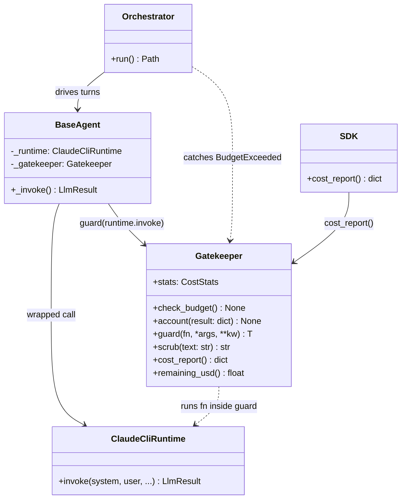

# PRD — Gatekeeper (LLM cost meter & cyber redaction layer)

> **Status:** Phase 1 design, binding. Implemented in Phase 2 (playbook §4) as `src/cosmos77_ex02/shared/gatekeeper.py`.
> **Scope:** the single chokepoint every LLM/agent call passes through. Meters USD/token spend per call, warns at a fraction of the budget, hard-stops the debate cleanly at the cap, enforces a per-call ceiling, and scrubs secrets from anything that reaches a log.
> **Owns acceptance criteria:** **A11** (Gatekeeper as a mandatory engineering must-have) and the cyber sub-criterion "no keys in git / logs." Supports the **cost-awareness** HW1-weakness fix surfaced in `docs/PRD_logging.md` (cost events) and the README §Cost analysis (playbook §12, Phase 10).

---

## 1. Context & rationale

This module is a **repurpose**, not a rewrite. HW1 shipped `ApiGatekeeper` in `src/cosmos77/shared/gatekeeper.py` — an HTTP rate-limiter that wrapped network calls with a sliding-window request cap (`requests_per_minute`/`requests_per_hour`), a concurrency `Semaphore`, and exponential-backoff retry on transient errors. HW2 has no HTTP endpoints to throttle: the only external dependency is the `claude -p` subprocess, authenticated by the Max subscription (no API key). Rate is not the scarce resource — **money** is.

The grader explicitly flagged **cost awareness** as an HW1 weakness (playbook §0.0). HW2 closes it by re-tasking the Gatekeeper from a *request* meter to a **token/USD meter** with a hard budget cap. The course frame is "token economy": every agent turn costs real subscription dollars, and an unbounded 3-process debate (Judge + Pro + Con, each calling the LLM many times per ping) can silently run up spend. The Gatekeeper makes that spend observable, bounded, and abortable — cleanly, mid-debate, with the transcript and verdict-so-far preserved.

The HW1 carry-overs we keep: the `Callable`-wrapping pattern (HW1 `execute(fn, *args, **kwargs)` becomes HW2 `guard(callable)`), the typed stats dataclass, the custom-exception discipline (`RateLimitExceeded`/`TooManyRetries` → `BudgetExceeded`/`CallTooExpensive`), and config-driven limits. What we drop: rate windows, the concurrency semaphore, and retry/backoff — retry on stalls is the Watchdog's job (`docs/PRD_watchdog.md`), not the cost meter's.

All limits are read from `config/gatekeeper.json` (CLAUDE.md rule 4 — zero hardcoded config; rule 13 — every LLM call routes through the Gatekeeper).

---

## 2. Configured values (single source of truth)

From `config/gatekeeper.json` (verbatim):

```json
{"version":"1.00","budget_usd_max":5.00,"per_call_usd_max":0.50,"warn_at_fraction":0.8,"hard_stop":true}
```

| Key | Value | Meaning in this module |
|---|---|---|
| `version` | `"1.00"` | Validated against `shared/version.py::VERSION` on load (CLAUDE.md rule 10). |
| `budget_usd_max` | `5.00` | Total spend ceiling for the whole debate session. At `accumulated_usd >= 5.00`, `check_budget()` raises `BudgetExceeded`. |
| `per_call_usd_max` | `0.50` | Per-call ceiling. A single `claude -p` result reporting `total_cost_usd > 0.50` raises `CallTooExpensive` during accounting. |
| `warn_at_fraction` | `0.8` | Warn threshold. The first time `accumulated_usd >= 0.8 * 5.00 = $4.00`, log one `WARNING`. |
| `hard_stop` | `true` | When `true`, the budget breach raises and aborts the debate. If set `false`, the breach logs `CRITICAL` but the call is allowed (degraded mode — documented for completeness; default and graded behaviour is `true`). |

Derived constants (computed, never hardcoded): `warn_at_usd = warn_at_fraction * budget_usd_max = $4.00`.

No value in this document is invented; every threshold above traces to `config/gatekeeper.json`. The number of LLM calls a debate makes is bounded by `pings_per_side=10` and `max_turns_per_call=6` from `config/setup.json` — see `docs/PRD_orchestrator.md` for the call-count model that the budget must cover.

---

## 3. Responsibilities & non-responsibilities

**The Gatekeeper IS responsible for:**
- Pre-flight budget check before any LLM call leaves the process.
- Reading `total_cost_usd` and `usage` (input/output tokens) from each `claude -p` JSON result and accumulating them.
- Enforcing the per-call ceiling (`per_call_usd_max`).
- Emitting exactly one warning when the warn fraction is first crossed.
- Raising `BudgetExceeded` to abort the debate cleanly at the cap.
- Exposing a spend/token snapshot for the cost report (`SDK.cost_report()`, playbook Phase 9).
- Redacting secret-shaped substrings via `scrub(text)` before any text is logged (cyber layer).

**The Gatekeeper is NOT responsible for:**
- Retrying or restarting stalled/dead processes → that is the **Watchdog** (`docs/PRD_watchdog.md`).
- Per-call timeouts → enforced by the **runtime** (`runtime/claude_cli.py`, `per_call_timeout_seconds=120`).
- Building argv or parsing the full JSON into `LlmResult` → the **runtime** owns the shape; the Gatekeeper only reads two fields off the result dict.
- Rate-limiting requests over time (the HW1 behaviour is intentionally removed).
- Judging cost-effectiveness of arguments → out of scope; persuasion scoring is the Judge's (`docs/PRD_judge_agent.md`).

---

## 4. Public API

Implemented in `src/cosmos77_ex02/shared/gatekeeper.py` (≤150 lines, CLAUDE.md rule 1; helpers split into `shared/scrub.py` if the cap is approached). All public signatures carry type hints (rule 16) and docstrings explaining *why* (rule 15).

### 4.1 Exceptions

```python
class BudgetExceeded(RuntimeError):
    """Raised when cumulative spend reaches budget_usd_max. Catchable so the
    orchestrator can stop the debate cleanly and still persist the transcript."""

class CallTooExpensive(RuntimeError):
    """Raised when a single call's total_cost_usd exceeds per_call_usd_max.
    Guards against a runaway WebSearch turn blowing the whole budget at once."""
```

Both subclass `RuntimeError` so a single `except RuntimeError` in the orchestrator's loop catches either, and so they are distinct from `RuntimeTimeout`/`RuntimeError` raised by the runtime layer.

### 4.2 Stats snapshot

```python
@dataclass
class CostStats:
    """Immutable-by-convention snapshot of the meter for the cost report."""
    total_usd: float = 0.0          # sum of every call's total_cost_usd
    input_tokens: int = 0           # sum of usage.input_tokens
    output_tokens: int = 0          # sum of usage.output_tokens
    call_count: int = 0             # number of accounted calls
    warned: bool = False            # whether the warn threshold has fired
    aborted: bool = False           # whether BudgetExceeded was raised
```

### 4.3 `class Gatekeeper`

```python
class Gatekeeper:
    def __init__(self, config: Config | None = None) -> None: ...
    @property
    def stats(self) -> CostStats: ...
    def remaining_usd(self) -> float: ...              # budget_usd_max - total_usd
    def check_budget(self) -> None: ...                # pre-check; may raise BudgetExceeded
    def account(self, call_result: dict) -> None: ...  # read cost/usage, accumulate, post-check
    def guard(self, fn: Callable[..., T], /, *args, **kwargs) -> T: ...  # the wrapper
    def scrub(self, text: str) -> str: ...             # cyber redaction
    def cost_report(self) -> dict: ...                 # serializable snapshot for SDK/menu
```

`__init__` loads `config/gatekeeper.json` via the shared `Config` loader (dot-path access, e.g. `cfg.get("budget_usd_max")`), validates the config `version`, and zeroes `CostStats`.

---

## 5. The `guard(callable)` wrapper — the chokepoint

`guard` is how **every** LLM call enters the system (CLAUDE.md rule 13, A11). `BaseAgent._invoke()` (`docs/PRD_agent_base.md`) never calls `ClaudeCliRuntime.invoke()` directly — it calls `self._gatekeeper.guard(self._runtime.invoke, system_prompt, user_prompt, ...)`. This makes the meter unbypassable: there is no code path to the LLM that skips it.

**Lifecycle: pre-check → run → account → post-check.**

```
guard(fn, *args, **kwargs):
    1. PRE-CHECK   check_budget()            # raise BudgetExceeded BEFORE spending if already at cap
    2. RUN         result = fn(*args, **kw)  # the actual claude -p invocation (returns LlmResult/dict)
    3. ACCOUNT     account(_as_dict(result)) # add total_cost_usd + usage; enforce per_call ceiling
    4. POST-CHECK  check_budget()            # raise BudgetExceeded if THIS call pushed us over
    return result
```

```mermaid
sequenceDiagram
    participant A as BaseAgent._invoke
    participant G as Gatekeeper.guard
    participant R as ClaudeCliRuntime.invoke
    A->>G: guard(runtime.invoke, system, user, ...)
    G->>G: 1. check_budget()  (pre)
    alt already at/over cap
        G--xA: raise BudgetExceeded
    else under cap
        G->>R: 2. run fn(...)
        R-->>G: LlmResult{cost_usd, usage, ...}
        G->>G: 3. account(result): += cost/tokens; per_call check
        alt cost_usd > per_call_usd_max
            G--xA: raise CallTooExpensive
        end
        G->>G: 4. check_budget() (post)
        alt total_usd >= budget_usd_max
            G--xA: raise BudgetExceeded
        else
            G-->>A: return LlmResult
        end
    end
```

Rationale for **both** a pre-check and a post-check: the pre-check refuses to spend more once we are already at the cap (cheap fail-fast); the post-check catches the call that *crossed* the cap (we cannot know a call's cost until it returns). Per-call enforcement sits inside `account()` so it triggers regardless of accumulated spend — one $0.60 call is rejected even on the first turn.

`_as_dict(result)` normalizes the runtime's return: if `guard` wraps `ClaudeCliRuntime.invoke` it receives an `LlmResult` dataclass and reads `.raw` / `.cost_usd`; if a test passes a plain dict it is used directly. The accounting reads only two logical fields — see §6.

---

## 6. `account(call_result)` — reading cost & tokens from the `claude -p` JSON

The `claude -p --output-format json` result carries spend telemetry. `account()` reads it defensively (the runtime's `parse.py` already defaults a missing cost to 0 with a warning per playbook Phase 3, but the Gatekeeper double-guards):

| JSON field | Read as | Missing-value policy |
|---|---|---|
| `total_cost_usd` | float USD for this call | default `0.0` + one `WARNING` "cost field absent; treating as $0.00" |
| `usage.input_tokens` | int | default `0` |
| `usage.output_tokens` | int | default `0` |

Accounting steps:
1. `cost = float(result.get("total_cost_usd", 0.0))`.
2. If `cost > per_call_usd_max` (`0.50`) → `raise CallTooExpensive(...)` (the call already ran; we refuse to fold a runaway cost silently and we let the orchestrator decide to stop).
3. `self._stats.total_usd += cost`; accumulate `input_tokens`/`output_tokens`; `call_count += 1`.
4. Warn check: if `not warned and total_usd >= warn_at_usd` (`$4.00`) → log one `WARNING`, set `warned=True` (idempotent — fires at most once).

Floating-point note: USD is summed as `float`. With `per_call_usd_max=0.50` and `budget_usd_max=5.00` the magnitudes are small and the `>=` comparisons are exact enough for this purpose; we deliberately do not introduce `Decimal` (CLAUDE.md "when in doubt: less code, fewer deps"). The comparison is `>=`, so spend landing *exactly* on a threshold trips it.

---

## 7. `check_budget()` and `BudgetExceeded` — the clean hard-stop

```python
def check_budget(self) -> None:
    if self._stats.total_usd >= self._budget_usd_max:
        if self._hard_stop:
            self._stats = replace(self._stats, aborted=True)
            raise BudgetExceeded(
                f"spend ${self._stats.total_usd:.2f} reached cap "
                f"${self._budget_usd_max:.2f}; aborting debate"
            )
        _LOG.critical("budget cap reached but hard_stop=false; continuing")
```

"Clean" abort means the exception is **catchable** and the orchestrator unwinds gracefully (no `sys.exit`, no killed children mid-write):
- The `Orchestrator` loop (`docs/PRD_orchestrator.md`) wraps each turn; on `BudgetExceeded` it stops issuing new turns, flushes `transcripts/session_NNN.json` with the turns completed so far, marks the session `aborted_on_budget: true`, and — budget permitting via the already-accounted spend — still records the partial state. The Watchdog is told to stop (no restarts on a budget abort — see `docs/PRD_watchdog.md`).
- The CLI/menu (`docs/PRD_terminal_menu.md`) surfaces the abort to the user with the final cost figure rather than a stack trace.

This is the behaviour playbook §0 promises: "debate aborts gracefully if exceeded." If the cap trips during the real Phase-9 run, the documented remedy is to lower `pings_per_side` in `config/setup.json`, note it in the README, and rerun (playbook §11.6, §12.12) — the Gatekeeper makes that overrun loud instead of silent.

---

## 8. `scrub(text)` — the cyber redaction layer

The cyber sub-criterion (A11; playbook §18 "Cyber: no keys in git") is partly the Gatekeeper's job: **nothing secret-shaped ever reaches a log file or transcript.** Although HW2 uses no API key (auth is the `claude` CLI Max login, `.env.example` placeholders only, CLAUDE.md rule 9), defence-in-depth still redacts anything that *looks* like a credential before logging — e.g. an `WEB_SEARCH_API_KEY` from the optional fallback backend (`docs/PRD_web_search.md`), a leaked session token in an error string, or a bearer header echoed by a tool.

```python
def scrub(self, text: str) -> str:
    """Redact secret-shaped substrings before logging. Returns text with
    matches replaced by '***REDACTED***'. Why: logs and transcripts are
    committed artifacts the grader reads; a leaked token there is a hard fail."""
```

Redaction patterns (regex, case-insensitive where sensible):
- Anthropic-style keys: `sk-ant-[A-Za-z0-9._-]{8,}`.
- Generic API keys/tokens: `(?:api[_-]?key|token|secret|bearer)["'\s:=]+[A-Za-z0-9._\-]{12,}`.
- `WEB_SEARCH_API_KEY=...` style `KEY=value` env assignments where the key name contains `KEY`/`TOKEN`/`SECRET`.
- Long opaque base64/hex blobs ≥ 24 chars adjacent to a secret keyword.

`scrub()` is applied by `logging_setup.py` (`docs/PRD_logging.md`) at the formatter boundary so it covers all JSON-line log events — agent calls, messages, costs, restarts, verdict — and by the orchestrator before any LLM result text is written to a transcript. It is pure and side-effect-free (deterministic, rule 17): same input → same output, no network, no time dependence.

---

## 9. Integration map



- **`docs/PRD_agent_base.md`** — `BaseAgent._invoke()` is the only caller of `guard()`; one `Gatekeeper` instance is shared across all three agents so the budget is a single session-wide meter (the orchestrator constructs it once and injects it).
- **`docs/PRD_orchestrator.md`** — catches `BudgetExceeded`/`CallTooExpensive`, stops the ping loop, persists the partial transcript, and reads `cost_report()` for `transcripts/session_NNN_cost.json`.
- **`docs/PRD_logging.md`** — every accounted call emits a JSON-line cost event; `scrub()` runs at the formatter.
- **`docs/PRD_watchdog.md`** — independent; a watchdog restart does NOT reset the meter (spend already incurred stays counted), and a `BudgetExceeded` abort suppresses further restarts.
- **`shared/config.py` / `shared/version.py`** — config load + version validation.
- **SDK / menu** — `SDK.cost_report()` and menu option **[6] Cost report** render `cost_report()`: total USD, input/output tokens, call count, remaining budget, and cost-per-ping (playbook Phase 8/9).

---

## 10. Cost-report shape (for `SDK.cost_report()` and README §Cost)

```json
{
  "total_usd": 1.83,
  "budget_usd_max": 5.00,
  "remaining_usd": 3.17,
  "fraction_used": 0.366,
  "input_tokens": 41280,
  "output_tokens": 9930,
  "call_count": 22,
  "warned": false,
  "aborted": false
}
```

Phase 9 (playbook §11) derives **cost per ping** and the **10-vs-5-ping projection** from this snapshot plus `pings_per_side` from `config/setup.json`. The values above are an illustrative shape, not a measured result — the real numbers come from `transcripts/session_001_cost.json`.

---

## 11. Functional requirements → acceptance criteria

| ID | Requirement | Maps to |
|---|---|---|
| FR-GK-1 | Every LLM/agent call routes through `Gatekeeper.guard`; no bypass path exists. | A11, CLAUDE.md rule 13 |
| FR-GK-2 | `account()` reads `total_cost_usd` + `usage` from the `claude -p` JSON and accumulates them. | A11, cost-awareness fix |
| FR-GK-3 | One `WARNING` fires the first time spend crosses `warn_at_fraction` (`$4.00`). | A11 |
| FR-GK-4 | `BudgetExceeded` raised (clean, catchable) at `budget_usd_max` ($5.00) when `hard_stop=true`; debate aborts gracefully. | A11 |
| FR-GK-5 | `CallTooExpensive` raised when a single call exceeds `per_call_usd_max` ($0.50). | A11 |
| FR-GK-6 | `scrub()` redacts secret-shaped substrings before any log/transcript write. | A11 (cyber), CLAUDE.md rule 9 |
| FR-GK-7 | All thresholds read from `config/gatekeeper.json`; nothing hardcoded. | CLAUDE.md rule 4 |
| FR-GK-8 | `cost_report()` exposes total USD, tokens, call count, remaining budget for the menu/README. | A15 (cost section) |

---

## 12. Test plan (TDD, all I/O mocked — CLAUDE.md rules 6, 7, 17)

Tests live in `tests/unit/test_shared/test_gatekeeper.py`. No live `claude` calls; the wrapped `fn` is a `Mock` returning canned dicts. Target coverage ≥ 85% (the module aims higher per playbook §4).

**Happy path**
- `account()` on a fake `{"total_cost_usd": 0.12, "usage": {"input_tokens": 900, "output_tokens": 300}}` increments `total_usd` to `0.12`, tokens to `900`/`300`, `call_count` to `1`.
- `guard(mock_fn)` runs pre-check → fn → account → post-check and returns the fn result unchanged; `mock_fn` called exactly once.
- `remaining_usd()` == `5.00 - total_usd`.
- `cost_report()` returns all keys with correct values.

**Error / threshold paths**
- Accumulating to `>= $4.00` logs exactly one `WARNING` and sets `warned=True`; a second crossing logs nothing more.
- Accumulating to `>= $5.00` then `check_budget()` raises `BudgetExceeded`; `stats.aborted` becomes `True`.
- A pre-loaded meter already at the cap → `guard()` raises `BudgetExceeded` **without** calling `mock_fn` (fail-fast pre-check; assert `mock_fn` not called).
- A call returning `total_cost_usd = 0.60` raises `CallTooExpensive`.
- Missing `total_cost_usd` → treated as `0.0` with a logged `WARNING` (no crash).
- `hard_stop=false` config → cap reached logs `CRITICAL` but does not raise.

**Cyber**
- `scrub("key=sk-ant-ABCD1234EFGH5678")` returns text with `***REDACTED***` and no original key substring.
- `scrub("WEB_SEARCH_API_KEY=deadbeefcafe123456")` redacts the value.
- `scrub("ordinary debate text about social media")` is returned unchanged (no false positives on normal prose).
- `scrub()` is deterministic across repeated calls.

**Config**
- Constructing with a config whose `version` mismatches `VERSION` raises (rule 10).
- Thresholds are read from config, not constants: a test config with `budget_usd_max=1.00` makes the cap trip at `$1.00`.

---

## 13. Open questions / ADR pointers

- **Per-call ceiling vs. budget interaction.** We enforce `per_call_usd_max` inside `account()` *after* the call ran (we cannot pre-know cost). A future refinement could pass a cost estimate pre-flight; deferred — see ADR-008 (Gatekeeper budget) in `docs/PLAN.md`.
- **Concurrency.** HW1's meter was thread-safe via a lock. HW2 agents are separate OS **processes** (A1), so the single `Gatekeeper` instance lives in the orchestrator/father process and is fed by accounting calls there; cross-process cost aggregation rides the JSON IPC return path (`docs/PRD_ipc_protocol.md` carries `cost_usd`/`tokens` per message). The in-process meter therefore needs no inter-process lock. This is recorded as an ADR consequence in `docs/PLAN.md`.
- **`hard_stop=false` mode** is supported but never the graded default; documented for extensibility (`docs/PRD_extension_points.md`: a future "advisory budget" mode).
