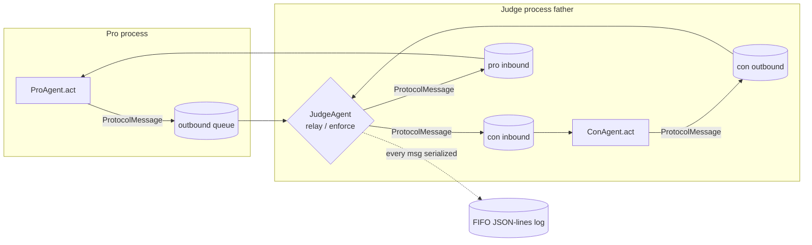

# PRD — JSON IPC Protocol (`cosmos77_ex02.protocol`)

> **Status:** Phase 1 design doc (binding). Implemented in **Phase 5** (playbook §7).
> **Owner module:** `src/cosmos77_ex02/protocol/` — `message.py`, `routing.py`, `serialize.py`.
> **Primary acceptance criteria:** **A5** (routing through the father), **A6** (JSON, schema-validated, logged, monitorable). Secondary: **A4** (mutual rebuttal — `turn_type`), **A7** (mandatory web-search citations), **A10** (word/time limits → `word_count` cap).
> **Sibling docs:** `docs/PRD_agent_base.md`, `docs/PRD_judge_agent.md`, `docs/PRD_debater_agents.md`, `docs/PRD_orchestrator.md`, `docs/PRD_watchdog.md`, `docs/PRD_gatekeeper.md`, `docs/PRD_logging.md`, `docs/PRD_web_search.md`.

---

## 1. Purpose & scope

The IPC protocol is the **single, typed wire format** for every message exchanged between the three OS processes (Judge/father, Pro, Con). It is the contract that makes the debate *monitorable, testable, and auditable* (A6) and that mechanically enforces the rule **all traffic flows child → judge → child; children never talk directly** (A5).

This module owns three concerns and nothing else:

1. **The envelope** — a single pydantic v2 model, `ProtocolMessage`, with a fixed field set.
2. **Validation** — field-level and message-level rules: required fields, valid roles, the citation requirement (when `require_citation_per_turn`), and the word-count ceiling.
3. **Routing** — `validate_route(sender, recipient)` rejecting any child→child hop, plus the `is_through_father(history)` audit helper that proves a whole transcript respected A5.

**Out of scope** (deliberately, to keep each `.py` ≤ 150 lines — rule 1): the *transport* itself (`multiprocessing.Queue` instances live in `orchestration/`, see `docs/PRD_orchestrator.md`); *prompt rendering* (`agents/`, see `docs/PRD_agent_base.md`); *cost metering* (`shared/gatekeeper.py`, see `docs/PRD_gatekeeper.md`) — the protocol only *carries* `tokens` and `cost_usd`, it does not compute the budget; and *log rotation* (`shared/logging_setup.py`, see `docs/PRD_logging.md`) — the protocol provides the JSON-lines payload that the logger writes.

---

## 2. Where the protocol sits



Every arrow above is a `ProtocolMessage` serialized via `serialize.to_json`. There is **no edge directly between the Pro and Con processes** — that absence is the design, and `validate_route` is what guarantees it at runtime.

---

## 3. The message envelope (`message.py`)

A single pydantic v2 `BaseModel`. Field set is **fixed by the playbook §3 task 6** and must not grow without an ADR in `docs/PLAN.md`.

| Field | Type | Required | Meaning / constraint |
|---|---|---|---|
| `msg_id` | `str` (UUID4) | yes | Globally unique id; default-factory `uuid4().hex`. Used for log correlation and dedup on watchdog replay. |
| `ts` | `datetime` (UTC, ISO-8601) | yes | Creation timestamp; default-factory `datetime.now(timezone.utc)`. Serialized as ISO-8601 with `Z`. |
| `sender` | `Literal["judge","pro","con"]` | yes | Originating role. Must be in `constants.ROLES = ("judge","pro","con")`. |
| `recipient` | `Literal["judge","pro","con"]` | yes | Destination role. Also in `ROLES`. |
| `role` | `Literal["judge","pro","con"]` | yes | The *authoring agent's* role (equals `sender` for normal turns; kept distinct so a future moderator could relay on behalf of another). |
| `ping_no` | `int` (`ge=0, le=`pings_per_side) | yes | Which ping this turn belongs to (1..`pings_per_side`=**10**). `0` reserved for the opening setup message and the final verdict. |
| `turn_type` | `Literal["opening","rebuttal","closing"]` | yes | Must be in `constants.TURN_TYPES = ("opening","rebuttal","closing")`. Drives A4 (rebuttal turns must reference the opponent). |
| `content` | `str` (non-empty) | yes | The argument/relay/verdict text. English only. Subject to the word-count rule (§4.2). |
| `citations` | `list[str]` | yes (may be empty per role) | Web-source URLs/identifiers from the debater's WebSearch. Subject to the citation rule (§4.3). Default `[]`. |
| `word_count` | `int` (`ge=0`) | yes | Server-computed count of whitespace-split tokens in `content`; validated to *match* `content` (§4.2) so a debater cannot under-report. |
| `tokens` | `int` (`ge=0`) | yes | LLM tokens consumed producing this turn (sum of input+output from the `claude -p` JSON `usage`), passed in from `agents/`. Carried for audit, not recomputed here. |
| `cost_usd` | `float` (`ge=0.0`) | yes | USD cost of this turn (`total_cost_usd` from the `claude -p` JSON), accounted by the Gatekeeper. Carried for the cost report (Phase 9). |

**Pydantic config:** `model_config = ConfigDict(extra="forbid", frozen=True, validate_assignment=True)`.
- `extra="forbid"` — an unknown field is a validation error, so the wire format cannot silently drift (A6).
- `frozen=True` — messages are immutable once created; a relay produces a *new* message rather than mutating, which keeps the transcript an append-only audit trail.

`constants.ROLES` and `constants.TURN_TYPES` are the single source of truth; the `Literal` types are derived from them so adding a role/turn-type is a one-line constants change (see `docs/PRD_extension_points.md`).

---

## 4. Validation rules

All validation lives on `ProtocolMessage` (field + model validators) and in `routing.py`. Configurable thresholds are read from `config/setup.json` (rule 4 — zero hardcoded config): `debate.max_words_per_turn = 180`, `debate.require_citation_per_turn = true`, `debate.pings_per_side = 10`. These are injected into the validation context (pydantic `model_validate(..., context=...)`) rather than imported globally, so tests can vary them deterministically (rule 17).

### 4.1 Field-presence & type rules
- Every field in §3 is **required**; a missing field raises `pydantic.ValidationError` with the field name (test: "missing required field raises a clear validation error" — playbook §7 task 1).
- `sender`, `recipient`, `role` must each be a member of `ROLES`; anything else fails the `Literal`.
- `turn_type` must be a member of `TURN_TYPES`.
- `content` must be non-empty after `strip()`.

### 4.2 Word-count rule (A10)
- A **model validator** recomputes `len(content.split())` and asserts it equals the supplied `word_count`. Mismatch → `ValidationError` ("word_count does not match content"). This stops a debater from lying about its length.
- If the recomputed count `> max_words_per_turn` (180), validation **fails** with `WordLimitExceeded`. The orchestrator/judge treat this as a rejected turn → retry (§6).

### 4.3 Citation rule (A7)
- When `require_citation_per_turn` is `true` **and** the message is a *debater turn* (`sender in {"pro","con"}` and `turn_type in {"opening","rebuttal","closing"}`), `citations` must contain **≥ 1** non-empty entry. Empty → `ValidationError` ("citation required for debater turn"). Test: "over-length content or empty `citations[]` fails validation when `require_citation_per_turn` is true" (playbook §7 task 1).
- Judge-authored messages (`sender == "judge"`: relays, moderation notes, the verdict) are **exempt** — the judge does not web-search; it adjudicates persuasiveness (see `docs/PRD_judge_agent.md`).
- Each citation entry must be a non-empty, stripped string. (Light shape check only; URL liveness/quality is the `WebSearchTool` fallback's job — see `docs/PRD_web_search.md`.)

### 4.4 Ping-bounds rule
- `ping_no` must satisfy `0 ≤ ping_no ≤ pings_per_side` (0..10). `ping_no == 0` is reserved for the orchestrator's opening setup message and the judge's final verdict; `1..10` are real debate turns. Out-of-range → `ValidationError`.

### 4.5 Routing rule (A5) — `routing.py`
`validate_route(sender: str, recipient: str) -> None` raises `RouteViolation` unless one of these holds:

| sender | allowed recipient(s) | rationale |
|---|---|---|
| `pro` | `judge` only | a debater may only *speak to* the father |
| `con` | `judge` only | same |
| `judge` | `pro` or `con` | the father relays to either child |

Forbidden combinations and their handling:
- `pro → con` or `con → pro` → **`RouteViolation`** ("child→child routing is forbidden; all traffic must pass through the judge"). This is the mechanical enforcement of A5; a child literally cannot address the other child.
- `x → x` (self) → `RouteViolation`.
- `judge → judge` → `RouteViolation` (the father never messages itself on the wire).

`validate_route` is invoked **inside** `ProtocolMessage`'s model validator (so an invalid route can never be constructed) **and** independently by the orchestrator before enqueuing, giving defence in depth.

---

## 5. The `is_through_father` audit helper (`routing.py`)

```python
def is_through_father(history: Sequence[ProtocolMessage]) -> bool:
    """Return True iff every hop in `history` is a legal child↔judge hop.

    Proves acceptance criterion A5 for a whole transcript: no message
    ever went child→child. Used by the orchestrator's invariant check,
    the test suite, and the Phase-9 transcript audit.
    """
```

Semantics:
- Returns `True` for an empty history (vacuously through the father).
- Returns `False` if **any** message has a `(sender, recipient)` pair that `validate_route` would reject (i.e., any child→child, self, or judge→judge hop).
- Pure, side-effect-free, deterministic — directly testable (rule 17). The orchestrator asserts `is_through_father(transcript)` after the run and the test `tests/unit/test_orchestration/` asserts it per ping (playbook §8 task 4: "every message is routed through the judge — assert via `protocol.is_through_father`").

A companion `assert_through_father(history)` raises `RouteViolation` with the offending `msg_id` for use in non-boolean call sites (logging, the watchdog audit).

---

## 6. Rejection & retry semantics

The protocol module **detects and reports**; the **orchestrator + judge act** (separation of concerns; see `docs/PRD_orchestrator.md` and `docs/PRD_judge_agent.md`). The flow when a debater turn is invalid:

```mermaid
sequenceDiagram
  participant D as Debater (Pro/Con)
  participant J as Judge (father)
  participant V as ProtocolMessage validation
  D->>J: candidate turn (text + citations + counts)
  J->>V: ProtocolMessage(... context=cfg)
  alt valid
    V-->>J: ProtocolMessage (frozen)
    J->>D: relay opponent turn (next ping)
  else missing citation / over-length / bad route
    V-->>J: ValidationError (typed)
    J->>D: REJECT + reason, request redo (same ping_no)
    Note over D,J: retry up to max_turns_per_call (config=6);<br/>each retry is a fresh LLM call via Gatekeeper.guard
  end
```

Rules:
- A turn that fails **§4.2 (over-length)**, **§4.3 (missing citation)**, or **§4.5 (bad route)** is **rejected, not silently dropped**. The judge returns a structured reason and the debater retries the *same* `ping_no`.
- Retries are bounded by `runtime.max_turns_per_call = 6` (config) and each retry is a real LLM call routed through `Gatekeeper.guard` — so retries still count against the `$5.00` budget cap (`budget_usd_max`); see `docs/PRD_gatekeeper.md`. If retries exhaust, the judge enforces a forfeit-style penalty for that turn (defined in `docs/PRD_judge_agent.md`), never a hang (A11) and never a tie (A8).
- Rejected candidates are logged (JSON-lines, with the `ValidationError` summary) so the grader can audit *why* a turn was retried (A6, A15) — see `docs/PRD_logging.md`.

**Typed error hierarchy** (so callers can branch precisely and tests assert exact types — rule 6):

```text
ProtocolError(Exception)
├── RouteViolation        # §4.5 / §5  — child→child or illegal hop
├── CitationRequired      # §4.3       — debater turn with empty citations[]
└── WordLimitExceeded     # §4.2       — content over max_words_per_turn
```

These wrap/accompany `pydantic.ValidationError`; the orchestrator catches `ProtocolError` to drive the retry loop, and the logger records the subclass name.

---

## 7. Serialization (`serialize.py`)

- `to_json(msg: ProtocolMessage) -> str` — `msg.model_dump_json()` with `ensure_ascii=False`, UTF-8 (`constants.DEFAULT_ENCODING`), ISO-8601 timestamps. English-only content (rule: English).
- `from_json(raw: str) -> ProtocolMessage` — `ProtocolMessage.model_validate_json(raw, context=cfg)`; malformed JSON or a schema mismatch raises `ProtocolError`/`ValidationError`. This is the round-trip required by the Phase-5 test "valid message round-trips through JSON (serialize → deserialize → equal)".
- `to_jsonl(msgs)` / transcript helpers emit one message per line so the FIFO logger (20 files × 500 lines, config-driven) and `transcripts/session_NNN.json` are both append-only and grep-able (A6, A15).

Round-trip invariant (test, rule 17): `from_json(to_json(m)) == m` for any valid `m` (equality holds because the model is `frozen` and all fields are JSON-native).

---

## 8. Worked JSON example

A valid **Con rebuttal on ping 3**, addressed to the judge (legal route `con → judge`), with one citation and within the 180-word limit:

```json
{
  "msg_id": "9f2c1d7a4b6e4f8aa1c0d3e5f7091234",
  "ts": "2026-05-31T09:14:22Z",
  "sender": "con",
  "recipient": "judge",
  "role": "con",
  "ping_no": 3,
  "turn_type": "rebuttal",
  "content": "Pro claims social media 'democratizes voice', but reach is not the same as a net positive. Engagement-ranked feeds amplify outrage over accuracy, and a 2018 MIT study found false news spreads roughly six times faster than true news on Twitter. That is not democratized truth; it is industrialized distortion. New point: the attention economy externalizes a public-health cost on adolescents, which no per-user benefit offsets.",
  "citations": [
    "https://www.science.org/doi/10.1126/science.aap9559"
  ],
  "word_count": 66,
  "tokens": 742,
  "cost_usd": 0.0181
}
```

The judge then **relays** it to Pro as a new, immutable message (legal route `judge → pro`; citation-exempt because `sender == "judge"`):

```json
{
  "msg_id": "1a2b3c4d5e6f70819aa2bb3cc4dd5ee6",
  "ts": "2026-05-31T09:14:23Z",
  "sender": "judge",
  "recipient": "pro",
  "role": "judge",
  "ping_no": 3,
  "turn_type": "rebuttal",
  "content": "RELAY (ping 3, Con): Con argues amplification of falsehood and an adolescent public-health externality. Rebut the misinformation point and the externality claim, add one new point, and cite at least one source.",
  "citations": [],
  "word_count": 33,
  "tokens": 0,
  "cost_usd": 0.0
}
```

A message such as `{"sender": "pro", "recipient": "con", ...}` would be rejected at construction by `validate_route` with `RouteViolation`, and `is_through_father([...])` over any history containing it returns `False`.

---

## 9. Requirements → acceptance-criteria mapping

| Requirement (this doc) | Acceptance criterion | Test (Phase 5, playbook §7 task 1) |
|---|---|---|
| Single typed JSON envelope, `extra="forbid"`, round-trips | **A6** | round-trip serialize→deserialize→equal |
| Every field required; clear error on omission | **A6** | missing field raises clear `ValidationError` |
| `citations` ≥ 1 for debater turns when `require_citation_per_turn` | **A7** | empty `citations[]` fails when flag true |
| `word_count` matches content and ≤ `max_words_per_turn` (180) | **A10** | over-length content fails validation |
| `validate_route`: debaters only ↔ judge; child→child rejected | **A5** | child→child rejected by routing validator |
| `is_through_father(history)` audit helper | **A5** | orchestrator asserts per ping (`tests/unit/test_orchestration/`) |
| `turn_type ∈ {opening,rebuttal,closing}` driving rebuttal turns | **A4** | role/turn-type validity |
| Rejection-and-retry on invalid turn, bounded by `max_turns_per_call`=6 | **A7/A10/A11** | judge enforcement tests (Phase 7) |

---

## 10. Non-functional requirements & constraints

- **Testability (rule 6, 17):** the module performs **no I/O** — no subprocess, no network, no file handles. It is therefore 100%-mockable-by-being-pure; target coverage **≥ 90%** on `protocol/` (playbook §7 task 3).
- **150-line cap (rule 1):** split across `message.py` (model + validators), `routing.py` (`validate_route`, `is_through_father`, `assert_through_father`), `serialize.py` (to/from JSON, JSON-lines). Errors live in `message.py` or a tiny `errors.py` if needed.
- **Zero hardcoded config (rule 4):** `max_words_per_turn`, `require_citation_per_turn`, `pings_per_side` are injected via validation context from `config/setup.json`; `ROLES`/`TURN_TYPES` are *structural* constants in `constants.py`, not tunables.
- **Type hints + docstrings (rules 15, 16):** every public symbol (`ProtocolMessage`, `validate_route`, `is_through_father`, `to_json`, `from_json`, the error classes) is fully annotated and documented (why, not what). No bare `Any`.
- **Immutability & audit:** `frozen=True` + append-only JSON-lines give the grader a complete, tamper-evident transcript (A15), persisted by the orchestrator to `transcripts/session_001.json`.
- **Extensibility (see `docs/PRD_extension_points.md`):** a new role (e.g., a second judge or a moderator) is a one-line change to `constants.ROLES` plus a new branch in `validate_route`; the envelope itself is unchanged.
