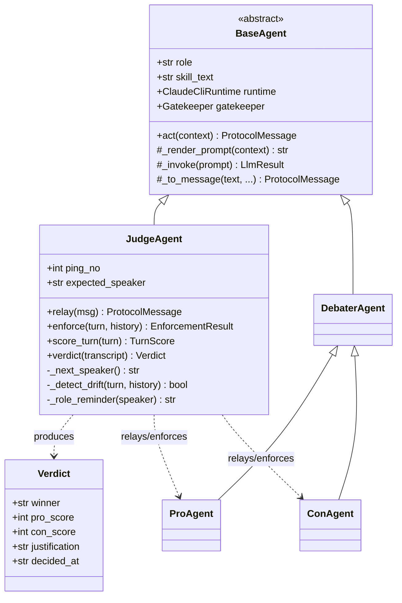

# PRD — Judge Agent (the Father Process)

> **Status:** Phase 1 mandatory documentation (playbook §3, task 3). Binding for Phase 4 (agent hierarchy), Phase 6 (orchestrator integration), and Phase 7 (judge logic hardening).
> **Scope:** The `JudgeAgent` class (`src/cosmos77_ex02/agents/judge.py`), the `Verdict` dataclass (`src/cosmos77_ex02/agents/verdict.py`), and the judge's behavioural contract for routing, turn-taking enforcement, anti-collusion intervention, persuasion scoring, and the mandatory no-tie verdict.
> **Sibling docs:** `docs/PRD_agent_base.md` (the `BaseAgent` abstraction this class extends), `docs/PRD_debater_agents.md` (the Pro/Con children the judge moderates), `docs/PRD_skills.md` (the `skill_judge.md` persona), `docs/PRD_ipc_protocol.md` (the `ProtocolMessage` envelope and routing rules the judge enforces), `docs/PRD_orchestrator.md` (the parent loop that hosts the judge), `docs/PRD_watchdog.md` (process-liveness layer), `docs/PRD_gatekeeper.md` (cost meter every judge LLM call routes through), and `docs/PRD_web_search.md` (citation-tool contract the judge audits).

---

## 1. Purpose and role

The Judge Agent is the **father process** in the three-process debate. It is simultaneously a *moderator* (it routes and gates every message), a *referee* (it enforces the rules of the turn), and an *adjudicator* (it scores persuasiveness and declares a single, justified winner). The two debaters — `ProAgent` (position: *Social media is a **NET POSITIVE** for society*) and `ConAgent` (position: *Social media is a **NET NEGATIVE** for society*) — are its children. They are spawned as separate OS processes by the Orchestrator (see `docs/PRD_orchestrator.md`) and **never communicate directly**: every message travels `child → judge → child`.

The debate runs on the configured topic **"Is social media a net positive for society?"** (`config/setup.json` → `debate.topic`) for **`pings_per_side = 10`** pings per side (`config/setup.json` → `debate.pings_per_side`).

This PRD covers the three responsibilities the judge owns end-to-end:

1. **Routing & turn-taking** — every message goes through the father; one speaker at a time; the ping counter advances deterministically (satisfies **A5**, contributes to **A3**/**A4**/**A10**).
2. **Enforcement & anti-collusion** — over-length, citation-less, non-rebutting, or *agreement-drift* turns are rejected/retried, with a role reminder when a debater starts conceding (satisfies **A4**, **A7**, **A10**; defends **A2**).
3. **Adjudication** — a persuasion rubric (clarity, evidence use, rebuttal quality, rhetorical force — **NOT factual truth**) and a **mandatory no-tie verdict** with a differential score and a written justification grounded in specific turns (satisfies **A8**; closes the HW1 "numbers aren't analysis" weakness).

> **Bias firewall (design invariant).** The judge does **not** know the "right answer" to the topic. Its skill (`skill_judge.md`) contains only the *rules of the game* and the *rubric*, never a position. Persuasiveness — not correctness — decides the debate. **Lies are explicitly allowed**; the judge does not fact-check. A false-but-unrebutted claim can legitimately *help* the side that made it, and a false claim that the opponent exposes legitimately *hurts* it. This keeps adjudication unbiased and forces the contradiction the assignment requires.

---

## 2. Stakeholders

| Stakeholder | Interest in the judge |
|---|---|
| Grader (automated + Dr. Yoram Segal) | Confirms A5 (routing), A8 (no tie + justification), A4/A7/A10 (enforcement) via committed tests and `transcripts/session_001.json`. |
| The two partners (Abdallah Khaldi, Tasneem Natour) | Need a deterministic, testable judge: every gate mockable, no live LLM in the suite (rule 6/17). |
| Pro / Con debater agents | Depend on the judge for fair relaying, consistent enforcement, and an unbiased verdict. |
| The Orchestrator | Calls the judge to relay, enforce, count pings, and produce the final `Verdict`. |

---

## 3. Position in the architecture

The judge subclasses `BaseAgent` (see `docs/PRD_agent_base.md`) and therefore inherits: skill loading, prompt rendering, the `ClaudeCliRuntime` handle, the `Gatekeeper.guard()` wrapper on every LLM call, timeout handling, and `_to_message()`. The judge adds the moderation/adjudication surface on top.



> **Line-cap note (rule 1).** `judge.py` must stay ≤ 150 lines (Phase 4 targets ≤ 120). Scoring helpers and the verdict tie-break live in `agents/verdict.py`; rubric weights and intervention strings are config/constants. If `judge.py` approaches the cap, extract enforcement into `agents/judge_enforce.py` and scoring into `agents/judge_score.py` (both ≤ 150). The `Verdict` dataclass and its validation always live in `agents/verdict.py`.

---

## 4. Functional requirements

### 4.1 Routing: child → judge → child (A5)

The judge is the **only** path between the two children. There is no direct Pro↔Con channel; the Orchestrator wires each debater's outbound queue to the judge and the judge's outbound queue to the debaters.

- **FR-J1.** `relay(msg: ProtocolMessage) -> ProtocolMessage` accepts a validated message from one child and produces the message destined for the *other* child. The relayed message's `recipient` is the opposite debater; its `sender` is `"judge"`. This guarantees every hop is `child → judge → child`.
- **FR-J2.** The judge **rejects any message whose `sender` and `recipient` violate the routing rule** by calling `protocol.routing.validate_route(sender, recipient)` (see `docs/PRD_ipc_protocol.md`): debaters may only send to `"judge"` and receive from `"judge"`; the judge may send to either child. A `pro → con` or `con → pro` message is invalid and never forwarded.
- **FR-J3.** The full message history must satisfy `protocol.routing.is_through_father(history)` — an audit helper asserting that no debater-to-debater hop ever occurred. This is asserted in tests and re-checked when the transcript is persisted.
- **FR-J4.** When relaying, the judge may attach an optional **moderation note** (a role reminder, an enforcement rejection, or `None`). The note rides in the relayed message so the receiving debater (and the transcript) see exactly why a redo was requested.

### 4.2 Turn-taking enforcement (A10, supports A3/A4)

One agent speaks, finishes, the other listens — never overlapping monologues.

- **FR-J5.** The judge tracks `expected_speaker` and alternates it strictly: opening → Pro, then Con, then Pro, … through the closing turns. A message from the wrong speaker (out of turn) is rejected and not counted.
- **FR-J6.** **Ping counting.** A *ping* = one debater argument **followed by the opponent's counter-argument** (per A3 definition). The judge increments `ping_no` only after **both** sides have produced an *accepted* turn for that ping. Rejected/retried turns (§4.3) do **not** advance the ping counter — a debater that fails enforcement must redo the same turn within the same ping. The loop ends when `ping_no` reaches `pings_per_side = 10`.
- **FR-J7.** `turn_type` is one of `opening | rebuttal | closing` (`constants.TURN_TYPES`). The first turn each side produces is `opening`; the last is `closing`; everything in between is `rebuttal`. The judge stamps/validates `turn_type` consistently with `ping_no`.

### 4.3 Per-turn enforcement gates (A4, A7, A10)

`enforce(turn: ProtocolMessage, history: list[ProtocolMessage]) -> EnforcementResult` runs **before** a turn is relayed or scored. A turn that fails any gate is **rejected and retried** (the orchestrator re-prompts the same debater with the rejection note; retries are capped — see §6). The gates:

| Gate | Rule | Source of truth | Acceptance |
|---|---|---|---|
| **G1 — Citation present** | Reject if `require_citation_per_turn` is true and `citations` is empty / contains no usable source. | `config/setup.json` → `debate.require_citation_per_turn = true` | A7 |
| **G2 — Word limit** | Reject if `word_count > max_words_per_turn`. | `config/setup.json` → `debate.max_words_per_turn = 180` | A10 |
| **G3 — Rebuttal present** | Reject if the turn does not reference/rebut the opponent's previous accepted point (a "parallel monologue"). The opening turn is exempt (no prior point exists). | `docs/PRD_debater_agents.md` rebuttal contract | A4 |
| **G4 — On-position / no agreement-drift** | Reject + role reminder if the debater drifts into **agreeing** with the opponent or abandons its fixed position. | §4.4 anti-collusion | A2 (defends), A4 |

`EnforcementResult` carries `{accepted: bool, reasons: list[str], moderation_note: str | None}`. On rejection, `moderation_note` is a concise, PC instruction telling the debater exactly what to fix (e.g., *"Your turn cited no source — add at least one web citation and resubmit."*).

> **Persuasiveness, not truth.** Enforcement checks *form and engagement* (cited? within length? actually rebutting? still arguing its side?). It never checks whether a claim is factually true. Detecting and punishing lies is the **opponent's** job, rewarded through the rebuttal-quality rubric dimension (§5).

### 4.4 Anti-collusion intervention (defends A2, supports A4)

The single biggest failure mode for an LLM-vs-LLM debate is **auto-agreement** — both sides converging into polite consensus, which collapses the contradiction the assignment requires. The judge actively defends against this.

- **FR-J8.** `_detect_drift(turn, history) -> bool` flags a turn that (a) explicitly agrees with or concedes the opponent's overall position, (b) softens its own fixed stance toward neutrality, or (c) restates the opponent's thesis approvingly instead of rebutting it. Detection signals (drift markers) live in `constants.py` / config — e.g., concession phrases ("you're right that social media is net negative", "I concede the overall point", "we actually agree") — and the judge may additionally ask its own LLM (via the rubric) to classify the turn as *rebuttal* vs *concession*.
- **FR-J9.** On detected drift, the judge **does not relay** the turn. Instead it issues a **role reminder** via `_role_reminder(speaker)` that re-states the debater's identity and fixed position drawn from config:
  - To Pro: *"You argue that social media is a NET POSITIVE for society. Do not concede. Rebut the opponent's last point and advance a new one, with a citation."*
  - To Con: *"You argue that social media is a NET NEGATIVE for society. Do not concede. Rebut the opponent's last point and advance a new one, with a citation."*
  The debater then retries the turn (subject to the retry cap, §6). The intervention is logged as a `judge.intervention` event (see `docs/PRD_logging.md`) for grader-auditable evidence.
- **FR-J10.** A debater that *exposes the opponent's lie* or *attacks the opponent's reasoning* is **not** drift — that is exactly the engagement the rubric rewards. Only genuine concession of one's own position triggers intervention.

### 4.5 Scoring (A8 — the persuasion rubric)

The judge scores **persuasiveness**, never factual correctness. `score_turn(turn) -> TurnScore` produces four sub-scores, each on a fixed 0–25 scale (so the four dimensions sum to a 0–100 per-turn persuasion score):

| Dimension | What it measures | Weight |
|---|---|---|
| **Clarity** | Is the argument well-structured, unambiguous, easy to follow? | 0–25 |
| **Evidence use** | How well is the cited web source(s) integrated and leveraged (not merely that one exists — G1 already requires presence)? | 0–25 |
| **Rebuttal quality** | How directly and effectively does the turn dismantle the opponent's prior point — **including catching and exposing the opponent's lies/weak evidence**? | 0–25 |
| **Rhetorical force** | Persuasive power, framing, and memorability — without sacrificing PC/respectful tone. | 0–25 |

- **FR-J11.** Rubric dimensions and their weights are **config-/constant-driven**, not hardcoded in scoring logic (rule 4), so a future judge variant can re-weight (an extension point — see `docs/PRD_extension_points.md`).
- **FR-J12.** **Truth is irrelevant to scoring.** A factually false but rhetorically devastating, well-cited, on-point rebuttal can score high. A true but muddled, source-less, off-point turn scores low. The judge never adjusts a score because a claim is "wrong" — that would import bias and break the firewall.
- **FR-J13.** A side's **cumulative score** is the sum (or configured aggregate) of its accepted turns' persuasion scores across all 10 pings. Rejected/retried turns do not score; only the accepted version counts.

### 4.6 The verdict (A8 — mandatory, no tie)

After the loop completes, the Orchestrator calls `verdict(transcript) -> Verdict`. The judge aggregates per-turn scores, names a **single winner**, and writes a justification grounded in specific turns.

- **FR-J14.** `verdict()` MUST return a `Verdict` with `winner ∈ {"pro", "con"}`. It is impossible to return `"tie"` or two equal scores (enforced by the `Verdict` validator, §4.7).
- **FR-J15.** **No-tie tie-break (deterministic).** If aggregate persuasion scores are equal, the judge breaks the tie by the **rebuttal-quality** dimension (per playbook §9: "if scores are close, break with rebuttal quality"). If rebuttal quality is also tied, break by evidence use, then clarity, then rhetorical force, in that fixed order. The tie-break order is config-/constant-driven and documented in the justification. The result is that **scores in the `Verdict` are always unequal** (e.g., `Pro 80 / Con 73`).
- **FR-J16.** **Written justification.** `justification` is a non-empty paragraph that (a) names the winner, (b) reports the differential score, (c) **cites specific turns** by `ping_no`/`turn_type` (e.g., *"Con's ping-4 rebuttal exposed Pro's uncited engagement-statistic, the debate's decisive moment"*), and (d) explains *where each side was strongest/weakest on persuasiveness*. This closes the HW1 "numbers aren't analysis" weakness and feeds README §10 "Session 1" interpretation.
- **FR-J17.** The `Verdict` is appended to `transcripts/session_NNN.json` by the Orchestrator and surfaced via `SDK.last_verdict()` (Phase 7 wiring; menu option [4]).

### 4.7 The `Verdict` structure and the no-tie rule

`agents/verdict.py`:

```python
from dataclasses import dataclass

@dataclass(frozen=True)
class Verdict:
    """Final adjudication of a debate. Persuasiveness-based; never a tie.

    Why frozen: a verdict is an immutable record of a completed debate,
    persisted to the transcript and read back by SDK.last_verdict().
    """
    winner: str            # "pro" or "con" — never "tie"
    pro_score: int         # cumulative persuasion score, 0..(100 * turns)
    con_score: int         # cumulative persuasion score, must != pro_score
    justification: str     # non-empty; references specific turns by ping_no
    decided_at: str        # ISO-8601 UTC timestamp

    def __post_init__(self) -> None:
        if self.winner not in ("pro", "con"):
            raise ValueError("winner must be 'pro' or 'con' — ties are forbidden (A8)")
        if self.pro_score == self.con_score:
            raise ValueError("equal scores are forbidden — judge must break the tie (A8)")
        winner_by_score = "pro" if self.pro_score > self.con_score else "con"
        if self.winner != winner_by_score:
            raise ValueError("winner must match the higher score")
        if not self.justification.strip():
            raise ValueError("justification must be non-empty and reference specific turns")
```

**The no-tie invariant, stated three ways (all enforced):**
1. `winner` may only be `"pro"` or `"con"` — the string `"tie"` (and any third value) is rejected at construction.
2. `pro_score == con_score` raises `ValueError` — equal scores are structurally impossible.
3. `winner` must agree with the higher score, so a malformed verdict cannot ship.

Because a `Verdict` *cannot be constructed* as a tie, the no-tie rule is guaranteed at the type boundary, not merely by convention.

---

## 5. The judge skill (`skill_judge.md`) — bias firewall

Defined fully in `docs/PRD_skills.md`; summarized here for the responsibilities it grants the judge. The skill:

- States the **rules of the game** (10 pings/side, one speaker at a time, mandatory citation, ≤ 180 words, mutual rebuttal) and the **persuasion rubric** (clarity, evidence use, rebuttal quality, rhetorical force).
- **Omits any position on the topic.** The judge is told the two *positions exist* (Pro = net positive, Con = net negative) so it can detect agreement-drift, but it is **never told which is correct**. This is the bias firewall (§1).
- Instructs the judge to **ignore factual truth** when scoring and to expect lies, treating them as the opponent's opportunity, not the judge's concern.
- Mandates a **single winner with unequal scores and a turn-grounded justification**; ties are explicitly forbidden in the skill text as well as in code.
- Mandates **PC, respectful, English-only** moderation language (rule "English only"; A10).

Per `docs/PRD_skills.md`, the skill's one-line `Description` header is what drives selection and must be **distinct** from `skill_pro.md` and `skill_con.md` (asserted by a Phase 4 test).

---

## 6. Interaction with the orchestrator, watchdog, and gatekeeper

- **Orchestrator (`docs/PRD_orchestrator.md`).** The judge runs in the father process the Orchestrator owns. The Orchestrator drives the loop and calls `relay` / `enforce` / `verdict`; the judge owns the *decisions*, the Orchestrator owns the *plumbing* (queues, transcript persistence, context selection). **Retry cap:** when `enforce()` rejects a turn, the Orchestrator re-prompts the same debater with the moderation note; this retry budget is config-bounded and ties into the watchdog's restart policy so a debater that cannot produce a compliant turn cannot stall the debate indefinitely.
- **Watchdog (`docs/PRD_watchdog.md`).** Orthogonal to enforcement: the watchdog handles *process liveness* (stalls past `watchdog_keepalive_seconds = 15`, dead processes, up to `max_restarts_per_agent = 3`), while the judge handles *content validity*. A judge rejection is a *redo request*, not a process failure.
- **Gatekeeper (`docs/PRD_gatekeeper.md`).** Every judge LLM call (scoring, drift classification, verdict authoring) routes through `Gatekeeper.guard()` and is metered against `budget_usd_max = 5.00` (`config/gatekeeper.json`), with a warning at `warn_at_fraction = 0.8` and a per-call ceiling `per_call_usd_max = 0.50`. If the budget hard-stops mid-debate, the judge still produces the best-available no-tie verdict from accepted turns so far (graceful abort, not a hang).
- **Timeouts.** Judge LLM calls obey `per_call_timeout_seconds = 120` (`config/setup.json` → `runtime`) inherited from `BaseAgent` (see `docs/PRD_agent_base.md`).

---

## 7. Error handling and edge cases

| Case | Judge behaviour |
|---|---|
| Debater message fails pydantic validation (`docs/PRD_ipc_protocol.md`) | Not relayed; treated as a rejected turn; redo requested with the validation reason. |
| Direct `pro → con` / `con → pro` message reaches the judge | Rejected by `validate_route`; never forwarded; logged as a routing violation. |
| Citation missing (G1) | Rejected; redo requested ("add ≥ 1 web source"). Repeated failure escalates to the retry cap. |
| Over-length turn (G2) | Rejected; redo requested ("trim to ≤ 180 words"). |
| Parallel monologue, no rebuttal (G3) | Rejected; redo requested ("directly rebut the opponent's last point"). |
| Agreement-drift / concession (G4) | Not relayed; role reminder issued (§4.4); logged as `judge.intervention`. |
| Scores tie at the verdict | Deterministic tie-break by rebuttal quality → evidence → clarity → rhetoric (§4.15); never returns a tie. |
| LLM call times out / errors during scoring | Inherited `BaseAgent` timeout/error handling; retried within budget; on persistent failure the orchestrator surfaces a clean abort, not a hang. |
| Budget hard-stop mid-debate | Graceful: judge renders a no-tie verdict from accepted turns; README cost section documents the truncation. |

---

## 8. Non-functional requirements

- **Determinism / testability (rules 6, 17).** All LLM and subprocess I/O is mocked in unit tests; no live `claude` call in the suite. `enforce`, `score_turn`, the tie-break, and `Verdict` validation are pure/deterministic given mocked inputs.
- **Coverage (rule 7).** Phase 7 targets **≥ 90 %** on `judge.py` and `verdict.py` (above the global ≥ 85 % floor).
- **Line cap (rule 1).** Each judge `.py` ≤ 150 lines; scoring/tie-break in `verdict.py`, optional enforcement/scoring splits as noted in §3.
- **Config-driven (rule 4).** Pings, word limit, citation requirement, rubric weights, tie-break order, drift markers, timeouts, and budget all read from `config/*.json` — no magic numbers in judge logic.
- **OOP / no duplication (rules 2, 3).** Judge logic flows through the `SDK`; shared agent behaviour stays in `BaseAgent`.
- **English-only, PC moderation** for every relayed note, intervention, and justification.

---

## 9. Acceptance criteria mapping

| Acceptance (playbook §1.5) | How the judge satisfies it |
|---|---|
| **A2** — distinct skills; unbiased judge | Judge loads its own `skill_judge.md` with no position (bias firewall, §1/§5); anti-collusion (§4.4) defends the distinctness from collapsing into agreement. |
| **A3** — ≥ 10 pings/side | `ping_no` advances only after both sides produce *accepted* turns; loop runs to `pings_per_side = 10` (§4.2). |
| **A4** — mutual rebuttal | G3 rejects non-rebutting turns; rebuttal quality is a scored rubric dimension (§4.3, §4.5). |
| **A5** — routing child→judge→child | `relay()` + `validate_route()` + `is_through_father()`; no direct child channel (§4.1). |
| **A7** — mandatory web search + citation | G1 rejects citation-less turns and triggers retry (§4.3). |
| **A8** — no tie + justification | `Verdict` forbids equal scores / "tie"; deterministic tie-break; turn-grounded justification (§4.6, §4.7). |
| **A10** — PC, turn-taking, word limit | `expected_speaker` alternation; G2 word limit; PC English moderation strings (§4.2, §4.3, §8). |
| HW1 fix — "numbers aren't analysis" | Justification interprets *why* and *where each side was strongest*, not just the score (§4.16). |

---

## 10. Test plan (Phase 7, runtime mocked)

- `relay()` forwards a Pro message to Con (and vice-versa) with `sender="judge"`; a `pro → con` message is rejected by `validate_route`.
- `is_through_father(history)` is true for a full mocked transcript; planting one child→child hop makes it false.
- Ping counting: 10 accepted ping-pairs yield `ping_no == 10`; a rejected turn does **not** advance `ping_no`.
- `enforce`: citation-less turn rejected (G1); over-length turn rejected (G2); parallel-monologue turn flagged (G3); an "I agree with you / social media really is net negative" Pro turn triggers a role-reminder intervention (G4) and is not relayed.
- `score_turn`: returns four 0–25 sub-scores; a factually false but well-cited, on-point rebuttal can outscore a true but muddled, uncited turn (proves truth-independence).
- `verdict`: always names a winner with **unequal** scores and a **non-empty** justification that references at least one specific turn; constructing `Verdict("tie", …)` or `Verdict("pro", 80, 80, …)` raises `ValueError`; equal aggregate scores resolve deterministically via the rebuttal-quality tie-break.
- `SDK.last_verdict()` reads the latest transcript's verdict.

---

## 11. Open questions / extension points

Cross-referenced in `docs/PRD_extension_points.md` and `docs/PLAN.md` ADRs:

- **Re-weighting the rubric** or adding a fifth dimension (e.g., "concision") — supported because weights are config-driven (§4.11).
- **Alternative tie-break orders** — config-driven (§4.15), so a future judge can prefer evidence over rebuttal.
- **A second judge / panel** for inter-rater reliability — a future agent subclass; the no-tie invariant in `Verdict` still holds per panellist.
- **Backend swap** (GLM/Gemini/Codex) — the judge calls the runtime interface (ADR-001), so it is backend-agnostic without changing adjudication logic.
