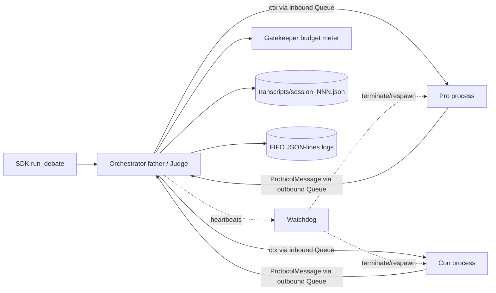
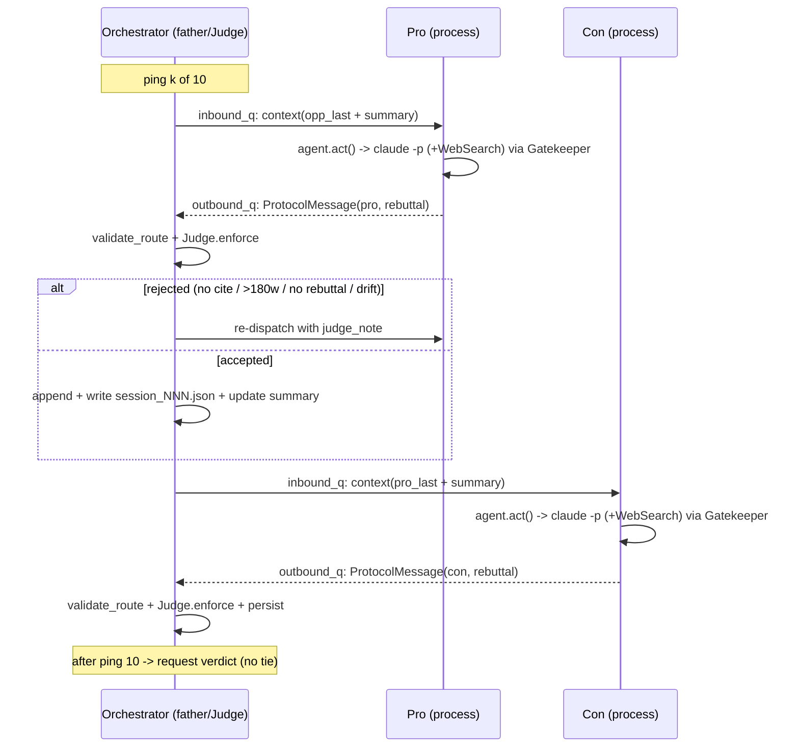

# PRD — Orchestrator (`orchestration/orchestrator.py`)

> Per-mechanism PRD for HW2 "AI Agent Debate" (UOH-RL07, Dr. Yoram Segal).
> Owner module: `src/cosmos77_ex02/orchestration/orchestrator.py` (+ `process_agent.py`, `loop.py`).
> Built in **Phase 6** of `../CLAUDE_CODE_PLAYBOOK.md` §8. Sibling docs: `docs/PRD_watchdog.md`, `docs/PRD_ipc_protocol.md`, `docs/PRD_judge_agent.md`, `docs/PRD_agent_base.md`, `docs/PRD_logging.md`, `docs/PRD_gatekeeper.md`, `docs/PLAN.md`.
> This document maps directly to acceptance criteria **A1, A3, A4, A5, A8, A9, A11** (see `../CLAUDE_CODE_PLAYBOOK.md` §1.5).

---

## 1. Purpose & scope

The Orchestrator is the **heart of the working debate** — per `../CLAUDE_CODE_PLAYBOOK.md` §0.0 it is the single largest slice of the grade (45% "the working debate"). It is the father process that:

1. **Spawns three OS processes** — Judge (itself, the father) plus two children, Pro and Con — and owns their lifecycle (A1).
2. **Owns the transcript and the context engineering** — for each turn it *selects* the opponent's last turn plus a running summary into the next agent's prompt and *evicts* old raw turns so prompts stay small.
3. **Runs the strict-alternation, child→judge→child ping loop** for exactly `debate.pings_per_side` (= **10**) pings per side (A3, A4, A5).
4. **Persists `transcripts/session_NNN.json` incrementally** so a crash never loses the run, and the graded session-1 transcript is reproducible (A9, A15).
5. **Closes the debate with a no-tie verdict** by asking the Judge to adjudicate the full transcript, then appending that `Verdict` (A8).

Everything is **config-driven** (rule 4): the Orchestrator reads every knob from `config/setup.json` and `config/gatekeeper.json` via the shared `Config` loader. It hardcodes no value that exists in config.

**In scope:** process spawning, context construction/eviction, the alternation loop, ordering and routing enforcement, incremental persistence, verdict request/append, clean shutdown, and integration with the Watchdog and Gatekeeper.

**Out of scope (cross-referenced):** the timeout/restart mechanics live in `docs/PRD_watchdog.md`; the JSON envelope and routing validators live in `docs/PRD_ipc_protocol.md`; the persuasion rubric and `verdict()` internals live in `docs/PRD_judge_agent.md`; the cost meter lives in `docs/PRD_gatekeeper.md`. The Orchestrator *uses* these, it does not reimplement them.

---

## 2. Where the Orchestrator sits

The Orchestrator is invoked only through the SDK (rule 2): `SDK.run_debate(topic=None)` constructs and drives an `Orchestrator`, and returns the transcript path + `Verdict`. No CLI, menu, or external caller touches the Orchestrator directly.



Pro and Con **never share a queue**; every message is routed child → judge → child (A5). The Judge role is co-located in the father process (the Orchestrator); the two debaters are the two child `multiprocessing.Process` instances. This satisfies "three agents, three processes" (A1): Orchestrator/Judge (father) + Pro + Con = three processes, two of which are children that communicate only by IPC.

---

## 3. Configured values (pinned — never invent)

All values below are read from `config/setup.json` / `config/gatekeeper.json` at construction time. The Orchestrator stores them as instance attributes; no literal duplicates appear in code.

| Knob | Config path | Value | Used by the Orchestrator for |
|---|---|---|---|
| Topic | `debate.topic` | `"Is social media a net positive for society?"` | Seed of every agent context; transcript header |
| Pro position | `debate.pro_position` | `"Social media is a NET POSITIVE for society."` | Pro context; position-drift checks |
| Con position | `debate.con_position` | `"Social media is a NET NEGATIVE for society."` | Con context; position-drift checks |
| Pings per side | `debate.pings_per_side` | **10** | Loop bound (A3) |
| Max words per turn | `debate.max_words_per_turn` | **180** | Passed in context; Judge enforces (A4/A10) |
| Citation required | `debate.require_citation_per_turn` | `true` | Passed in context; Judge enforces (A7) |
| Language | `debate.language` | `"english"` | Context; output validation (rule "English only") |
| Allowed tools | `runtime.allowed_tools` | `["WebSearch"]` | Forwarded to the runtime per call |
| Per-call timeout | `runtime.per_call_timeout_seconds` | **120** | Handed to the Watchdog as the per-call deadline |
| Watchdog keepalive | `orchestration.watchdog_keepalive_seconds` | **15** | Stall threshold for the Watchdog |
| Max restarts/agent | `orchestration.max_restarts_per_agent` | **3** | Restart budget per child (Watchdog) |
| Transcript dir | `orchestration.transcript_dir` | `"transcripts"` | Where `session_NNN.json` is written |
| Logs dir | `paths.logs_dir` | `"logs"` | FIFO log target |
| Budget cap | `gatekeeper.budget_usd_max` | **$5.00** | Hard-stop ceiling (via Gatekeeper) |
| Per-call cap | `gatekeeper.per_call_usd_max` | **$0.50** | Per-call ceiling (via Gatekeeper) |

A full debate is `10 × 2 = 20` debater turns plus 1 verdict call (21 LLM invocations), each metered against the $5.00 cap. See §9 for cost and budget interaction.

---

## 4. Process model & IPC

### 4.1 Spawning

The Orchestrator owns three artifacts per child:

- a `multiprocessing.Process` running `process_agent.run(role, inbound_q, outbound_q, hb_q, cfg)` (`orchestration/process_agent.py`),
- an **inbound** `multiprocessing.Queue` (father → child contexts),
- an **outbound** `multiprocessing.Queue` (child → father `ProtocolMessage`s),
- a **heartbeat** `multiprocessing.Queue` (child → Watchdog liveness pings).

The Judge agent is built and run **in-process** in the father; it does not get its own child process because the father *is* the judge (relay + enforce + verdict). This keeps the "father routes everything" invariant (A5) trivially true: a child can only put on its outbound queue, which only the father drains.

`process_agent.run` loop (≤140 lines, see §8 of `../CLAUDE_CODE_PLAYBOOK.md` Phase 6):

1. block on `inbound_q.get()` for a context dict (or a `STOP` sentinel),
2. build a `BaseAgent` via `agents/factory.build_agent(role, cfg)` (see `docs/PRD_agent_base.md`),
3. call `agent.act(context)` → a `ProtocolMessage`,
4. `outbound_q.put(message)`,
5. emit a heartbeat on `hb_q` each loop iteration (and ideally before/after the LLM call) so the Watchdog can distinguish "working" from "hung",
6. on `STOP`, break and exit cleanly.

### 4.2 Message envelope

Every queued message is a `ProtocolMessage` (pydantic) defined in `docs/PRD_ipc_protocol.md`:
`{msg_id, ts, sender, recipient, role, ping_no, turn_type, content, citations[], word_count, tokens, cost_usd}`.
The Orchestrator validates `sender`/`recipient` with `protocol.routing.validate_route` before accepting any child output, rejecting any child→child route. After a run it can assert `protocol.routing.is_through_father(history)` — a property the orchestration tests check directly (see §10, A5).

### 4.3 Why processes + queues (ADR pointer)

This is **ADR-003** in `docs/PLAN.md`: `multiprocessing` + Queues for IPC, chosen because the spec demands "agent = OS process" with IPC (A1), and because clean `terminate()`/respawn is required by the Watchdog (`docs/PRD_watchdog.md`). Stateless child processes (ADR-002) make restart trivial — the father replays the last context and the child reconstructs identical behavior, because all conversational state lives in the father-owned transcript, not inside the child.

---

## 5. Context engineering — SELECT / WRITE / evict

This is the explicit "Context Engineering over Prompt Engineering" requirement from `../CLAUDE_CODE_PLAYBOOK.md` §3 and §0.0. The Orchestrator — not the agents — owns memory. Agents are stateless (ADR-002); the father decides what each agent sees.

### 5.1 What gets SELECTed into a turn

For the agent about to speak (say Con on ping *k*), the Orchestrator builds a compact context dict:

```jsonc
{
  "topic": "Is social media a net positive for society?",
  "your_position": "Social media is a NET NEGATIVE for society.",   // con_position
  "ping_no": k,
  "turn_type": "opening" | "rebuttal" | "closing",
  "opponent_last_turn": { "content": "...", "citations": [...] },   // SELECTed verbatim
  "running_summary": "Pro has argued X, Y; Con has argued A, B; open threads: ...",
  "constraints": {
      "max_words_per_turn": 180,
      "require_citation_per_turn": true,
      "language": "english",
      "must_rebut": true,            // A4
      "must_add_new_point": true,    // A4
      "must_cite": true              // A7
  },
  "judge_note": null | "Role reminder: you are CON, do not concede."  // moderation, see §6.2
}
```

The two heavy fields are **`opponent_last_turn`** (the single most recent opposing `ProtocolMessage`, verbatim, so rebuttal is grounded — A4) and **`running_summary`** (a short rolling abstract of everything before it). The agent therefore receives *the last turn in full + a summary of the rest*, never the whole raw transcript.

### 5.2 WRITE / evict policy

- The **authoritative full transcript** is WRITTEN to `transcripts/session_NNN.json` after every turn (§7). Nothing is ever lost from disk.
- The **in-prompt context** keeps only `opponent_last_turn` + `running_summary`; older raw turns are **evicted** from what the next agent sees.
- The **running summary** is refreshed each ping. Two acceptable strategies, decided by **ADR-002** in `docs/PLAN.md`:
  - *Deterministic (default for tests / cheap mode):* a Python-side summary that lists each side's points by ping number — purely mechanical, no LLM call, so it adds zero cost and is fully deterministic for tests (rule 17).
  - *LLM-condensed (optional):* a metered summarization call routed through the Gatekeeper. Disabled in the test suite; if enabled it counts against the $5.00 budget.

This bounds prompt size to roughly `O(one turn + summary)` instead of `O(all turns)`, which (a) keeps cost low under the $5.00 cap, (b) keeps each `claude -p` call inside `runtime.per_call_timeout_seconds` = 120 s, and (c) makes a Watchdog restart cheap because the replayed context is small.

### 5.3 Why orchestrator-owned context (not `claude --resume`)

Per **ADR-002**: we deliberately do *not* use per-agent persistent CLI sessions (`claude --resume`). Reasons: a killed/restarted child would lose its session, defeating the Watchdog; persistent sessions grow context unboundedly (cost + timeout risk); and the course explicitly grades Context Engineering. Orchestrator-owned context is the on-theme, watchdog-friendly, budget-friendly choice.

---

## 6. The ping loop — ordering, alternation, routing

### 6.1 Definitions

- A **ping** (per A3) = one side's argument followed by the opponent's counter-argument. We run `pings_per_side` = **10** pings per side, i.e. 10 Pro turns and 10 Con turns, strictly alternating.
- **Turn types:** ping 1 = `opening`, pings 2..9 = `rebuttal`, ping 10 = `closing` (mapped from `cosmos77_ex02.constants.TURN_TYPES`). The opening turn has no `opponent_last_turn` and is exempt from the "must rebut" check; all later turns must rebut (A4).

### 6.2 One ping, step by step

For `k in 1..pings_per_side`, **Pro speaks first, then Con** (deterministic, fixed ordering):

1. **Build Pro context** (§5) — SELECT Con's last turn (or `null` on ping 1) + running summary.
2. **Dispatch to Pro** — `pro_inbound_q.put(pro_context)`; the Watchdog arms a `per_call_timeout_seconds` deadline and watches Pro's heartbeats (`docs/PRD_watchdog.md`).
3. **Receive Pro's `ProtocolMessage`** from `pro_outbound_q`. Inside the Pro process the LLM call was already routed through `Gatekeeper.guard` (`docs/PRD_gatekeeper.md`); the message carries its `cost_usd`/`tokens`.
4. **Judge relays + enforces** — the father calls `JudgeAgent.enforce(turn, history)` (`docs/PRD_judge_agent.md`). If the turn (a) lacks a citation while `require_citation_per_turn` is true (A7), (b) exceeds `max_words_per_turn` = 180, (c) fails to rebut on a non-opening ping (A4), or (d) drifts into agreeing with the opponent, the Judge **rejects** it and the Orchestrator **re-dispatches the same ping** with a `judge_note` role reminder appended to context. Retries are bounded (see §6.3).
5. **Accept & persist** — on acceptance, the message is appended to the transcript and written to disk (§7), and the running summary is updated (§5.2).
6. **Build Con context** — now SELECT Pro's just-accepted turn + the refreshed summary.
7. **Dispatch to Con**, receive, Judge enforces, accept & persist, update summary — same as steps 2–5.

After 10 such pings, the loop exits and §8 (verdict) runs.



### 6.3 Retry & failure semantics

- **Enforcement retry:** a rejected turn is retried up to a bounded number of attempts (config-extensible; defaults to a small constant such as 2 redos before the Orchestrator records a forfeited/penalized turn and moves on, so the debate can never spin forever on one stubborn turn). This complements, and is distinct from, the **process** restart budget `max_restarts_per_agent` = 3 in `docs/PRD_watchdog.md`.
- **Timeout:** if a call exceeds `per_call_timeout_seconds` = 120 s, the Watchdog fires; see `docs/PRD_watchdog.md`. The Orchestrator's contract is only to *hand the Watchdog the deadline and the heartbeat queue* and to *re-dispatch the last context* to the respawned child.
- **Budget hard-stop:** if `Gatekeeper.check_budget()` raises `BudgetExceeded` (cumulative spend ≥ $5.00, `hard_stop=true`), the Orchestrator stops dispatching new turns, logs the abort, **still persists the partial transcript**, and — if at least one full ping completed — asks the Judge for a verdict on the partial transcript so the run ends with a winner rather than a hang. The README documents any such early stop (per Phase 9, `../CLAUDE_CODE_PLAYBOOK.md` §11).

### 6.4 Strict alternation invariant

The loop never lets a side speak twice in a row, never lets a child message reach the other child without passing through the father, and never exceeds 10 turns/side. These three invariants are the orchestration test contract (§10) and map to A3/A4/A5.

---

## 7. Transcript persistence (`transcripts/session_NNN.json`)

### 7.1 Naming

`session_NNN.json` where `NNN` is the next free zero-padded index in `orchestration.transcript_dir` (`transcripts/`). The first graded run produces `session_001.json`, committed to the repo (kept by the `.gitignore` exception `!transcripts/session_001.json`) and embedded in the README (A15, `../CLAUDE_CODE_PLAYBOOK.md` §12).

### 7.2 Schema

```jsonc
{
  "session_id": "001",
  "version": "1.00",
  "started_at": "2026-05-31T...Z",
  "config_snapshot": {
    "topic": "Is social media a net positive for society?",
    "pro_position": "Social media is a NET POSITIVE for society.",
    "con_position": "Social media is a NET NEGATIVE for society.",
    "pings_per_side": 10,
    "max_words_per_turn": 180,
    "require_citation_per_turn": true,
    "language": "english"
  },
  "messages": [ /* ordered list of accepted ProtocolMessage dicts */ ],
  "events": [ /* restarts, rejections, budget warnings — audit trail */ ],
  "cost": { "total_usd": 0.0, "input_tokens": 0, "output_tokens": 0 },
  "verdict": null
}
```

### 7.3 Incremental write

The transcript is rewritten (atomic: write to `session_NNN.json.tmp`, then `os.replace`) after **every accepted turn** and after the verdict. This guarantees that a watchdog kill, a budget abort, or a Ctrl-C never leaves a torn or empty file — the file always reflects the last consistent state (A9 robustness, A11). Consumed downstream by `SDK.last_verdict()` and `SDK.cost_report()`, and by the README's "Session 1" section (A15).

---

## 8. Closing the debate — the no-tie verdict (A8)

After ping 10 completes, the Orchestrator (as the father/Judge) calls `JudgeAgent.verdict(transcript)` (`docs/PRD_judge_agent.md`, built out in Phase 7). The Judge scores **persuasiveness only** — clarity, evidence use, rebuttal quality, rhetorical force — **not factual truth**. Lies are permitted and are expected to be caught by the opponent, not penalized by the Judge.

The returned `Verdict` (`agents/verdict.py`, `@dataclass Verdict {winner, pro_score, con_score, justification, decided_at}`) must:

- name a **winner** (`"pro"` or `"con"`),
- carry **unequal** differential scores (e.g., Pro 80 / Con 73) — equal scores or the string "tie" are rejected by `Verdict` validation; if raw scores tie, the Judge breaks the tie on rebuttal quality,
- include a **non-empty justification grounded in specific turns** (referencing ping numbers / quotes).

The Orchestrator appends the `Verdict` to the transcript (`"verdict"` field), performs the final incremental write, sends `STOP` to both children, joins the processes, and returns `(transcript_path, verdict)` to `SDK.run_debate`. **The Orchestrator never produces a tie and never short-circuits the Judge** — it has no scoring logic of its own.

---

## 9. Cost & budget interaction (closes HW1 "cost awareness" weakness)

Every LLM call originates inside a child (or the Judge) and is wrapped by `Gatekeeper.guard` (rule 13, `docs/PRD_gatekeeper.md`): pre-check budget → invoke `claude -p` → account `total_cost_usd`/`usage` → post-check. The Orchestrator:

- aggregates per-turn `cost_usd`/`tokens` from each `ProtocolMessage` into the transcript's `cost` block,
- honors `warn_at_fraction` = 0.8 (logs a warning when cumulative spend crosses $4.00) and `budget_usd_max` = $5.00 (`hard_stop=true` → §6.3 abort),
- supports the Phase-9 cost report: total USD, input/output tokens, cost per ping, and a 10-vs-5-ping projection (`../CLAUDE_CODE_PLAYBOOK.md` §11, A15).

Budget-mode fallback: if 10 pings/side risks the cap, `debate.pings_per_side` can be lowered in config (the loop bound is config-driven), the change noted in the README, and the run repeated — no code change.

---

## 10. Testing strategy (TDD, all I/O mocked — rules 6, 7, 17)

Unit tests live in `tests/unit/test_orchestration/`. **No live `claude` call ever runs in the suite**; child agents are replaced with stubs that `put` canned `ProtocolMessage`s on the outbound queue. Coverage target ≥ 85% (Phase 6); the loop helpers in `loop.py` aim higher.

Required tests (the orchestration test contract):

1. **Exact turn count (A3):** a full run produces exactly `pings_per_side` accepted turns per side (10/10) in strict alternation.
2. **Routing through the father (A5):** assert `protocol.routing.is_through_father(history)` is true; assert no child→child message exists; a child message with a child recipient is rejected by `validate_route`.
3. **Context engineering (§5):** the context handed to each agent contains the opponent's last turn + a running summary, and does **not** contain the full raw transcript (eviction proven by size/asserting absent older turns).
4. **Enforcement re-dispatch (A4/A7):** a stub turn with empty `citations[]` or word_count > 180, or a non-rebutting non-opening turn, is rejected and re-dispatched with a `judge_note`.
5. **Restart on dead/hung process (A11):** a simulated dead child is detected (no heartbeat past `watchdog_keepalive_seconds` = 15) and respawned with its last context replayed; a hung call hits `per_call_timeout_seconds` = 120. (Mechanics tested jointly with `docs/PRD_watchdog.md`.)
6. **Incremental persistence (A9):** `session_NNN.json` exists and is valid JSON after each accepted turn; an injected mid-run failure leaves a consistent (non-torn) file.
7. **No-tie verdict (A8):** at end of loop the Judge is asked for a verdict; the returned `Verdict` always has a winner and unequal scores; an attempt to return equal scores raises.
8. **Budget hard-stop (A11/rule 13):** when the mocked Gatekeeper raises `BudgetExceeded`, the loop stops, the partial transcript is persisted, and (if ≥1 ping completed) a verdict is still produced.

An integration smoke test `tests/integration/test_debate_smoke.py` (pytest marker `live`) runs a **1-ping real debate** end-to-end; it is **skipped in CI** (no live LLM in CI, rule 6) and runnable locally to prove the three processes truly debate.

---

## 11. Module layout & the 150-line cap (rule 1)

| File | Responsibility | Cap |
|---|---|---|
| `orchestration/orchestrator.py` | `class Orchestrator`: spawn, own transcript+context, drive the loop, request+append verdict, clean shutdown | ≤ 150 |
| `orchestration/loop.py` | extracted per-ping loop helpers (build context, dispatch, enforce/retry, accept+persist) | ≤ 150 |
| `orchestration/process_agent.py` | the per-process child runner (`run(role, in_q, out_q, hb_q, cfg)`) | ≤ 140 |
| `orchestration/watchdog.py` | `class Watchdog` — owned by `docs/PRD_watchdog.md` | ≤ 140 |

Shared helpers (config access, logging, gatekeeper guarding, protocol validation) are imported from `shared/` and `protocol/` — no duplication (rule 3). Public classes/functions carry docstrings (rule 15) and type hints (rule 16).

---

## 12. Public interface (used only via the SDK — rule 2)

```python
class Orchestrator:
    def __init__(self, cfg: Config, gatekeeper: Gatekeeper) -> None: ...
    def run(self, topic: str | None = None) -> tuple[Path, Verdict]:
        """Spawn judge/pro/con, run the 10-ping loop, persist the
        transcript incrementally, append the no-tie verdict, and return
        (transcript_path, verdict). Raises BudgetExceeded only after a
        partial transcript has been safely persisted."""
```

`SDK.run_debate(topic=None)` is the sole caller; it returns the transcript path + verdict to the terminal menu / CLI (`docs/PRD_terminal_menu.md`). The Orchestrator imports nothing from the CLI layer.

---

## 13. Acceptance-criteria traceability

| Criterion | How the Orchestrator satisfies it | Section |
|---|---|---|
| **A1** three agents/three processes | Father (Judge) + Pro child + Con child; children IPC-only | §2, §4 |
| **A3** ≥10 pings/side | Loop bound = `pings_per_side` = 10 | §3, §6 |
| **A4** mutual rebuttal | `must_rebut`/`must_add_new_point` in context; Judge rejects non-rebutting non-opening turns | §5.1, §6.2 |
| **A5** routing through father | Children put on outbound queue only; `validate_route`/`is_through_father` enforced | §4.2, §6, §10 |
| **A7** mandatory citation | `require_citation_per_turn`=true in context; Judge rejects citation-less turns → re-dispatch | §6.2 |
| **A8** no tie | `JudgeAgent.verdict` produces winner + unequal scores; appended to transcript | §8 |
| **A9** real LLM debate, robust | Turns come from `claude -p` in child processes; incremental atomic persistence | §4, §7 |
| **A11** engineering must-haves | Per-call timeout handoff, Watchdog heartbeats/restart, Gatekeeper cap, FIFO logs | §6.3, §9 |

---

## 14. Open decisions / risks (see `docs/PLAN.md` risk register)

- **Summarization cost vs. fidelity** — deterministic Python summary (default, free, test-stable) vs. an LLM-condensed summary (richer, metered). Resolved by ADR-002; default is deterministic for the graded run to protect the $5.00 budget.
- **Enforcement retry storms** — a debater that repeatedly drops citations could burn budget on redos; mitigated by a small bounded redo count (§6.3) before recording a penalized turn.
- **Process-start overhead on macOS (`spawn` start method)** — children must be import-safe and picklable; `process_agent.run` rebuilds the agent from `role`+`cfg` rather than receiving a live object, which also makes restarts (Watchdog) clean.
- **Ordering fairness** — Pro always opens; this is a fixed, documented convention, not a bias in scoring (the Judge does not know the "right answer" and scores persuasiveness only — `docs/PRD_judge_agent.md`).
