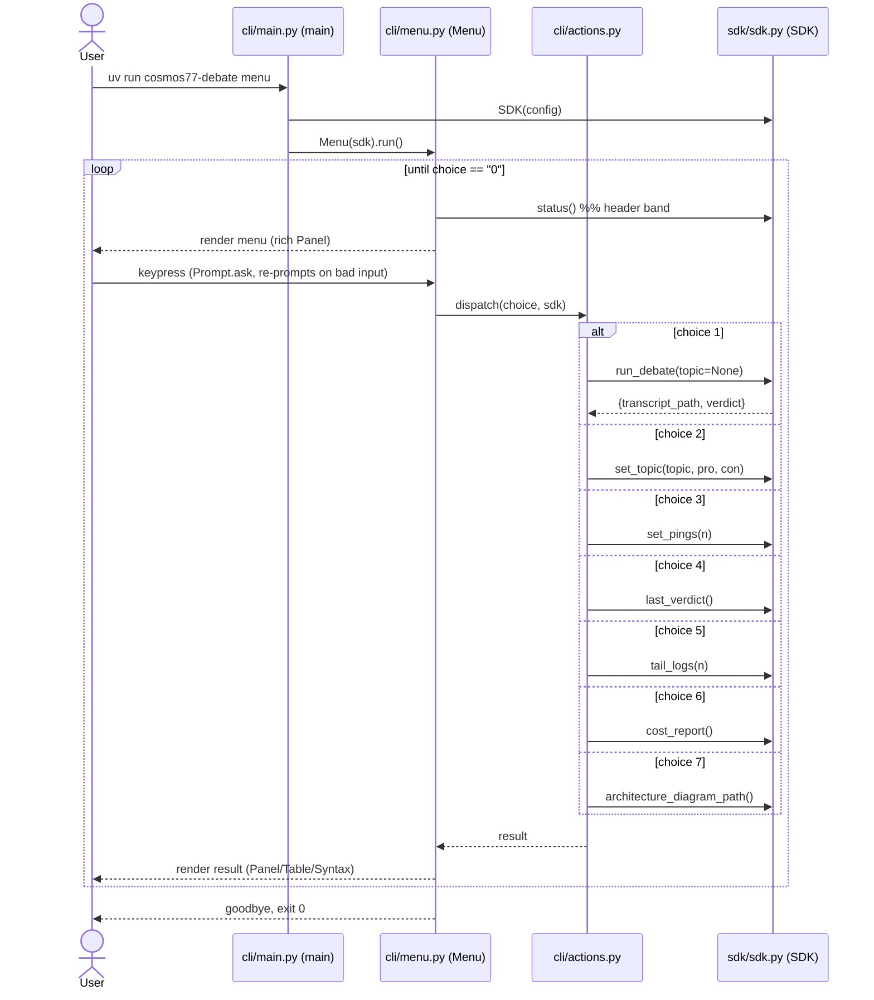

# PRD — Terminal Menu

> **Status:** Phase 1 specification (binding). Implemented in Phase 8 (playbook §10). See `../../CLAUDE_CODE_PLAYBOOK.md` §3 task 12 for the originating prompt.
> **Owner module:** `src/cosmos77_ex02/cli/menu.py` (+ extracted `src/cosmos77_ex02/cli/actions.py`), invoked by `src/cosmos77_ex02/cli/main.py`.
> **Primary acceptance criterion:** **A12 — Terminal menu** ("the system is operable from a keyboard-driven terminal menu"). Grading is on the menu/SDK, not on any optional GUI.

---

## 1. Purpose & scope

This document specifies the **keyboard-driven terminal menu** — the human-facing operator surface for the COSMOS77-ex02 "AI Agent Debate" system. The menu lets a grader or operator run a full Pro-vs-Con debate, reconfigure the debate, inspect the last verdict, tail logs, read the cost report, and locate the architecture diagram — all from the keyboard, with no GUI required.

The single most important architectural constraint for this component, restated from **rule 2** of `CLAUDE.md` and the playbook's 17 rules:

> **The menu holds NO business logic.** Every menu action is a thin call into `class SDK` (`src/cosmos77_ex02/sdk/sdk.py`). The menu renders, prompts, validates *input shape only*, and delegates. It never spawns processes, never reads a transcript file, never touches the Gatekeeper, never parses logs. All of that lives behind the SDK.

This keeps the SDK programmatically drivable (rule 2: "usable programmatically so an agent can drive and debug the system without the UI") and keeps `menu.py`/`actions.py` inside the **150-line cap** (rule 1).

### 1.1 In scope
- The eight-entry menu (`[1]`–`[7]`, `[0]`) and its render/dispatch/re-prompt loop.
- Input validation and re-prompt behavior for the menu selector and every sub-prompt (topic text, position strings, ping count, log line count).
- `rich`-based rendering of menus, tables, panels, and verdict/cost output.
- The exact SDK method each option calls.

### 1.2 Out of scope (delegated or owned elsewhere)
- Running the debate, scoring, routing, watchdog, cost metering — owned by the orchestrator/agents/gatekeeper. See `docs/PRD_orchestrator.md`, `docs/PRD_judge_agent.md`, `docs/PRD_gatekeeper.md`.
- The `argparse` non-interactive subcommands (`run`, `verdict`, `cost`, `logs`) — owned by `cli/main.py`; this PRD covers only the interactive `menu` subcommand (the default). Both surfaces call the same SDK.
- Any optional GUI (explicitly optional per A12 and `docs/PRD.md` "out of scope").

---

## 2. Stakeholders & user stories

| Stakeholder | Need the menu serves |
|---|---|
| Grader (Dr. Yoram Segal / grading agent) | One obvious keyboard entry point: launch `uv run cosmos77-debate menu`, press `1`, watch a real debate end in a no-tie verdict; press `6` to see the cost; press `7` to find the diagram. |
| Operator / the two partners | Reconfigure topic, positions, and ping count without editing JSON by hand; audit the last run via logs and the verdict. |
| The SDK / orchestrator (downstream) | A caller that never duplicates business logic, so the SDK remains the single source of truth (rule 2). |

**User stories**
- *US-M1:* "As a grader, I run one command and from a menu I press `1` to watch a Pro-vs-Con debate that is judged to a winner." → option `[1]` → `SDK.run_debate()`.
- *US-M2:* "As an operator, I change the debate topic and the two positions from the keyboard." → option `[2]` → `SDK.set_topic(...)`.
- *US-M3:* "As an operator, I set how many pings each side gets." → option `[3]` → `SDK.set_pings(...)`.
- *US-M4:* "As a grader, I re-read the judge's last verdict and justification." → option `[4]` → `SDK.last_verdict()`.
- *US-M5:* "As an operator, I tail the structured logs to audit the last run." → option `[5]` → `SDK.tail_logs(n)`.
- *US-M6:* "As a grader, I see total USD spent and cost-per-ping." → option `[6]` → `SDK.cost_report()`.
- *US-M7:* "As a grader, I find the architecture diagram on disk." → option `[7]` → `SDK.architecture_diagram_path()`.
- *US-M8:* "As anyone, I quit cleanly." → option `[0]`.

---

## 3. The menu layout (A12)

Rendered once per loop iteration. Wording matches the Phase 8 prompt (playbook §10) verbatim where it specifies labels.

```
┌──────────────────────────────────────────────────────────────┐
│  COSMOS77-ex02 — AI Agent Debate            v1.00              │
│  Topic: Is social media a net positive for society?           │
│  Pings/side: 10   Budget cap: $5.00   Spent so far: $0.00     │
├──────────────────────────────────────────────────────────────┤
│  [1] Run debate (current topic)                                │
│  [2] Set topic & positions                                     │
│  [3] Set pings per side                                        │
│  [4] View last verdict                                         │
│  [5] Tail logs (last N)                                        │
│  [6] Cost report                                               │
│  [7] Show architecture diagram path                            │
│  [0] Quit                                                      │
└──────────────────────────────────────────────────────────────┘
Select an option [0-7]:
```

The header band (topic, pings/side, budget cap, spent-so-far) is read **from the SDK** each render via a lightweight read method (`SDK.status()` returning a dict), never from a hardcoded string and never by reading `config/setup.json` directly from the menu (rule 4). Default header values reflect `config/setup.json`: topic `"Is social media a net positive for society?"`, `pings_per_side = 10`, `budget_usd_max = $5.00` (`config/gatekeeper.json`).

---

## 4. Option → SDK method contract

Every row below is the binding wiring. The "menu responsibility" column is the *only* logic the menu may contain. If a method does not yet exist on the SDK at Phase 8, it is added to the SDK (rule 2) — the menu is never the place new logic lands.

| # | Label | SDK call | Args (validated by menu) | Returns (menu renders) | Menu responsibility |
|---|---|---|---|---|---|
| 1 | Run debate (current topic) | `SDK.run_debate(topic=None)` | none (uses configured topic) | `{transcript_path, verdict}` | Show "running…" status, then render the returned verdict panel + transcript path. |
| 2 | Set topic & positions | `SDK.set_topic(topic, pro_position, con_position)` | `topic:str`, `pro_position:str`, `con_position:str` | updated effective config (dict) | Prompt for three non-empty strings; pass through; confirm. |
| 3 | Set pings per side | `SDK.set_pings(pings_per_side)` | `pings_per_side:int` | updated effective config (dict) | Prompt for one positive integer; pass through; confirm. |
| 4 | View last verdict | `SDK.last_verdict()` | none | `Verdict` (winner, pro_score, con_score, justification, decided_at) or `None` | Render verdict panel; if `None`, show "no debate has been run yet". |
| 5 | Tail logs (last N) | `SDK.tail_logs(n)` | `n:int` | `list[str]` (JSON-lines) | Prompt for N (default 20); render lines in a scrollable `rich` block. |
| 6 | Cost report | `SDK.cost_report()` | none | cost dict (total_usd, input/output tokens, cost_per_ping, projections) | Render a `rich` table. |
| 7 | Show architecture diagram path | `SDK.architecture_diagram_path()` | none | `dict` of paths (`.mmd` + rendered `.png`) | Print absolute paths; do not open the file. |
| 0 | Quit | — (no SDK call) | none | — | Break the loop, print a goodbye line, return exit code 0. |

### 4.1 SDK method notes
- `run_debate`, `set_topic`, `last_verdict`, `cost_report`, `tail_logs` are the five methods stubbed in the Phase 2 SDK skeleton (playbook §4 task 6) and made real across Phases 6–9. The menu binds to exactly those signatures.
- `set_pings(...)`, `status()`, and `architecture_diagram_path()` are **net-new SDK methods this PRD requires** so options `[3]`, the header band, and `[7]` carry no logic in the menu. They are small read/setter methods on the SDK; their addition is recorded in `docs/PLAN.md` and `docs/TODO.md`.
- `set_topic` / `set_pings` mutate the **effective in-session configuration via the Config layer** (`src/cosmos77_ex02/shared/config.py`); whether changes persist to `config/setup.json` or live only for the session is an SDK decision documented in `docs/PRD.md`, never decided in the menu.

---

## 5. Input validation & re-prompt behavior

The menu's *only* logic is input-shape validation and re-prompting. Semantic validation (e.g., "is this topic debatable", "is 0 pings sensible") and all enforcement belong to the SDK/config layer. The rule is: **validate the keystroke shape, delegate the meaning.**

### 5.1 The top-level selector
- Accepts a single token after `.strip()`; the only valid tokens are `0`–`7`.
- **Empty input** (bare Enter): re-prompt without an error (treated as a no-op refresh).
- **Out-of-range / non-numeric** (e.g., `9`, `q`, `abc`): print `rich`-styled `Invalid choice. Enter a number 0-7.` and re-render the menu.
- The selector is read with `rich.prompt.Prompt.ask("Select an option", choices=["0","1","2","3","4","5","6","7"], show_choices=False)`, which already loops until a valid choice is entered — re-prompt behavior is therefore inherited from `rich`, not hand-rolled.
- `EOFError` / `KeyboardInterrupt` (Ctrl-D / Ctrl-C) at the selector are caught and treated as **option `[0]` Quit** so the program never crashes with a traceback (clean exit, rule-aligned robustness).

### 5.2 Sub-prompts

| Sub-prompt | Validation rule | On invalid input |
|---|---|---|
| Topic (opt 2) | Non-empty after strip; ≤ 200 chars | Re-prompt: "Topic cannot be empty." |
| Pro position (opt 2) | Non-empty after strip | Re-prompt: "Position cannot be empty." |
| Con position (opt 2) | Non-empty after strip; should differ from Pro | Re-prompt with a warning if identical to Pro (distinctness underpins A2/A4 — but the SDK is the authority; the menu only warns). |
| Pings per side (opt 3) | Integer `≥ 1`; suggested default `10`; soft warning if `< 5` (budget-mode floor) or very large (budget risk per `gatekeeper.budget_usd_max = $5.00`) | Use `rich.prompt.IntPrompt.ask(..., default=10)`, which re-asks on non-integers; reject `< 1` with "Pings must be at least 1." |
| Tail count N (opt 5) | Integer `≥ 1`; default `20` | `rich.prompt.IntPrompt.ask(..., default=20)`; clamp/reject `< 1`. |

General sub-prompt rules:
- Every sub-prompt offers a way back: entering a bare cancel sentinel (Enter on an optional field, or a documented `b`/blank where the field is optional) returns to the main menu **without calling the SDK**.
- The menu **never coerces silently into a bad call**: it re-prompts until the input is shape-valid, *then* calls the SDK exactly once.
- All numeric parsing uses `rich`'s `IntPrompt`/`Prompt` so there is one consistent re-prompt UX and the menu code stays under the line cap.

### 5.3 Error surfacing from the SDK
When an SDK call raises a known, catchable exception, the menu catches it, renders a red `rich` panel with the message, and returns to the menu loop — it never lets a traceback reach the terminal. Specifically:
- `BudgetExceeded` (from the Gatekeeper, see `docs/PRD_gatekeeper.md`) during `[1] Run debate`: render "Budget cap of $5.00 reached — debate stopped cleanly. See cost report (option 6)." and continue the loop. This realizes the graceful-abort behavior of **A11**.
- A missing-transcript condition for `[4]`/`[6]` (no debate run yet): the SDK returns `None`/empty and the menu shows an informational message — not an error.
- Any unexpected exception is caught at the loop boundary, logged via the SDK's logging path, and shown as a single-line error so the menu stays alive.

---

## 6. Rendering with `rich`

`rich>=13.7` is a declared dependency (playbook §2 task 2, `pyproject.toml`). Selection is plain `input()`-equivalent via `rich.prompt`, per the Phase 8 prompt: *"Use `rich` for rendering, plain input() for selection — no heavy TUI dependency."* We deliberately avoid `Live`/full-screen TUI frameworks (e.g., Textual) to keep the surface testable and dependency-light.

| `rich` construct | Used for |
|---|---|
| `rich.console.Console` | Single shared console instance; all output goes through it (one I/O seam → trivially mockable in tests). |
| `rich.panel.Panel` | The bordered menu frame; the verdict block (option 4); error messages. |
| `rich.table.Table` | The cost report (option 6): columns total USD, input/output tokens, cost/ping, 10-vs-5-ping projection. |
| `rich.prompt.Prompt` / `IntPrompt` | The selector and all sub-prompts; provides built-in re-prompt and `choices=`/`default=`. |
| `rich.text.Text` / styles | Color the winner, the budget "spent so far", and error lines (green for the leading side, red for errors). |
| `rich.syntax.Syntax` (JSON lexer) | Pretty-print log JSON-lines (option 5) and the verdict justification. |

Rendering conventions:
- A single module-level/`Menu`-held `Console` is the only print path — no bare `print()`. This isolates output for assertions (`Console(file=StringIO())` in tests).
- The verdict is always rendered as **"<winner> wins — Pro <pro_score> / Con <con_score>"** plus the justification, reinforcing **A8 (no tie, differential score)** in the UI.
- Color and emoji are avoided in machine-graded paths; the cost table and verdict are plain enough to screenshot for the README (A15, Phase 9 task 3 lists the exact screenshot filenames).

---

## 7. Control flow



The dispatch is a **dict of `choice -> action callable`** in `cli/actions.py` (not an if/elif ladder) to keep `menu.py` short and to make each action independently unit-testable. Each action receives the `SDK` instance and the shared `Console`, calls exactly one SDK method, and renders. This is the seam that keeps `menu.py` and `actions.py` each under 150 lines (rule 1).

---

## 8. Module layout & line-cap strategy (rule 1)

| File | Responsibility | Target size |
|---|---|---|
| `src/cosmos77_ex02/cli/menu.py` | `class Menu`: holds the `SDK` + `Console`, renders the frame, reads the selector, runs the loop, delegates to `actions`. | ≤ 150 lines |
| `src/cosmos77_ex02/cli/actions.py` | One small function per option (`action_run`, `action_set_topic`, `action_set_pings`, `action_view_verdict`, `action_tail_logs`, `action_cost`, `action_diagram`) + the dispatch table + shared render helpers. | ≤ 150 lines |
| `src/cosmos77_ex02/cli/main.py` | `main()`: `argparse` with subcommands `menu` (default), `run`, `verdict`, `cost`, `logs`; constructs the SDK; launches `Menu(sdk).run()` for `menu`. Wires the `cosmos77-debate` console script. | ≤ 130 lines |

`cli/*` is excluded from the coverage source set in `pyproject.toml` (`omit = ["src/cosmos77_ex02/cli/*", ...]`), but the menu is still unit-tested (Section 9) because the dispatch and validation are real logic worth pinning; the *coverage gate* (≥ 85%, rule 7) is met by the SDK and shared/agent layers.

---

## 9. Testing strategy (rules 6, 17)

All tests live under `tests/unit/test_cli/` and **mock the SDK entirely** (the menu must never trigger a real debate or a live `claude -p` call — rule 6: "no live calls in tests"). The `SDK` is replaced with a `MagicMock`/`pytest-mock` double; the `Console` is constructed with `file=io.StringIO()` to capture rendered output.

| Test | Asserts |
|---|---|
| `test_menu_run_debate` | Choosing `1` calls `sdk.run_debate` exactly once and renders the returned verdict. |
| `test_menu_set_topic` | Choosing `2` with three non-empty strings calls `sdk.set_topic(topic, pro, con)` with those exact args. |
| `test_menu_set_pings_valid` | Choosing `3` then `10` calls `sdk.set_pings(10)`. |
| `test_menu_set_pings_reprompts` | Non-integer then `5` re-prompts and finally calls `sdk.set_pings(5)`; `0`/negative is rejected. |
| `test_menu_invalid_choice_reprompts` | Input `9`/`q` does **not** call any SDK method and re-renders the menu. |
| `test_menu_view_verdict_none` | `last_verdict()` returning `None` renders "no debate run yet" and calls no other method. |
| `test_menu_tail_logs_default` | Choosing `5` with bare Enter calls `sdk.tail_logs(20)`. |
| `test_menu_cost_report` | Choosing `6` calls `sdk.cost_report()` and renders a table containing the total USD figure. |
| `test_menu_diagram_path` | Choosing `7` calls `sdk.architecture_diagram_path()` and prints the returned path(s). |
| `test_menu_quit` | Choosing `0` exits the loop with no SDK call and returns 0. |
| `test_menu_budget_exceeded` | `run_debate` raising `BudgetExceeded` is caught, shown as a clean message, and the loop continues (A11). |
| `test_menu_eof_quits` | `EOFError`/`KeyboardInterrupt` at the selector exits cleanly as Quit. |

`input()` / `Prompt.ask` is driven by monkeypatching (`monkeypatch.setattr` on the prompt source or feeding a `Console(file=...)` with `input=` stream), per the Phase 8 prompt: *"monkeypatch input() to drive the menu and assert the right SDK method is called."* Tests are deterministic (rule 17): no randomness, no real subprocess, no network.

**Phase 8 acceptance commands** (playbook §10 verification):
```
uv sync && uv run cosmos77-debate --help        # lists subcommands
echo "0" | uv run cosmos77-debate menu          # renders the menu, then quits cleanly
```

---

## 10. Non-functional requirements

| NFR | Requirement | Source |
|---|---|---|
| No business logic | Menu contains only render + input-shape validation + single SDK delegation. | rule 2, `CLAUDE.md` |
| Line cap | `menu.py`, `actions.py` ≤ 150 lines; `main.py` ≤ 130. | rule 1 |
| Config-driven | Header band (topic, pings, budget) read from SDK/Config, never hardcoded. Defaults: topic `"Is social media a net positive for society?"`, pings `10`, budget `$5.00`. | rule 4, `config/setup.json`, `config/gatekeeper.json` |
| Robustness | No traceback ever reaches the terminal; bad input re-prompts; Ctrl-C/Ctrl-D quit cleanly; `BudgetExceeded` handled gracefully. | A11, A12 |
| English only | All labels, prompts, and messages in English. | rule, `CLAUDE.md` |
| Testability | SDK and Console are injectable seams; suite mocks both. | rule 6, 17 |
| Docstrings & types | `class Menu`, `run()`, every action function carry Google-style docstrings (why, not what) and full type hints. | rules 15, 16 |

---

## 11. Acceptance criteria mapping

| Criterion | How this component satisfies it |
|---|---|
| **A12 — Terminal menu** | The eight-entry keyboard menu in Sections 3–4 is the operable surface; `echo "0" \| uv run cosmos77-debate menu` renders and quits. |
| **A8 — No tie** | Option `[4]` and the `[1]` post-run panel always render a single winner with a differential score (e.g., "Pro 80 / Con 73") plus justification, surfaced from the `Verdict` dataclass (`docs/PRD_judge_agent.md`). |
| **A11 — Engineering must-haves** | `BudgetExceeded` from the Gatekeeper is shown as a clean stop; the cost report (option 6) surfaces the budget meter; option `[5]` exposes the FIFO logs (`docs/PRD_logging.md`). |
| **A15 — README evidence** | Options `[1]`, `[4]`, `[6]`, and the menu frame are the exact screens captured for the README (Phase 9 task 3). |
| **A2 / A4 (supportive)** | Option `[2]` warns if Pro and Con positions are identical, nudging toward genuine contradiction; the SDK remains the authority. |

---

## 12. Open questions / ADR pointers
- **Persistence of `[2]`/`[3]` edits** — session-only vs written back to `config/setup.json`. Decided in the SDK/Config layer; recorded as an ADR in `docs/PLAN.md`. The menu is agnostic.
- **Live-progress rendering of a running debate** — the current design renders the result *after* `run_debate` returns. A streaming view (per-turn `rich` updates) is a future enhancement noted in `docs/PRD_extension_points.md`; it must still flow strictly through the SDK.

---

## 13. Cross-references
- `docs/PRD.md` — assignment-wide context, scope, and acceptance criteria A1–A15.
- `docs/PRD_orchestrator.md` — what `SDK.run_debate()` drives (3 processes, the 10-ping loop, transcript persistence).
- `docs/PRD_judge_agent.md` — the `Verdict` structure rendered by options `[1]` and `[4]`.
- `docs/PRD_gatekeeper.md` — the `BudgetExceeded` path and the figures behind option `[6]`.
- `docs/PRD_logging.md` — the FIFO logs (20 files × 500 lines) surfaced by option `[5]`.
- `docs/PLAN.md` — ADR-005 (SDK single entry point), which this component depends on absolutely.
