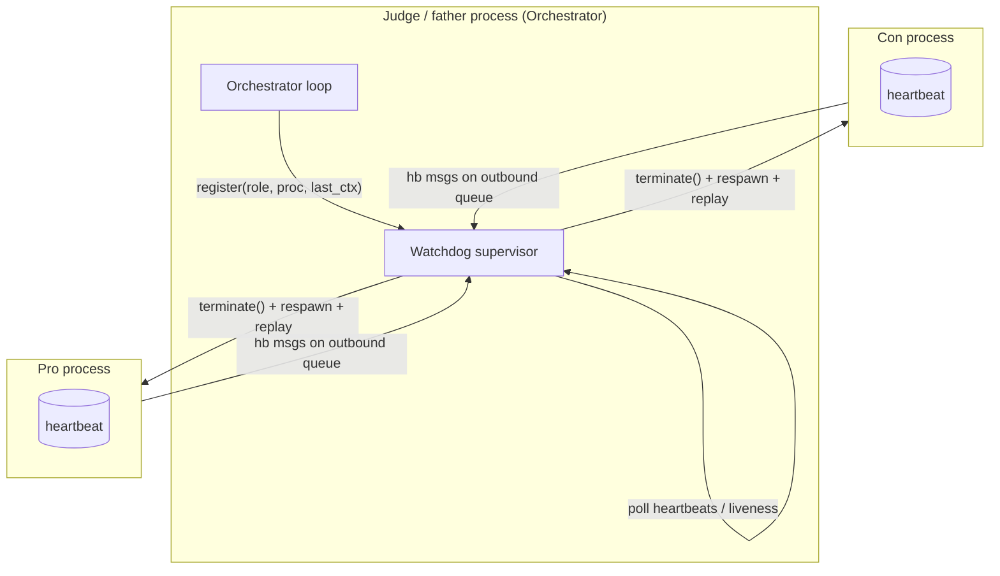

# PRD — Watchdog (per-call timeouts, heartbeat, stall/death detection, restart with context replay)

> **Status:** Phase 1 mandatory design document. Implemented in Phase 6 (`src/cosmos77_ex02/orchestration/watchdog.py`, ≤140 lines per playbook §8). Binding against the 17 rules in `CLAUDE.md` and acceptance criteria A1–A15 in `../CLAUDE_CODE_PLAYBOOK.md` §1.5. All numeric values below are pinned from `config/setup.json` and `config/gatekeeper.json`; this document MUST NOT invent values that exist in config.

---

## 1. Purpose and scope

The Watchdog is the liveness-and-recovery layer that makes the HW2 debate **finish reliably even when an agent process hangs or dies**. The grader will clone the repo and run a full 10-ping-per-side debate; the single worst failure mode is a hung `claude -p` subprocess that freezes the run forever. This component exists to guarantee that does not happen.

It is the direct owner of three acceptance-criteria obligations in **A11 ("Engineering must-haves")**:

- **Per-request timeouts** on every LLM call.
- **A Watchdog with keep-alive that kills and restarts a stuck/dead process.**
- Continuity: a restarted agent rejoins the debate without corrupting the ping count or the transcript.

It is a sibling of, and tightly coupled to, the Orchestrator (see `docs/PRD_orchestrator.md`). The Orchestrator owns the debate *flow* (the 10-ping loop, child→judge→child routing per **A5**, transcript persistence). The Watchdog owns the *health* of the three OS processes the Orchestrator spawned. The division of responsibility is deliberate and is the central design decision of this document (§3).

**In scope:** per-call timeout enforcement; the heartbeat protocol; stall vs. death detection; `terminate()`/respawn; per-agent restart accounting against `max_restarts_per_agent`; context replay so the debate resumes at the correct turn; the clean abort path when restarts are exhausted; structured logging of every restart event.

**Out of scope (owned elsewhere):** the ping loop and turn ordering (`docs/PRD_orchestrator.md`); USD/token budget enforcement (`docs/PRD_gatekeeper.md` — the Watchdog handles *time/liveness*, the Gatekeeper handles *money*); the JSON envelope (`docs/PRD_ipc_protocol.md`); the verdict (`docs/PRD_judge_agent.md`).

---

## 2. Configuration (pinned values — never hardcoded, per rule 4)

Every knob is read at construction time via the `Config` loader (`cosmos77_ex02.shared.config`); none is hardcoded.

| Key (`config/setup.json`) | Value | Meaning for the Watchdog |
|---|---|---|
| `runtime.per_call_timeout_seconds` | **120** | Hard ceiling on a single `claude -p` invocation. Enforced inside the runtime via `subprocess.run(..., timeout=120)`; the Watchdog treats a turn that produces no result within this window as a stall. |
| `orchestration.watchdog_keepalive_seconds` | **15** | Heartbeat staleness threshold. If the most recent heartbeat from a process is older than 15 s, the process is declared stalled. |
| `orchestration.max_restarts_per_agent` | **3** | Maximum respawns per agent role for the whole session. The 4th failure of the same role is fatal (§7). |
| `runtime.claude_cli_path` | `"claude"` | Backend binary the restarted process re-launches. |
| `runtime.allowed_tools` | `["WebSearch"]` | Tool set the restarted process must restore (mandatory web search, **A7**). |
| `runtime.max_turns_per_call` | **6** | Agentic-turn ceiling per call (bounds WebSearch loops; a secondary guard against runaway calls inside the timeout window). |
| `orchestration.transcript_dir` | `"transcripts"` | Source of replayable context after a restart (§6). |

**Relationship between the two time constants.** `per_call_timeout_seconds` (120 s) is the *upper bound on legitimate work*; `watchdog_keepalive_seconds` (15 s) is the *liveness pulse*. Because 15 s ≪ 120 s, a healthy in-progress call still emits heartbeats while it works (the process loop pulses around the blocking call — see §4), so the Watchdog distinguishes "busy but alive" from "stalled" long before the 120 s timeout would fire. The two mechanisms are complementary: the timeout caps a *single* call's duration; the heartbeat detects a *frozen* process that has stopped pulsing entirely.

---

## 3. Design decision: shared-process supervisor, not a separate OS process

The Watchdog runs **inside the Orchestrator (the Judge/father process)** as a supervisory object polled on the orchestration thread — it is *not* a fourth OS process. This keeps the process model exactly the three required by **A1** (Judge father + Pro + Con) and avoids a watchdog-of-the-watchdog regression. The father process is the natural supervisor because it already owns the `multiprocessing.Process` handles and the `multiprocessing.Queue` pair for each child (ADR-003 in `docs/PLAN.md`).

This aligns with the stateless-agent design (ADR-002): children carry **no durable session state**, so killing and respawning one is cheap and safe — all the context a child needs is re-injected by the Orchestrator on its next turn (§6). Had we chosen per-agent persistent `claude --resume` sessions, a restart would have lost in-flight session state; the stateless choice is what makes the Watchdog's "replay last context" strategy correct.



---

## 4. Heartbeat mechanism

### 4.1 Emission (child side — `orchestration/process_agent.py`)

Each agent runs in its own `multiprocessing.Process` with an inbound `Queue` (contexts from the father) and an outbound `Queue` (results + control messages back to the father). The process loop emits a **heartbeat** as a lightweight control message on the outbound queue:

- **On entering the loop** (process is up and waiting for work).
- **Immediately before** the blocking `agent.act()` call (about to start an LLM turn).
- **Periodically while blocked** on the LLM call — the `act()`/runtime layer pulses a heartbeat at most every `watchdog_keepalive_seconds / 2 ≈ 7.5 s` so a healthy long call (up to the 120 s timeout) keeps proving liveness without spamming the queue.
- **Immediately after** putting the resulting `ProtocolMessage` on the outbound queue (turn complete, idle again).

A heartbeat is a small control envelope, distinct from a debate `ProtocolMessage` (which is defined in `docs/PRD_ipc_protocol.md`):

```json
{ "kind": "heartbeat", "role": "pro", "ping_no": 4, "phase": "in_call", "monotonic_ts": 18423.91 }
```

`phase ∈ {idle, in_call, post_turn}`. `monotonic_ts` is `time.monotonic()` (wall-clock-immune; never affected by NTP/clock changes — rule 17 determinism applies to tests, but production timing uses a monotonic source).

### 4.2 Observation (father side — `orchestration/watchdog.py`)

The Watchdog keeps a per-role record:

```python
@dataclass
class AgentHealth:
    role: str                 # "pro" | "con"  (judge is the father; not supervised here)
    process: Process          # multiprocessing handle
    last_beat_monotonic: float
    last_phase: str           # idle | in_call | post_turn
    restarts_used: int = 0    # accounted against max_restarts_per_agent (3)
    last_context: dict | None = None  # replay payload for THIS agent's pending turn
```

On every poll tick the Watchdog drains heartbeat control messages off each child's outbound queue and refreshes `last_beat_monotonic`/`last_phase`. Debate `ProtocolMessage` results are passed through to the Orchestrator untouched — the Watchdog only consumes `kind == "heartbeat"` messages.

### 4.3 Poll cadence

The Watchdog is polled by the Orchestrator on every loop tick and additionally while the Orchestrator is blocked waiting for a child's result, on a sub-`watchdog_keepalive_seconds` cadence (poll interval ≈ 5 s, i.e. comfortably below the 15 s threshold so a stall is caught within one threshold window, not after several). Polling is cooperative (no extra thread is mandatory); if a thread is used it is a daemon thread owned by the father, never a new OS process (§3).

---

## 5. Stall vs. death detection

The Watchdog classifies each supervised child into exactly one of three states on every tick:

| State | Detection rule | Signal |
|---|---|---|
| **ALIVE** | `process.is_alive()` is `True` **and** `now − last_beat_monotonic ≤ watchdog_keepalive_seconds (15 s)` | Normal. No action. |
| **STALLED** | `process.is_alive()` is `True` **but** `now − last_beat_monotonic > watchdog_keepalive_seconds (15 s)` | The process exists but has stopped pulsing — a frozen/deadlocked `claude -p` child, a hung WebSearch, or a wedged I/O read. Recovery = §6. |
| **DEAD** | `process.is_alive()` is `False` (process exited, was OOM-killed, crashed, or raised an uncaught exception) | The OS process is gone. Recovery = §6. |

Two distinct detectors, one recovery path:

- **Death detection** is authoritative and immediate: `multiprocessing.Process.is_alive()` returns `False` and `process.exitcode` is set (non-`None`). A non-zero `exitcode` is logged as a crash; a `None`→exit transition without a result on the queue is logged as a silent death.
- **Stall detection** is timer-based and uses the **monotonic** heartbeat age, so it is immune to wall-clock adjustment. A stall is only declared after the *full* `watchdog_keepalive_seconds` window of silence — a single delayed beat does not trigger a restart.

**Timeout vs. stall — the boundary.** The 120 s `per_call_timeout_seconds` lives in the runtime layer (`subprocess.run(timeout=...)`, raising `RuntimeTimeout` per `docs/PRD_agent_base.md`). Ordinarily a healthy-but-slow call still heartbeats (§4.1) and the runtime's own timeout fires first, surfacing a clean `RuntimeTimeout` that the Orchestrator can convert into a turn retry. The Watchdog's 15 s stall detector is the **backstop** for the worse case where the process froze so hard it stopped heartbeating *and* failed to honor its own subprocess timeout (e.g., the Python interpreter in the child is wedged, not just the subprocess). In that case the Watchdog forces recovery without waiting for the 120 s ceiling.

---

## 6. Recovery: terminate, respawn, replay

When a child is STALLED or DEAD, the Watchdog runs one recovery cycle for that role:

```mermaid
sequenceDiagram
    participant WD as Watchdog (father)
    participant Old as Stalled/dead child
    participant New as Respawned child
    participant T as transcripts/session_NNN.json

    WD->>WD: classify role=con -> STALLED (no beat > 15s)
    WD->>WD: restarts_used < max_restarts_per_agent (3)?  yes
    WD->>Old: terminate() (SIGTERM) ; join(grace) ; kill() if still alive
    WD->>WD: restarts_used += 1 ; log restart event (JSONL)
    WD->>New: spawn new Process(role, skill, runtime, gatekeeper)
    WD->>T: read last persisted context for this pending turn
    WD->>New: re-inject last_context (opponent's last turn + running summary)
    New-->>WD: heartbeat phase=idle
    Note over WD,New: ping_no is unchanged; debate resumes at the same turn
```

### 6.1 Terminate

1. `process.terminate()` (SIGTERM) to the stalled/dead handle.
2. `process.join(timeout=grace)` for a short grace window.
3. If still alive, `process.kill()` (SIGKILL) and `join()` again.
4. Close/drain that child's stale queues so no orphaned heartbeat or partial result leaks into the new process's stream.

A DEAD process skips straight to draining/closing (nothing to terminate), but the bookkeeping path is identical.

### 6.2 Respawn

A fresh `multiprocessing.Process` is created for the **same role** with the same construction the Orchestrator used originally: the role's distinct Skill file (**A2**, `docs/PRD_skills.md`), a new `ClaudeCliRuntime`, and the shared `Gatekeeper` (so the accumulated USD spend carries across the restart — a restart does **not** reset the $5.00 budget; see `docs/PRD_gatekeeper.md`). A new inbound/outbound `Queue` pair is wired in.

### 6.3 Replay the last context (continuity — the heart of "the debate continues")

Because agents are **stateless** (ADR-002) and the Orchestrator owns the canonical transcript (`docs/PRD_orchestrator.md`), the replay payload for the interrupted turn is fully reconstructible from data the father already holds — no child-side state is lost. The Watchdog (via the Orchestrator) re-injects the exact context the agent needed for its *pending* turn:

- the **opponent's last turn** (the message the agent must rebut — **A4**), and
- the **running summary** of prior pings (Context-Engineering "Select"), and
- the agent's fixed **position string** and `ping_no`.

This is the same context object the Orchestrator built for the original (failed) turn, persisted alongside `transcripts/session_NNN.json`. Re-injecting it means the respawned agent answers the *same* turn it was supposed to answer — **`ping_no` is not advanced, no turn is skipped, no duplicate turn is emitted**, and the child→judge→child routing invariant (**A5**, `protocol.is_through_father`) is preserved. A partial/garbage result from the killed process (if any landed on the queue) is discarded; only a fully validated `ProtocolMessage` counts as a completed turn.

---

## 7. Restart accounting and exhaustion

### 7.1 Per-agent budget

`restarts_used` is tracked **per role** (`pro`, `con`) and is incremented **once per recovery cycle** (§6.1 step). The limit is `max_restarts_per_agent = 3`. Accounting rules:

- The counter is **per session and per role**; Pro and Con have independent budgets (Pro may restart 3 times and Con 0, etc.).
- A restart is counted whether the trigger was a **stall** or a **death** — both consume one unit.
- The counter is **monotonic for the session**; it is **not** decremented on a subsequent healthy turn. (Rationale: an agent that needed 3 restarts is unstable; we do not want a slow leak of unlimited restarts spread across 20 turns.)
- The Gatekeeper budget is **orthogonal**: restarts do not refund spend, and an exhausted USD budget aborts the run regardless of restart headroom (`docs/PRD_gatekeeper.md`).

A role may be restarted **up to 3 times**; the **4th** consecutive failure of the same role (i.e., a failure detected when `restarts_used == 3`) is **fatal** and triggers the exhaustion path.

### 7.2 Exhaustion path (graceful abort, never a hang)

When a role fails and `restarts_used >= max_restarts_per_agent (3)`:

1. The Watchdog does **not** respawn again.
2. It raises a clean, catchable `WatchdogExhausted(role, restarts_used)` to the Orchestrator.
3. The Orchestrator stops the ping loop, terminates the *other* live children cleanly (SIGTERM → join → SIGKILL fallback), and flushes/persists the partial `transcripts/session_NNN.json` with a recorded abort reason.
4. **No tie is fabricated and no winner is faked.** The session is marked **aborted** (distinct from a completed, judged debate). If at least the minimum scorable material exists, the Orchestrator MAY request the Judge to render a verdict over the turns completed so far (still no tie — **A8**); otherwise the session ends as an explicit `aborted` record. The README/cost report (`docs/PRD_logging.md`, Phase 9/10) surfaces the abort honestly rather than masking it.
5. The process exits with a non-zero status so CI/operators see the failure; the abort is logged as a single terminal event.

This guarantees the contract that matters for grading: **the run always terminates** — either with a real no-tie verdict or with an explicit, logged, recoverable abort. It never hangs.

---

## 8. Structured logging (auditability — `docs/PRD_logging.md`, A6/A15)

Every Watchdog action is a JSON-lines event on the `cosmos77_ex02` logger (FIFO handler: 20 files × 500 lines, config-driven). Logged events, with fields:

| Event | Key fields |
|---|---|
| `watchdog.heartbeat_stale` | `role`, `age_s`, `threshold_s=15`, `last_phase`, `ping_no` |
| `watchdog.process_dead` | `role`, `exitcode`, `ping_no` |
| `watchdog.terminate` | `role`, `signal` (`SIGTERM`/`SIGKILL`), `pid` |
| `watchdog.restart` | `role`, `restarts_used`, `max=3`, `reason` (`stall`/`death`) |
| `watchdog.replay` | `role`, `ping_no`, `replayed_context_keys` |
| `watchdog.exhausted` | `role`, `restarts_used=3`, `outcome` (`partial_verdict`/`aborted`) |

Cyber hygiene: any text logged passes through `Gatekeeper.scrub()` so no key/token-like string is ever written (rule 9). Restart events carry **no** raw LLM content, only metadata — the replayed context bodies live in the transcript, not the watchdog log.

---

## 9. Functional requirements → acceptance criteria

| # | Requirement | Maps to |
|---|---|---|
| WD-1 | Enforce `per_call_timeout_seconds = 120` on every LLM call (runtime layer; Watchdog backstops) | **A11** |
| WD-2 | Emit a keep-alive heartbeat from each child (idle / in_call / post_turn) | **A11** |
| WD-3 | Declare STALLED when no heartbeat for `watchdog_keepalive_seconds = 15` (monotonic) | **A11** |
| WD-4 | Declare DEAD via `is_alive()`/`exitcode`; distinguish from STALLED | **A11** |
| WD-5 | `terminate()` (SIGTERM→join→SIGKILL) and respawn the same role | **A11** |
| WD-6 | Cap restarts at `max_restarts_per_agent = 3` per role; account monotonically | **A11** |
| WD-7 | Replay last context so the *same* `ping_no` resumes; no skipped/duplicated turn; routing stays child→judge→child | **A4, A5** |
| WD-8 | On exhaustion, abort gracefully (partial verdict or explicit aborted record) — never hang, never tie | **A8, A11** |
| WD-9 | Carry Gatekeeper spend across restarts (no budget reset) | **A11** + `docs/PRD_gatekeeper.md` |
| WD-10 | Log every heartbeat-stale/death/terminate/restart/replay/exhausted event as JSONL | **A6, A15** |

---

## 10. Non-functional requirements

- **Robustness:** the run completes or aborts deterministically; no infinite hang under any single-process stall or death (the primary HW2 failure mode, playbook §0.0).
- **Process-model fidelity:** exactly three OS processes (**A1**); the Watchdog adds none.
- **Cost safety:** liveness recovery never circumvents the $5.00 Gatekeeper cap (`docs/PRD_gatekeeper.md`).
- **Reproducibility/testability (rules 6, 17):** all subprocess/queue I/O is mocked. Unit tests in `tests/unit/test_orchestration/` simulate: (a) a child that stops heartbeating → STALLED → restart; (b) a child whose `is_alive()` flips False → DEAD → restart; (c) `restarts_used` reaching 3 then a 4th failure → `WatchdogExhausted` → graceful abort; (d) replay re-injects the same `ping_no` context and routing audit still passes (`protocol.is_through_father`). Time is injected (fake monotonic clock) so stall detection is deterministic — no real `sleep`, no flakes.
- **Line cap (rule 1):** `orchestration/watchdog.py` ≤ 140 lines; helpers (e.g., `AgentHealth`, terminate/replay routines) split into a small companion module if the cap is approached.
- **English only** (rule 30/CLAUDE.md): all logs and messages in English.

---

## 11. Interfaces (sketch — finalized in Phase 6)

```python
class Watchdog:
    """Liveness supervisor for the Pro/Con child processes (runs in the father)."""

    def __init__(self, cfg: Config, gatekeeper: Gatekeeper) -> None: ...

    def register(self, role: str, process: Process, last_context: dict) -> None:
        """Track a freshly spawned agent process and the context of its pending turn."""

    def record_heartbeat(self, beat: dict) -> None:
        """Refresh last_beat_monotonic/last_phase from a child control message."""

    def check(self, now: float) -> list[str]:
        """Return roles classified STALLED or DEAD at monotonic time `now`."""

    def recover(self, role: str, respawn: Callable[[str, dict], Process]) -> Process:
        """terminate → (increment + respawn + replay) OR raise WatchdogExhausted."""
```

`respawn` is supplied by the Orchestrator (it owns process construction and the transcript replay payload), keeping the Watchdog focused purely on liveness and accounting. See `docs/PRD_orchestrator.md` for how `recover` is wired into the ping loop and how the replayed context is assembled from `transcripts/session_NNN.json`.

---

## 12. Open items / ADR pointers

- **ADR-002 (stateless agents)** in `docs/PLAN.md` is the precondition that makes context-replay restart correct; cross-referenced here.
- **ADR-003 (multiprocessing + Queues)** justifies the kill/respawn model the Watchdog relies on.
- A future ADR may add an exponential backoff between restarts of the same role; the current spec restarts immediately (within the 3-restart budget) to minimize debate stall time. Documented as an extension in `docs/PRD_extension_points.md`.
