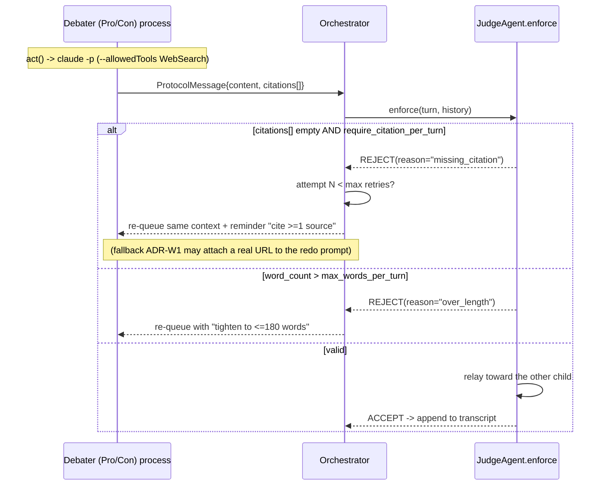

# PRD — Mandatory Web-Search Tool (the internet citation layer)

> **Status:** authoritative (Phase 1). This document replaces the placeholder at `docs/PRD_web_search.md`.
> **Owner mechanism:** the internet-access tool that satisfies acceptance criterion **A7** ("Mandatory web search — each debater must use a web-search tool and cite ≥1 source per argument; no citations → the turn is rejected and retried").
> **Scope:** the *primary* path (`claude -p --allowedTools WebSearch`), the *citation-validation rule* (empty `citations[]` ⇒ reject + retry), how citations live in the JSON protocol, and the *fallback* `WebSearchTool` (captured as an ADR).
> **Sibling docs:** `docs/PRD_agent_base.md`, `docs/PRD_debater_agents.md`, `docs/PRD_ipc_protocol.md`, `docs/PRD_orchestrator.md`, `docs/PRD_judge_agent.md`, `docs/PRD_gatekeeper.md`, `docs/PRD_logging.md`, `docs/PRD_extension_points.md`, `docs/PLAN.md`.

---

## 1. Purpose & rationale

The assignment requires that the debate be grounded in *real evidence pulled from the internet*, not invented facts. Each debater turn must cite **at least one** web source, and a turn that cites nothing must be **rejected and retried** — never silently accepted. This is acceptance criterion **A7** and it is graded directly.

Two design facts make this a first-class mechanism rather than a one-liner:

1. **The judge scores persuasiveness, not truth** (see `docs/PRD_judge_agent.md`). Lies are *allowed*; the opponent is expected to catch them. Therefore a fabricated or hallucinated "citation" is not a correctness bug for the judge — but a *missing* citation is a hard protocol violation. The web-search layer guarantees the *presence and shape* of citations; it does not police their factual truth.
2. **There must always be a usable internet tool.** If, for any run, the primary `WebSearch` tool inside `claude -p` is unavailable or a turn comes back citation-less, the system must still be able to attach a real source rather than aborting the debate. That is the job of the fallback `WebSearchTool` (ADR-W1, §7).

This module turns "the debaters should cite sources" from an aspiration into an *enforced, testable invariant*.

---

## 2. Configured values (pinned — never invent these)

All values are read through the Config loader (`src/cosmos77_ex02/shared/config.py`); none are hardcoded (global rule 4). Source of truth is `config/setup.json` and `config/gatekeeper.json`.

| Key (dot-path) | Configured value | Role in this mechanism |
|---|---|---|
| `runtime.claude_cli_path` | `"claude"` | The CLI binary the primary tool runs through. |
| `runtime.output_format` | `"json"` | Forces structured output so citations/cost are parseable. |
| `runtime.allowed_tools` | `["WebSearch"]` | The **only** tool we pass to `--allowedTools`; this *is* the primary web-search path. |
| `runtime.per_call_timeout_seconds` | `120` | Hard ceiling on a single tool-using LLM call (enforced by the runtime + Watchdog). |
| `runtime.max_turns_per_call` | `6` | Internal agentic turns allowed per call, leaving headroom for a search + answer cycle. |
| `debate.require_citation_per_turn` | `true` | Master switch for the citation-validation rule (§5). When `true`, empty `citations[]` is a rejection. |
| `debate.max_words_per_turn` | `180` | The other turn-rejection rule (over-length), enforced alongside the citation rule. |
| `debate.pings_per_side` | `10` | Each side produces 10 turns; **every** turn must carry ≥1 citation ⇒ ≥20 cited turns/session. |
| `debate.language` | `"english"` | Search queries and citation titles are English (English-only rule). |
| `gatekeeper.budget_usd_max` | `5.00` | Search-tool calls consume budget like any LLM call; metered by the Gatekeeper. |
| `gatekeeper.per_call_usd_max` | `0.50` | Per-call ceiling; a tool-heavy turn that would exceed this is stopped by the Gatekeeper. |
| `.env` → `WEB_SEARCH_API_KEY` | placeholder only (optional) | Used **only** by the fallback backend if it needs an API key; the primary path needs no key (Max-subscription `claude` login). |

> **Important:** the primary path needs **no API key**. LLM auth is the `claude` CLI Max-subscription login (global rule 9). `WEB_SEARCH_API_KEY` exists in `.env.example` solely for an optional keyed fallback backend and is `.gitignore`d.

---

## 3. Architecture: where web search sits

```mermaid
flowchart LR
    subgraph Child["Debater process (Pro or Con)"]
      DA[DebaterAgent.act]
    end
    subgraph Runtime["ClaudeCliRuntime"]
      GK[[Gatekeeper.guard]]
      CLI["claude -p --output-format json\n--allowedTools WebSearch"]
    end
    WEB[(Public web)]
    subgraph Fallback["Fallback (ADR-W1)"]
      WST[WebSearchTool\nDuckDuckGo]
    end
    JUDGE[JudgeAgent.enforce]
    ORCH[Orchestrator]

    DA -->|system+user prompt| GK --> CLI -->|WebSearch sub-tool| WEB
    CLI -->|JSON result + cited URLs| DA
    DA -->|ProtocolMessage with citations\[\]| JUDGE
    JUDGE -->|missing citation? reject| ORCH
    ORCH -.->|retry path: enrich a citation-less turn| WST --> WEB
    ORCH -.->|requeue context| DA
```

The web-search layer has exactly two implementations behind one logical contract:

- **Primary — in-LLM tool.** The debater's `claude -p` call is launched with `--allowedTools WebSearch`. The model performs its own searches mid-turn and weaves the results into its argument, returning the cited URLs in its output. This is on-theme (the course is about agentic tool use) and needs no extra dependency. See `docs/PRD_agent_base.md` for how `ClaudeCliRuntime.invoke(...)` builds the argv (`runtime/argv.py`) and parses the result (`runtime/parse.py`).
- **Fallback — orchestrator-side Python tool.** A pure-Python `WebSearchTool` (default backend: DuckDuckGo, no key) the Orchestrator calls **only** on the retry path when a turn arrives with an empty `citations[]`, to fetch a real source the agent can be re-prompted with. Specified as **ADR-W1** in §7.

Both flow through the **Gatekeeper** (`docs/PRD_gatekeeper.md`, global rule 13) for cost accounting and through the **structured FIFO logs** (`docs/PRD_logging.md`) for auditability.

---

## 4. Citations in the protocol

Citations are carried by the JSON message envelope defined in `docs/PRD_ipc_protocol.md`. The relevant field is `citations`, a `list[str]` on every `ProtocolMessage`. This document fixes the **citation representation contract** so the protocol, the agents, and the judge agree.

### 4.1 Representation

- **Field:** `citations: list[str]` on `ProtocolMessage` (pydantic model in `protocol/message.py`).
- **Element format:** each element is a single **absolute URL string** (`http://` or `https://`). One element = one cited source.
- **Minimum cardinality:** when `debate.require_citation_per_turn` is `true` (it is), every *debater* turn (`turn_type ∈ {opening, rebuttal, closing}` sent by `sender ∈ {pro, con}`) MUST have `len(citations) >= 1`.
- **Judge/relay messages** (`sender == "judge"`, e.g. moderation notes or the verdict) are exempt — the citation rule applies to debater turns only.
- **Provenance:** the in-text reference inside `content` (e.g. "according to Pew Research…") is for the *reader and the opponent*; the machine-checkable obligation is the URL list in `citations[]`. The judge's rebuttal/evidence scoring (`docs/PRD_judge_agent.md`) reads both.

> **Why `list[str]` of URLs, not a richer object.** The protocol stays token-frugal and trivially serializable (ADR-004 in `docs/PLAN.md`). A URL is sufficient to prove a source was consulted, is what the `claude -p` WebSearch result reliably returns, and is what the DuckDuckGo fallback returns. Richer metadata (title, snippet, accessed-at) is logged in the FIFO event stream (`docs/PRD_logging.md`) but does **not** bloat the routed message.

### 4.2 Example (Pro opening turn carrying a citation)

```json
{
  "msg_id": "f1c2…",
  "ts": "2026-05-31T09:14:02Z",
  "sender": "pro",
  "recipient": "judge",
  "role": "pro",
  "ping_no": 1,
  "turn_type": "opening",
  "content": "Social media democratizes voice: it let the #MeToo movement scale globally within weeks, giving the previously voiceless a platform …",
  "citations": ["https://www.pewresearch.org/internet/2021/01/06/the-state-of-online-harassment/"],
  "word_count": 162,
  "tokens": 1840,
  "cost_usd": 0.031
}
```

### 4.3 Validation in the protocol layer

`protocol/message.py` carries a pydantic validator that, **when `require_citation_per_turn` is true and the message is a debater turn**, rejects construction/deserialization of a message with an empty `citations[]`. This is the *schema-level* guard. The *behavioural* enforcement (reject + retry the LLM turn) lives in the Judge/Orchestrator and is specified in §5. The two are complementary: the protocol guarantees a malformed message never enters the transcript; the judge guarantees a citation-less turn is regenerated rather than dropped.

---

## 5. The citation-validation rule (A7) — reject & retry

This is the binding behaviour the grader checks.

### 5.1 Rule statement

> A debater turn whose `citations[]` is empty (when `debate.require_citation_per_turn == true`) is **rejected** by the Judge during `enforce(turn, history)` and the debater is asked to **redo** the same turn. The over-length rule (`word_count > debate.max_words_per_turn`, i.e. `> 180`) is enforced in the *same* gate. A turn is accepted into the transcript only when it passes **both**.

### 5.2 Enforcement sequence



### 5.3 Retry policy (pinned)

- **Trigger:** `enforce()` returns a rejection with `reason ∈ {"missing_citation", "over_length", …}` (the citation reason is this doc's concern; the full reason set is owned by `docs/PRD_judge_agent.md`).
- **Action:** the Orchestrator re-queues the *same* context to the same debater process, appending an explicit corrective instruction ("Your previous turn was rejected: it cited no source. Use WebSearch and include at least one URL.").
- **Bounded retries:** retries reuse the same restart/attempt ceiling philosophy as the rest of the system; the Orchestrator caps citation retries per turn (recommended: **2** redo attempts) so a stubborn agent cannot loop forever and burn the `$5.00` budget. After the cap, the Orchestrator invokes the **fallback** (ADR-W1, §7) to attach a real citation, then re-prompts once more; only if *that* fails does the turn escalate as an error (logged; the Watchdog/Orchestrator decides whether to continue or abort — see `docs/PRD_watchdog.md`).
- **Cost-safety:** every retry is another metered LLM call (`docs/PRD_gatekeeper.md`). The Gatekeeper's `per_call_usd_max = 0.50` and `budget_usd_max = 5.00` caps still apply; a runaway retry loop cannot exceed the budget — the debate hard-stops cleanly first (`hard_stop = true`).
- **Auditability:** every rejection and retry is a JSON-lines event in the FIFO logs (`docs/PRD_logging.md`) with `{event: "turn_rejected", reason: "missing_citation", ping_no, sender, attempt}`.

### 5.4 Mapping to acceptance criteria

| Requirement | Mechanism here | Criterion |
|---|---|---|
| Each debater uses a web-search tool | Primary `--allowedTools WebSearch`; fallback `WebSearchTool` | **A7** |
| ≥1 source cited per argument | `citations[] >= 1` validator + Judge `enforce` | **A7** |
| Citation-less turn rejected & retried | §5.2/§5.3 reject+redo loop | **A7** |
| Real LLM debate (sources not faked by Python) | Primary path; fallback only *supplies* a URL, the *argument* is still LLM-authored | **A9** |
| Cost stays bounded despite retries | Gatekeeper `per_call_usd_max`/`budget_usd_max` | **A11** |
| Every retry/rejection auditable | JSON-lines FIFO events | **A6**, **A11** |
| English-only queries & citations | `debate.language == "english"` | (global English rule) |

---

## 6. Tool interface

### 6.1 Primary path (in-LLM WebSearch) — no new code

The primary tool is exercised through the existing runtime contract (see `docs/PRD_agent_base.md`):

```python
# src/cosmos77_ex02/runtime/claude_cli.py (already specified in Phase 3)
result: LlmResult = runtime.invoke(
    system_prompt=skill_text,          # the debater Skill (docs/PRD_skills.md)
    user_prompt=context_prompt,        # opponent's last turn + running summary
    allowed_tools=cfg.get("runtime.allowed_tools"),   # -> ["WebSearch"]
    timeout_s=cfg.get("runtime.per_call_timeout_seconds"),  # -> 120
)
# DebaterAgent then extracts cited URLs from result.text / result.raw
# and populates ProtocolMessage.citations[].
```

The Skill files (`skill_pro.md`, `skill_con.md`, see `docs/PRD_skills.md`) explicitly instruct each debater to **use WebSearch and cite at least one source per turn**. Citation *presence* is then enforced downstream by §5 regardless of whether the model complied.

### 6.2 Fallback path — `WebSearchTool` (Python)

Defined in `src/cosmos77_ex02/tools/web_search.py` (≤150 lines, global rule 1). It is a thin, swappable abstraction so a new backend is an extension point (`docs/PRD_extension_points.md`).

```python
# src/cosmos77_ex02/tools/web_search.py
from dataclasses import dataclass

@dataclass(frozen=True)
class SearchResult:
    """A single web result. `url` is what becomes a protocol citation."""
    title: str
    url: str
    snippet: str

class WebSearchTool(Protocol):  # structural interface
    def search(self, query: str, *, max_results: int = 3) -> list[SearchResult]:
        """Return up to `max_results` results for `query`. Network I/O — mocked in tests."""

class DuckDuckGoSearchTool:
    """Default keyless backend. Used by the Orchestrator only on the retry path."""
    def __init__(self, config) -> None: ...
    def search(self, query: str, *, max_results: int = 3) -> list[SearchResult]: ...
    def first_citation(self, query: str) -> str | None:
        """Convenience: return the first result URL, or None if no results."""
```

Interface contract:

- `search(query, max_results=3) -> list[SearchResult]` — all network I/O; **mocked in every unit test** (global rules 6, 17). No live network calls in the suite.
- `first_citation(query) -> str | None` — the helper the Orchestrator uses to obtain one URL to attach to a citation-less turn's redo prompt.
- Backend is **config-selectable** (default DuckDuckGo, keyless). A keyed backend reads `WEB_SEARCH_API_KEY` from `.env`. Swapping the backend = implementing this interface (ADR-W1; extension point).
- Returned `url` values feed straight into `ProtocolMessage.citations[]` (§4), keeping representation uniform across the primary and fallback paths.

---

## 7. ADR-W1 — Fallback Python web-search tool (DuckDuckGo)

> Recorded here and cross-referenced from `docs/PLAN.md`. Status: **Accepted**.

**Context.** Acceptance A7 makes "≥1 citation per turn" a hard, retried invariant. The primary mechanism is the in-LLM `WebSearch` tool exposed via `--allowedTools WebSearch`. But (a) `WebSearch` availability in the headless `claude -p` path can vary by account/region, and (b) a model can occasionally return an otherwise-good argument with no URL. Aborting the debate or looping retries indefinitely would both fail the assignment (a hung debate is the explicit HW2 failure mode) and risk the `$5.00` Gatekeeper budget.

**Decision.** Implement a small, keyless Python `WebSearchTool` (default backend: **DuckDuckGo**) that the Orchestrator calls **only** on the retry path, after the Judge rejects a turn for `reason == "missing_citation"`. The tool fetches one real URL relevant to the debate topic/the turn's claim; the Orchestrator attaches it to the corrective redo prompt so the regenerated turn carries a genuine citation. The *argument text remains LLM-authored* — the fallback supplies evidence, never prose, preserving **A9** (no Python-templated arguments).

**Consequences.**
- *Positive:* the citation invariant is always satisfiable; the debate never hangs on a citation-less turn; no API key required for the default backend (global rule 9); the backend is swappable (extension point).
- *Negative:* adds one Python module + a network dependency on the retry path; the fetched source may be only topically relevant rather than precisely supporting the specific claim (acceptable — the judge scores *persuasiveness*, not factual support, and the opponent may still attack a weak source).
- *Cost:* the fallback HTTP search itself is not an LLM call, so it does not consume the LLM budget; the subsequent redo *is* a metered `claude -p` call subject to the Gatekeeper caps.

**Alternatives considered.**
1. *Abort the debate on a citation-less turn.* Rejected — violates the "must not hang/abort" robustness goal and wastes the run.
2. *Let Python synthesize a citation/argument.* Rejected — violates **A9** (arguments must come from the LLM) and risks fabricated-URL hygiene.
3. *Unbounded retries on the primary path only.* Rejected — risks burning the `$5.00` budget and a livelock; the bounded-retry-then-fallback policy (§5.3) is strictly safer.

---

## 8. Module layout & line-cap compliance

| File | Responsibility | Cap |
|---|---|---|
| `src/cosmos77_ex02/tools/web_search.py` | `SearchResult`, `WebSearchTool` interface, `DuckDuckGoSearchTool` | ≤150 lines |
| `src/cosmos77_ex02/protocol/message.py` | `citations: list[str]` field + the empty-citation validator (§4.3) | (owned by `docs/PRD_ipc_protocol.md`) |
| `src/cosmos77_ex02/agents/judge.py` | `enforce()` citation/over-length rejection (§5) | (owned by `docs/PRD_judge_agent.md`) |
| `src/cosmos77_ex02/orchestration/orchestrator.py` (or `loop.py`) | retry policy + fallback wiring (§5.3, §7) | (owned by `docs/PRD_orchestrator.md`) |

All public classes/functions carry docstrings (why, not what) and type hints (global rules 15, 16). The fallback module obeys the 150-line cap; if it grows, the keyed backend is split into a sibling file.

---

## 9. Testing strategy (TDD, all network mocked)

Per global rules 6, 7, 17, **no live network or `claude` calls** run in the suite. Coverage target ≥85% (≥90% on `tools/`).

Unit tests (`tests/unit/test_tools/test_web_search.py`):
- `search()` returns parsed `SearchResult`s from a **mocked** HTTP response (happy path).
- `search()` with zero results returns `[]`; `first_citation()` returns `None` (error/empty path).
- network error from the mocked backend surfaces a clean, catchable exception (no leak of secrets — see Gatekeeper `scrub()`).

Protocol/judge/orchestrator tests (cross-referenced):
- a debater `ProtocolMessage` with empty `citations[]` fails validation when `require_citation_per_turn` is true (`tests/unit/test_protocol/`).
- `JudgeAgent.enforce` rejects a citation-less turn and an over-length (`> 180` word) turn (`tests/unit/test_agents/test_judge.py`).
- the Orchestrator retries a rejected turn and, after the retry cap, invokes the mocked `WebSearchTool.first_citation()` to attach a URL, then re-prompts (`tests/unit/test_orchestration/`).
- a judge/verdict message with empty `citations[]` is **accepted** (exemption holds).

Deterministic: any randomness is seeded; the mocked fallback returns fixed `SearchResult`s so assertions are stable.

---

## 10. Open questions / future work

- **Citation deduplication.** Should repeated identical URLs across a side's 10 turns be penalized? Currently no — out of scope; the judge may note repetition as weak evidence use (`docs/PRD_judge_agent.md`).
- **Source-quality scoring.** Out of scope for HW2; the judge scores persuasiveness, not source authority. A future rubric extension (`docs/PRD_extension_points.md`) could weight source diversity.
- **Alternative backends.** A keyed backend (Bing/Brave/SerpAPI) is a drop-in `WebSearchTool` implementation reading `WEB_SEARCH_API_KEY`; documented as an extension point, not built for v1.00.
